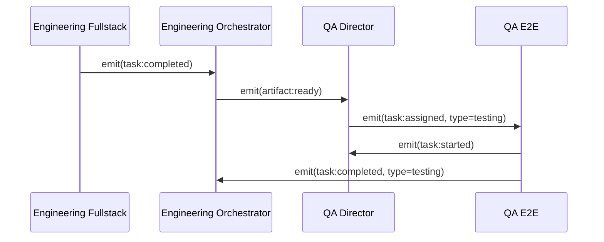
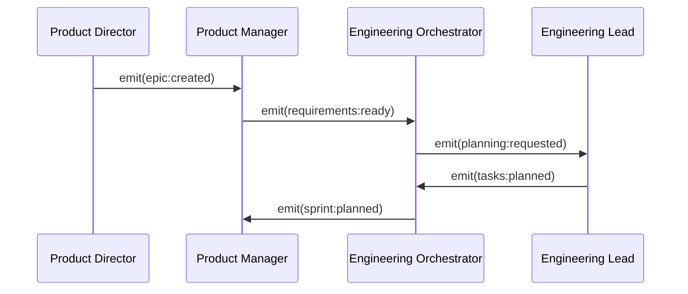

# Complete Event Catalog & Developer Reference

## Overview

This document provides a comprehensive catalog of all events in the Claude Code orchestration system, including schemas, producers, consumers, and integration patterns. This serves as the definitive reference for developers working with the event-driven architecture.

## Event Categories

### 1. Task Events
Events related to task lifecycle management and execution status.

#### `task:created`
**Purpose**: Signals that a new task has been defined and added to the system.

```json
{
  "type": "task:created",
  "timestamp": "2025-01-20T14:30:00Z",
  "source": "engineering-orchestrator",
  "priority": "normal",
  "payload": {
    "task_id": "task-auth-oauth-impl",
    "epic_id": "epic-authentication",
    "sprint_id": "sprint-3",
    "title": "Implement OAuth2 flow",
    "type": "feature",
    "description": "Implement OAuth2 authentication flow with Google and GitHub providers",
    "assignee": null,
    "priority": "high",
    "estimate": 5,
    "dependencies": ["task-auth-database"],
    "acceptance_criteria": [
      "OAuth flow handles Google authentication",
      "OAuth flow handles GitHub authentication",
      "Error handling for invalid tokens",
      "Test coverage >= 85%"
    ],
    "labels": ["authentication", "oauth", "security"],
    "created_by": "engineering-orchestrator",
    "created_at": "2025-01-20T14:30:00Z"
  }
}
```

**Producers**: engineering-orchestrator, product-manager  
**Consumers**: engineering-lead, team-members, state-manager  
**Triggers**: Sprint planning, epic breakdown  

#### `task:assigned`
**Purpose**: Indicates a task has been assigned to a specific agent.

```json
{
  "type": "task:assigned",
  "timestamp": "2025-01-20T14:35:00Z",
  "source": "engineering-orchestrator",
  "priority": "normal",
  "payload": {
    "task_id": "task-auth-oauth-impl",
    "agent_id": "engineering-fullstack",
    "assigned_by": "engineering-orchestrator",
    "context": {
      "spec_url": "docs/specs/oauth.md",
      "dependencies_ready": ["task-auth-database"],
      "worktree": "feature/auth-oauth",
      "review_required": true,
      "estimated_hours": 20
    },
    "assigned_at": "2025-01-20T14:35:00Z"
  }
}
```

**Producers**: engineering-orchestrator, engineering-lead  
**Consumers**: assigned-agent, state-manager, observability-system  
**Triggers**: Task delegation, capacity planning  

#### `task:started`
**Purpose**: Agent confirms work has begun on assigned task.

```json
{
  "type": "task:started",
  "timestamp": "2025-01-20T15:00:00Z",
  "source": "engineering-fullstack",
  "priority": "normal",
  "payload": {
    "task_id": "task-auth-oauth-impl",
    "agent_id": "engineering-fullstack",
    "session_id": "session-uuid-123",
    "worktree": "feature/auth-oauth",
    "estimated_completion": "2025-01-22T17:00:00Z",
    "started_at": "2025-01-20T15:00:00Z"
  }
}
```

**Producers**: All agent types  
**Consumers**: engineering-orchestrator, state-manager, observability-system  
**Triggers**: Agent begins task execution  

#### `task:completed`
**Purpose**: Task has been successfully completed with all deliverables.

```json
{
  "type": "task:completed",
  "timestamp": "2025-01-22T16:45:00Z",
  "source": "engineering-fullstack",
  "priority": "high",
  "payload": {
    "task_id": "task-auth-oauth-impl",
    "agent_id": "engineering-fullstack",
    "session_id": "session-uuid-123",
    "artifacts": [
      "src/auth/oauth.ts",
      "src/auth/providers/google.ts", 
      "src/auth/providers/github.ts",
      "tests/auth/oauth.test.ts"
    ],
    "metrics": {
      "test_coverage": 0.87,
      "lines_of_code": 450,
      "complexity_score": 12,
      "performance_score": 0.95
    },
    "review_required": true,
    "completion_notes": "All acceptance criteria met. Added comprehensive error handling and logging.",
    "completed_at": "2025-01-22T16:45:00Z",
    "actual_hours": 18
  }
}
```

**Producers**: All agent types  
**Consumers**: engineering-orchestrator, qa-e2e, engineering-lead, state-manager  
**Triggers**: Task completion, artifact creation  

#### `task:failed`
**Purpose**: Task encountered unrecoverable errors and could not be completed.

```json
{
  "type": "task:failed",
  "timestamp": "2025-01-21T10:30:00Z",
  "source": "engineering-fullstack",
  "priority": "high",
  "payload": {
    "task_id": "task-auth-oauth-impl",
    "agent_id": "engineering-fullstack",
    "session_id": "session-uuid-123",
    "error_type": "dependency_failure",
    "error_message": "Required OAuth library version conflict with existing dependencies",
    "error_details": {
      "conflicting_package": "oauth2-lib",
      "required_version": "^3.0.0",
      "installed_version": "2.8.1",
      "resolution_attempts": 3
    },
    "retry_count": 2,
    "max_retries": 3,
    "requires_manual_intervention": true,
    "suggested_actions": [
      "Update dependency constraints",
      "Consider alternative OAuth library",
      "Consult with engineering-lead"
    ],
    "failed_at": "2025-01-21T10:30:00Z"
  }
}
```

**Producers**: All agent types  
**Consumers**: engineering-orchestrator, engineering-lead, state-manager  
**Triggers**: Unrecoverable errors, dependency failures  

#### `task:blocked`
**Purpose**: Task cannot proceed due to external dependencies or blockers.

```json
{
  "type": "task:blocked",
  "timestamp": "2025-01-21T09:15:00Z",
  "source": "engineering-fullstack",
  "priority": "high",
  "payload": {
    "task_id": "task-auth-oauth-impl",
    "agent_id": "engineering-fullstack",
    "blocker_type": "external_dependency",
    "reason": "Waiting for API keys from third-party OAuth providers",
    "blocking_dependencies": [
      {
        "type": "api_keys",
        "provider": "google_oauth",
        "status": "pending_approval",
        "eta": "2025-01-22T00:00:00Z"
      },
      {
        "type": "api_keys", 
        "provider": "github_oauth",
        "status": "approved",
        "eta": "available"
      }
    ],
    "escalation_required": true,
    "escalate_to": "product-manager",
    "blocked_at": "2025-01-21T09:15:00Z"
  }
}
```

**Producers**: All agent types  
**Consumers**: engineering-orchestrator, product-manager, state-manager  
**Triggers**: External dependencies, resource unavailability  

---

### 2. State Events
Events related to orchestration state changes and system status.

#### `state:updated`
**Purpose**: Notification that orchestration state has been modified.

```json
{
  "type": "state:updated",
  "timestamp": "2025-01-20T14:30:00Z", 
  "source": "state-manager",
  "priority": "low",
  "payload": {
    "path": "tasks.task-auth-oauth-impl.status",
    "previous_value": "pending",
    "new_value": "assigned",
    "change_source": "engineering-orchestrator",
    "transaction_id": "txn-state-456",
    "affected_agents": ["engineering-fullstack"],
    "cascading_updates": [
      "sprints.sprint-3.tasks.active"
    ]
  }
}
```

**Producers**: state-manager  
**Consumers**: All active agents, observability-system  
**Triggers**: Any state modification  

#### `epic:created`
**Purpose**: New epic has been defined and added to project planning.

```json
{
  "type": "epic:created",
  "timestamp": "2025-01-15T10:00:00Z",
  "source": "product-director",
  "priority": "normal",
  "payload": {
    "epic_id": "epic-authentication",
    "title": "User Authentication System",
    "description": "Complete user authentication system with OAuth, 2FA, and session management",
    "business_value": "Enable user accounts and personalization features",
    "features": [
      "OAuth integration",
      "Two-factor authentication", 
      "Session management",
      "Password reset flow",
      "Account management UI"
    ],
    "acceptance_criteria": [
      "Support Google and GitHub OAuth",
      "90% test coverage",
      "Security audit passed",
      "Performance benchmarks met"
    ],
    "estimated_sprints": 3,
    "priority": "high",
    "dependencies": ["epic-user-database"],
    "stakeholders": ["product-manager", "engineering-lead", "security-team"],
    "target_completion": "2025-02-28T00:00:00Z",
    "created_by": "product-director"
  }
}
```

**Producers**: product-director, product-manager  
**Consumers**: All team orchestrators, engineering-lead, qa-director  
**Triggers**: Product planning, roadmap updates  

#### `sprint:started`
**Purpose**: Sprint execution has begun with team coordination.

```json
{
  "type": "sprint:started", 
  "timestamp": "2025-01-20T09:00:00Z",
  "source": "engineering-orchestrator",
  "priority": "high",
  "payload": {
    "sprint_id": "sprint-3",
    "epic_id": "epic-authentication",
    "name": "Authentication Core Implementation",
    "duration_days": 14,
    "start_date": "2025-01-20T09:00:00Z",
    "end_date": "2025-02-03T17:00:00Z",
    "goals": [
      "Complete OAuth implementation",
      "Implement 2FA foundation",
      "Achieve 85% test coverage"
    ],
    "teams_involved": ["engineering", "qa"],
    "tasks": [
      "task-auth-oauth-impl",
      "task-auth-2fa-setup", 
      "task-auth-session-mgmt",
      "task-auth-ui-components"
    ],
    "capacity": {
      "engineering": {
        "total_points": 34,
        "available_agents": 5,
        "estimated_velocity": 30
      },
      "qa": {
        "total_points": 8,
        "available_agents": 2,
        "estimated_velocity": 8
      }
    },
    "success_criteria": [
      "All tasks completed",
      "Test coverage >= 85%",
      "Security review passed",
      "Performance benchmarks met"
    ]
  }
}
```

**Producers**: Team orchestrators  
**Consumers**: All team members, observability-system, stakeholders  
**Triggers**: Sprint planning completion  

---

### 3. Team Events
Events related to team coordination and resource management.

#### `team:activated`
**Purpose**: Team has been activated and is ready for coordinated work.

```json
{
  "type": "team:activated",
  "timestamp": "2025-01-20T08:45:00Z",
  "source": "engineering-orchestrator", 
  "priority": "normal",
  "payload": {
    "team_id": "engineering",
    "orchestrator": "engineering-orchestrator",
    "session_id": "team-session-789",
    "members": [
      {
        "agent_id": "engineering-lead",
        "role": "technical_leadership",
        "capacity": 1,
        "status": "active",
        "specialties": ["architecture", "code_review"]
      },
      {
        "agent_id": "engineering-fullstack",
        "role": "full_stack_development", 
        "capacity": 3,
        "status": "active",
        "specialties": ["frontend", "backend", "api"]
      },
      {
        "agent_id": "engineering-ux",
        "role": "ux_engineering",
        "capacity": 2, 
        "status": "active",
        "specialties": ["ui_components", "responsive_design"]
      }
    ],
    "total_capacity": 6,
    "current_sprint": "sprint-3",
    "coordination_settings": {
      "standups_enabled": true,
      "auto_assignment": true,
      "review_required": true,
      "parallel_execution": true
    }
  }
}
```

**Producers**: Team orchestrators  
**Consumers**: Team members, state-manager, resource-manager  
**Triggers**: Team activation commands  

#### `team:status`
**Purpose**: Periodic team progress and status update.

```json
{
  "type": "team:status",
  "timestamp": "2025-01-21T12:00:00Z",
  "source": "engineering-orchestrator",
  "priority": "normal", 
  "payload": {
    "team_id": "engineering",
    "sprint_id": "sprint-3",
    "progress": {
      "tasks_completed": 2,
      "tasks_in_progress": 3,
      "tasks_queued": 1,
      "tasks_blocked": 1,
      "completion_percentage": 0.35
    },
    "velocity": {
      "current_sprint": 8.5,
      "previous_sprint": 7.2,
      "trend": "improving"
    },
    "blockers": [
      {
        "task_id": "task-auth-oauth-impl",
        "blocker_type": "external_dependency",
        "severity": "medium",
        "eta_resolution": "2025-01-22T00:00:00Z"
      }
    ],
    "resource_utilization": {
      "engineering-lead": 0.8,
      "engineering-fullstack": 1.0,
      "engineering-ux": 0.6
    },
    "quality_metrics": {
      "test_coverage": 0.82,
      "code_review_completion": 1.0,
      "build_success_rate": 0.95
    },
    "next_update": "2025-01-22T12:00:00Z"
  }
}
```

**Producers**: Team orchestrators  
**Consumers**: Cross-team coordinators, stakeholders, observability-system  
**Triggers**: Scheduled status updates, milestone completion  

---

### 4. Agent Events
Events related to individual agent lifecycle and status.

#### `agent:spawned`
**Purpose**: New agent instance has been created and is ready for work.

```json
{
  "type": "agent:spawned",
  "timestamp": "2025-01-20T14:30:00Z",
  "source": "orchestration-system",
  "priority": "normal",
  "payload": {
    "agent_id": "engineering-fullstack-001",
    "agent_type": "engineering-fullstack",
    "session_id": "session-uuid-123",
    "parent_session": "team-session-789",
    "spawned_by": "engineering-orchestrator",
    "initial_context": {
      "task_id": "task-auth-oauth-impl",
      "worktree": "feature/auth-oauth",
      "specialization": "oauth_implementation"
    },
    "resource_allocation": {
      "model": "sonnet",
      "max_tokens": 50000,
      "timeout_minutes": 120
    },
    "capabilities": [
      "frontend_development",
      "backend_development", 
      "api_integration",
      "testing"
    ]
  }
}
```

**Producers**: orchestration-system  
**Consumers**: state-manager, observability-system, resource-manager  
**Triggers**: Agent spawning requests  

#### `agent:status_changed`
**Purpose**: Agent status has changed (idle, busy, blocked, error).

```json
{
  "type": "agent:status_changed",
  "timestamp": "2025-01-20T15:00:00Z",
  "source": "engineering-fullstack-001",
  "priority": "low",
  "payload": {
    "agent_id": "engineering-fullstack-001",
    "previous_status": "idle",
    "new_status": "busy",
    "current_task": "task-auth-oauth-impl",
    "context": {
      "work_phase": "implementation",
      "current_file": "src/auth/oauth.ts",
      "progress_percentage": 0.15
    },
    "availability": {
      "can_accept_new_tasks": false,
      "estimated_completion": "2025-01-22T16:00:00Z"
    }
  }
}
```

**Producers**: All agent types  
**Consumers**: orchestrator, resource-manager, state-manager  
**Triggers**: Status changes, task assignments  

---

### 5. Communication Events
Events for inter-agent messaging and coordination.

#### `question:asked`
**Purpose**: Agent needs clarification or assistance from another agent.

```json
{
  "type": "question:asked",
  "timestamp": "2025-01-21T11:30:00Z",
  "source": "engineering-fullstack-001",
  "priority": "normal",
  "payload": {
    "question_id": "q-oauth-storage-001",
    "from": "engineering-fullstack-001",
    "to": "engineering-lead",
    "task_context": "task-auth-oauth-impl",
    "question": "Should OAuth tokens be stored in Redis for session management or PostgreSQL for persistence?",
    "context": {
      "current_implementation": "localStorage on client",
      "security_requirements": "tokens must be httpOnly",
      "performance_requirements": "sub-100ms retrieval",
      "options_considered": ["Redis", "PostgreSQL", "JWT-only"]
    },
    "urgency": "medium",
    "requires_decision_by": "2025-01-21T16:00:00Z"
  }
}
```

**Producers**: All agent types  
**Consumers**: target-agent, engineering-lead (fallback), state-manager  
**Triggers**: Implementation decisions, blockers  

#### `review:requested`
**Purpose**: Agent requests code or design review.

```json
{
  "type": "review:requested",
  "timestamp": "2025-01-22T16:50:00Z",
  "source": "engineering-fullstack-001",
  "priority": "normal",
  "payload": {
    "review_id": "review-oauth-impl-001",
    "requestor": "engineering-fullstack-001",
    "reviewers": ["engineering-lead"],
    "review_type": "code_review",
    "task_id": "task-auth-oauth-impl",
    "artifacts": [
      "src/auth/oauth.ts",
      "src/auth/providers/google.ts",
      "tests/auth/oauth.test.ts"
    ],
    "scope": {
      "focus_areas": ["security", "error_handling", "test_coverage"],
      "complexity_score": 12,
      "lines_changed": 450,
      "breaking_changes": false
    },
    "checklist": [
      "Security best practices followed",
      "Error handling comprehensive", 
      "Test coverage >= 85%",
      "Documentation updated",
      "Performance impact assessed"
    ],
    "deadline": "2025-01-23T17:00:00Z"
  }
}
```

**Producers**: All implementation agents  
**Consumers**: engineering-lead, qa-agents, state-manager  
**Triggers**: Task completion, milestone checkpoints  

---

### 6. System Events
Events related to infrastructure, monitoring, and system health.

#### `resource:threshold_reached`
**Purpose**: System resource usage has reached defined thresholds.

```json
{
  "type": "resource:threshold_reached",
  "timestamp": "2025-01-21T14:45:00Z",
  "source": "resource-monitor",
  "priority": "high",
  "payload": {
    "resource_type": "agent_capacity",
    "threshold_type": "concurrent_agents",
    "current_value": 8,
    "threshold_value": 10,
    "percentage": 0.8,
    "threshold_level": "warning",
    "affected_teams": ["engineering"],
    "recommended_actions": [
      "Consider queuing new tasks",
      "Optimize current agent utilization",
      "Evaluate sprint scope"
    ],
    "auto_scaling_available": false,
    "manual_intervention_required": true
  }
}
```

**Producers**: resource-monitor, observability-system  
**Consumers**: All orchestrators, system-administrators  
**Triggers**: Resource threshold breaches  

#### `security:alert`
**Purpose**: Security-related event requiring attention.

```json
{
  "type": "security:alert",
  "timestamp": "2025-01-21T16:20:00Z",
  "source": "security-monitor",
  "priority": "critical",
  "payload": {
    "alert_id": "sec-001-oauth-creds",
    "alert_type": "credential_exposure",
    "severity": "high",
    "description": "OAuth client secret detected in code repository",
    "affected_components": [
      "src/auth/config/oauth.ts"
    ],
    "detection_method": "static_analysis",
    "remediation_required": true,
    "recommended_actions": [
      "Remove credentials from code",
      "Rotate OAuth client secret",
      "Update environment configuration",
      "Audit git history"
    ],
    "compliance_impact": ["SOC2", "GDPR"],
    "assigned_to": "engineering-lead"
  }
}
```

**Producers**: security-monitor, compliance-checker  
**Consumers**: engineering-lead, security-team, compliance-team  
**Triggers**: Security scans, compliance checks  

---

## Event Flow Patterns

### Standard Flow Patterns

#### 1. Task Execution Flow
```
task:created → task:assigned → task:started → [work] → task:completed
                                          ↘ task:blocked → [resolution] → task:started
                                          ↘ task:failed → [recovery] → task:assigned
```

#### 2. Sprint Orchestration Flow
```
epic:created → sprint:planned → team:activated → sprint:started → 
[task execution] → sprint:completed → team:status
```

#### 3. Question/Answer Flow
```
question:asked → [routing] → question:answered → state:updated
```

#### 4. Review Flow
```
review:requested → [review process] → review:completed → task:completed
```

### Cross-Team Communication Patterns

#### Engineering → QA Handoff


#### Product → Engineering Requirements Flow


## Event Schema Validation

### Base Event Schema
All events must conform to this base schema:

```json
{
  "$schema": "http://json-schema.org/draft-07/schema#",
  "type": "object",
  "required": ["type", "timestamp", "source", "priority", "payload"],
  "properties": {
    "type": {
      "type": "string",
      "pattern": "^[a-z_]+:[a-z_]+$",
      "description": "Event type in category:action format"
    },
    "timestamp": {
      "type": "string",
      "format": "date-time",
      "description": "ISO 8601 timestamp"
    },
    "source": {
      "type": "string",
      "description": "Agent or system that emitted the event"
    },
    "priority": {
      "type": "string",
      "enum": ["low", "normal", "high", "critical"]
    },
    "payload": {
      "type": "object",
      "description": "Event-specific data"
    },
    "correlation_id": {
      "type": "string",
      "description": "Optional correlation ID for related events"
    },
    "version": {
      "type": "string",
      "default": "1.0",
      "description": "Event schema version"
    }
  }
}
```

### Event Versioning Strategy
- **Version Format**: Semantic versioning (major.minor.patch)
- **Breaking Changes**: Increment major version
- **New Fields**: Increment minor version  
- **Bug Fixes**: Increment patch version
- **Backward Compatibility**: Maintain for 2 major versions

## Implementation Guidelines

### Event Emission Best Practices
1. **Always include correlation_id** for related events
2. **Use appropriate priority levels** based on urgency
3. **Include comprehensive context** in payload
4. **Emit events atomically** with state changes
5. **Handle emission failures** gracefully

### Event Subscription Patterns
1. **Subscribe to relevant categories** only
2. **Implement idempotent handlers** for duplicate events
3. **Use event filtering** to reduce noise
4. **Handle missing events** gracefully
5. **Implement circuit breakers** for event processing

### Error Handling
1. **Dead letter queues** for failed events
2. **Retry policies** with exponential backoff
3. **Event replay capabilities** for recovery
4. **Monitoring and alerting** for event failures

## Monitoring and Observability

### Key Metrics to Track
- **Event volume** by type and source
- **Event processing latency** end-to-end
- **Failed event rates** and patterns
- **Queue depths** and processing delays
- **Cross-team communication** frequency

### Dashboards and Alerts
- **Real-time event streams** for debugging
- **Team activity dashboards** for progress tracking
- **System health monitoring** for infrastructure
- **Alert thresholds** for critical events

---

This event catalog serves as the complete reference for all event-driven interactions in the Claude Code orchestration system. Developers should use this document to understand event schemas, implement proper event handling, and maintain consistency across the system.

**Last Updated**: 2025-01-20  
**Version**: 1.0  
**Total Events**: 32  
**Categories**: 6