# Event Flow Diagrams & Communication Patterns

## Overview

This document provides visual representations of event flows and communication patterns across the Claude Code orchestration system. These diagrams help developers understand how events propagate through the system and how teams coordinate through event-driven architecture.

## High-Level System Architecture

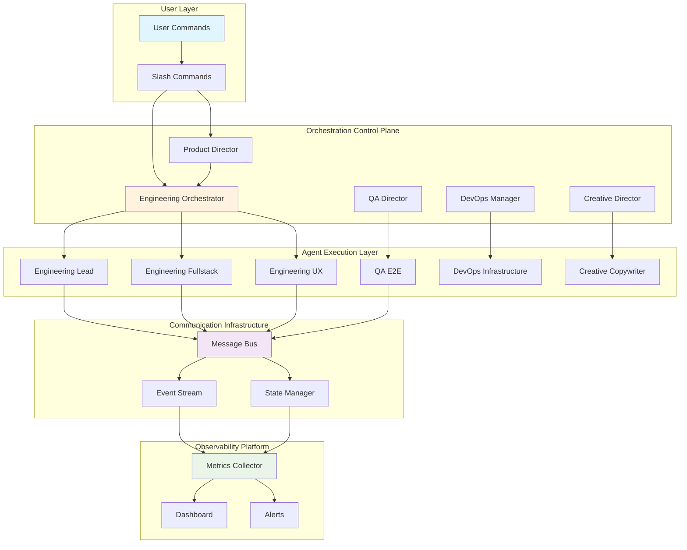

## Core Event Flow Patterns

### 1. Sprint Orchestration Flow

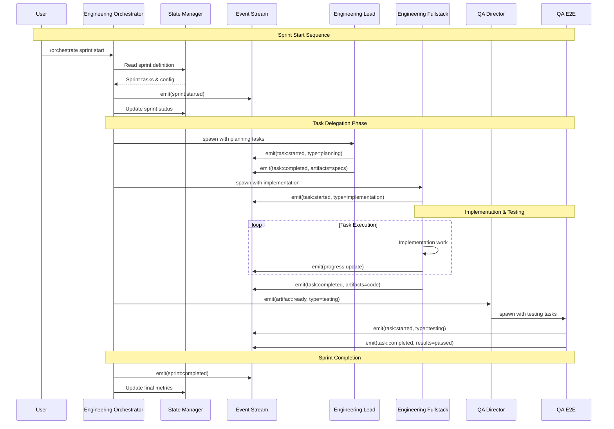

### 2. Cross-Team Communication Pattern

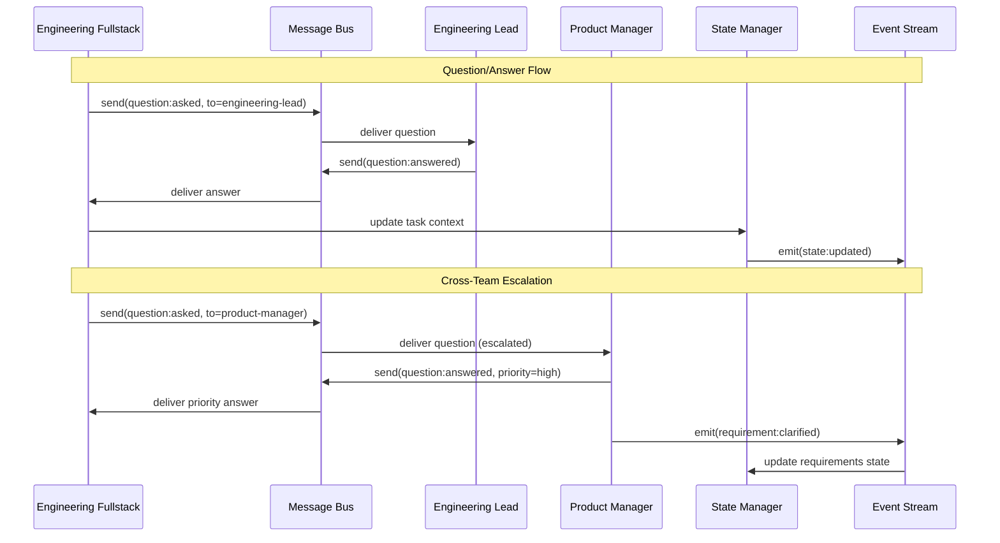

### 3. Error Handling & Recovery Flow

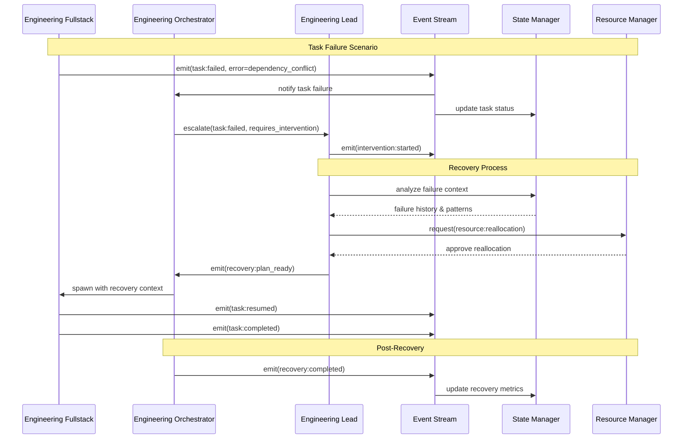

### 4. Review & Approval Workflow

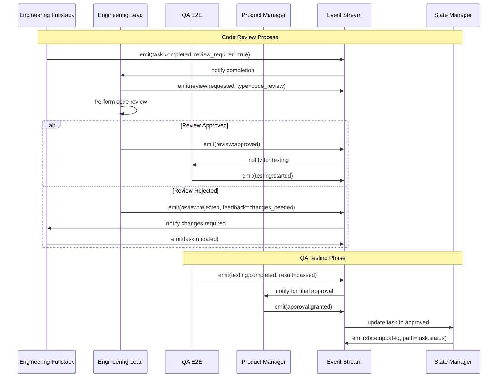

## Team-Specific Event Patterns

### Engineering Team Internal Flow

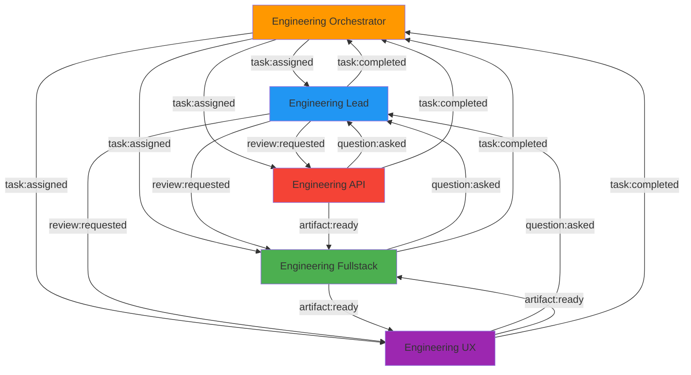

### Product Team Event Flow

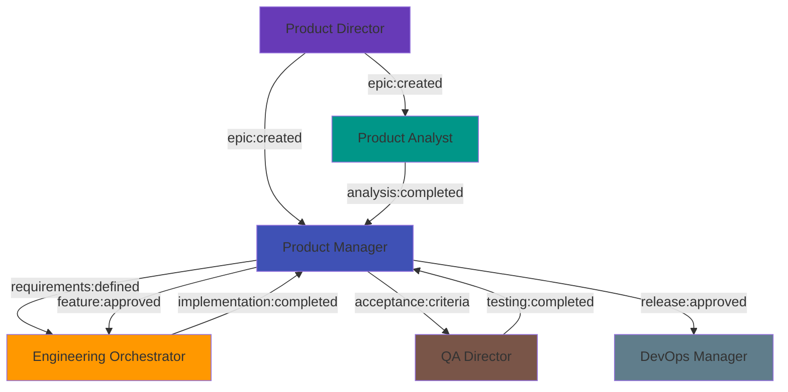

### QA Team Testing Pipeline

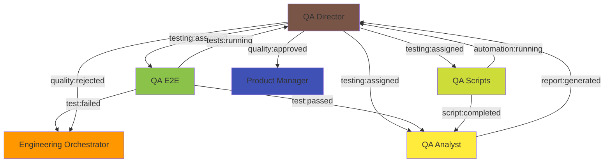

## Event Priority & Routing Patterns

### Priority-Based Event Routing

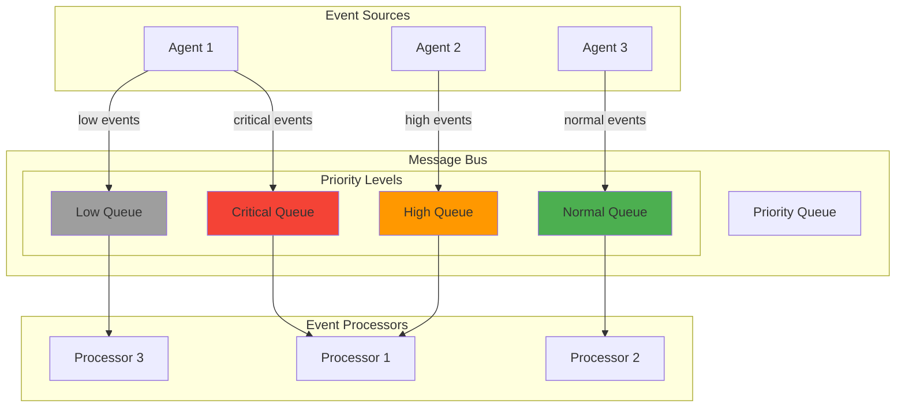

### Event Filtering & Subscription

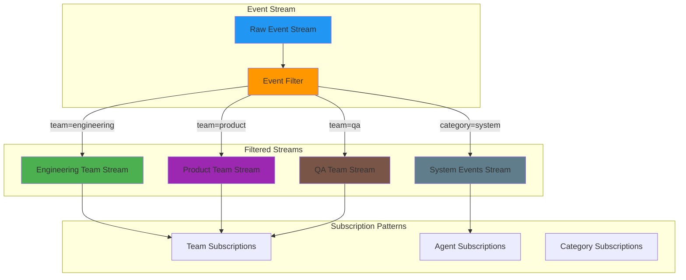

## State Management Event Flows

### State Synchronization Pattern

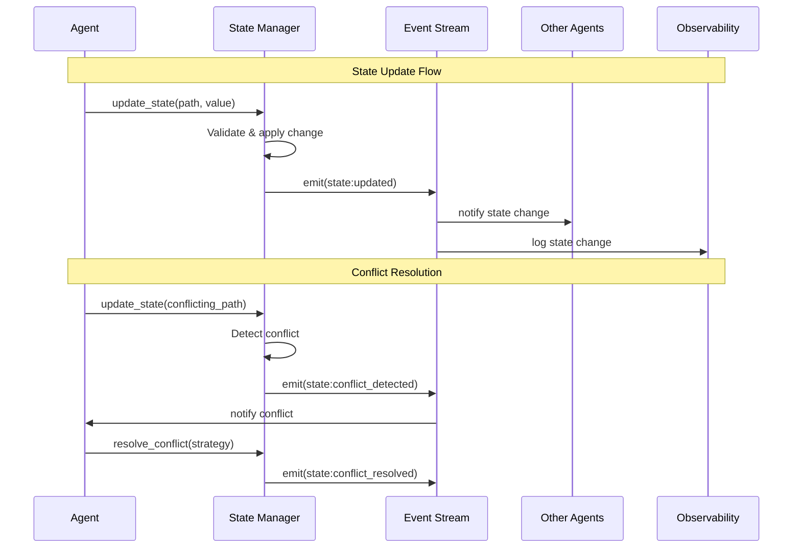

### Distributed State Consistency

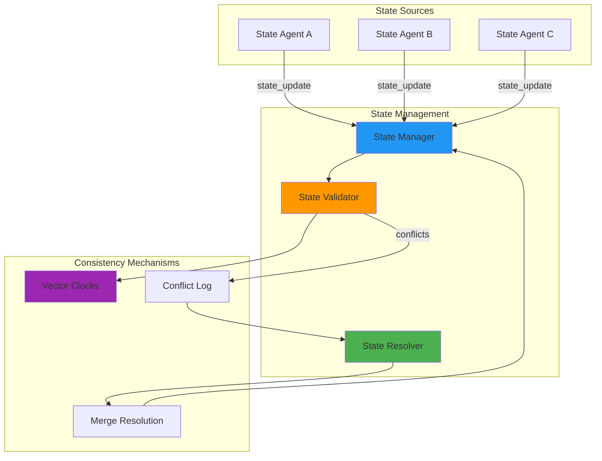

## Error Handling Event Patterns

### Circuit Breaker Pattern for Events

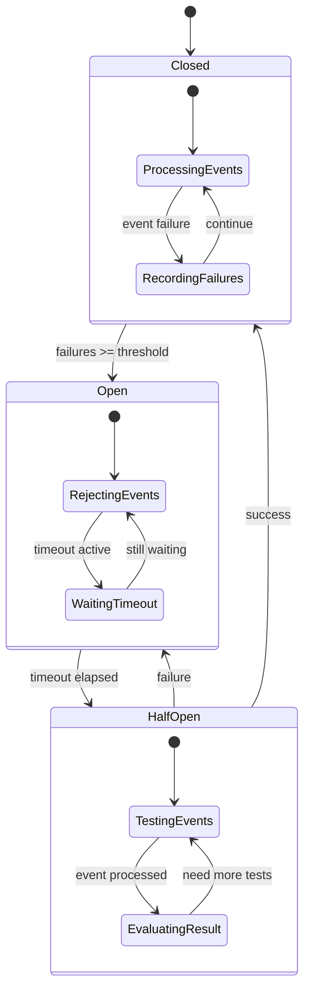

### Event Retry and Recovery

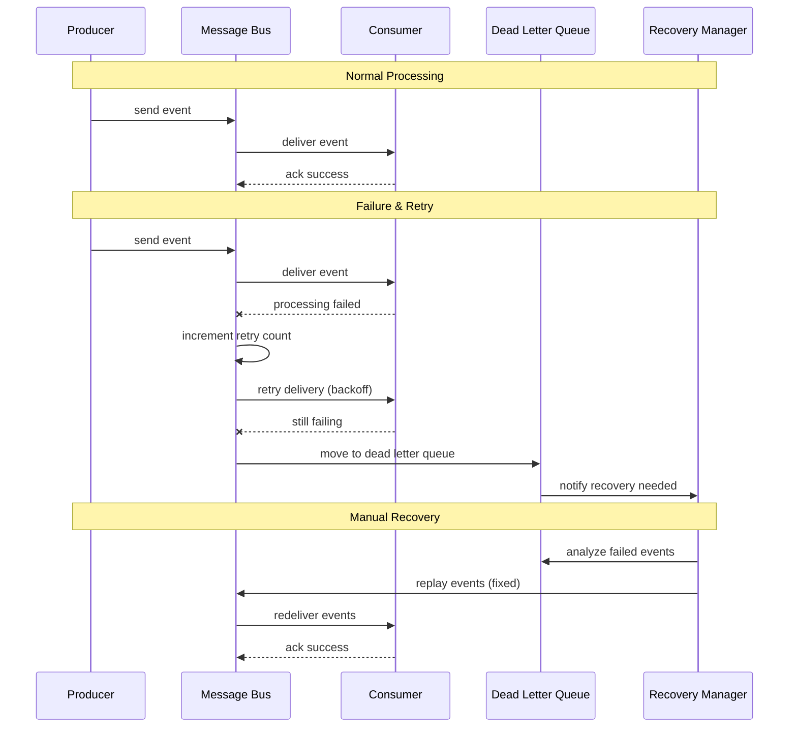

## Performance Monitoring Event Flows

### Real-time Metrics Collection

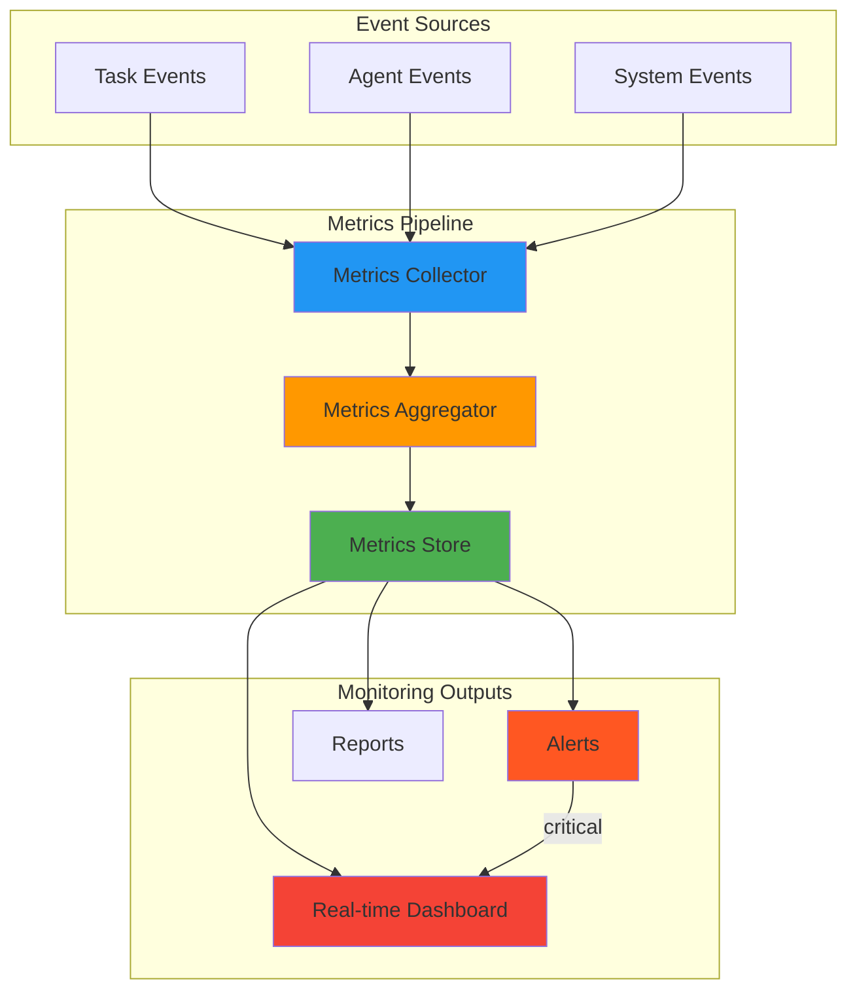

## Event Debugging & Tracing

### Distributed Event Tracing

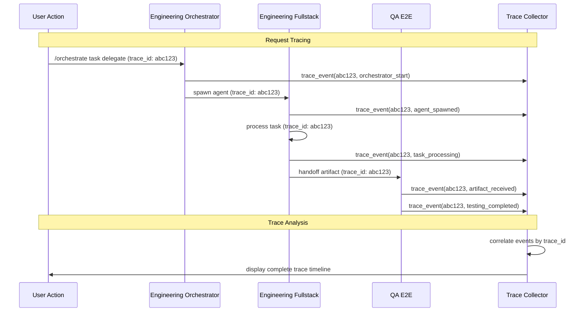

---

This comprehensive set of event flow diagrams provides visual guidance for understanding how events propagate through the Claude Code orchestration system. These patterns can be used as references for implementing event-driven features and debugging communication issues between agents and teams.

**Last Updated**: 2025-01-20  
**Diagram Count**: 15  
**Coverage**: All major event patterns and flows