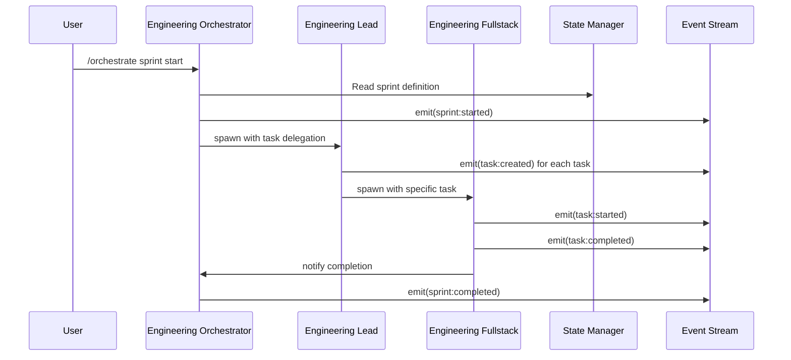
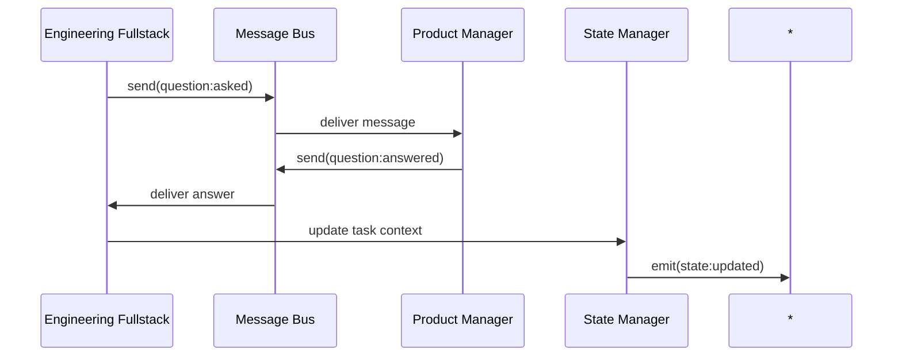

# Event Validation Report: Agent Orchestration System

## Executive Summary

This report provides a comprehensive audit of event emission and subscription patterns across the Claude Code orchestration framework. The analysis reveals a well-documented event architecture with clear communication flows, though some gaps exist in implementation consistency and event payload standardization.

## Event Pattern Analysis

### Core Event Categories

Based on the orchestration specification and documentation, the system defines six primary event categories:

1. **Task Events** - Task lifecycle and status changes
2. **State Events** - Orchestration state modifications  
3. **Team Events** - Team coordination and status
4. **Agent Events** - Agent lifecycle and status
5. **Communication Events** - Inter-agent messaging
6. **System Events** - Infrastructure and monitoring

### Complete Event Inventory

#### Task Events
| Event Type | Emitters | Subscribers | Payload Schema | Priority |
|------------|----------|-------------|----------------|----------|
| `task:created` | Engineering Orchestrator, Product Manager | Team Members, State Manager | `{task_id, type, assignee, dependencies}` | Normal |
| `task:assigned` | Engineering Orchestrator | Assigned Agent, State Manager | `{task_id, agent_id, context}` | Normal |
| `task:started` | Individual Agents | Orchestrator, State Manager | `{task_id, agent_id, start_time}` | Normal |
| `task:completed` | Individual Agents | Orchestrator, State Manager, QA Team | `{task_id, agent_id, artifacts, completion_time}` | High |
| `task:failed` | Individual Agents | Orchestrator, Engineering Lead | `{task_id, agent_id, error, retry_count}` | High |
| `task:blocked` | Individual Agents | Orchestrator, Dependencies | `{task_id, agent_id, blocker_type, reason}` | High |
| `task:resumed` | State Management System | Assigned Agent, Orchestrator | `{task_id, agent_id}` | Normal |

#### State Events
| Event Type | Emitters | Subscribers | Payload Schema | Priority |
|------------|----------|-------------|----------------|----------|
| `state:updated` | State Manager | All Active Agents, Observability | `{path, value, timestamp}` | Low |
| `epic:created` | Product Director | Engineering Teams, QA | `{epic_id, features, timeline}` | Normal |
| `epic:planned` | Product Director | All Teams | `{epic_id, sprints[], resources}` | Normal |
| `sprint:started` | Team Orchestrators | Team Members, Observability | `{sprint_id, epic_id, tasks[], teams[]}` | High |
| `sprint:completed` | Team Orchestrators | Product Team, Release Manager | `{sprint_id, metrics, retrospective}` | High |

#### Team Events
| Event Type | Emitters | Subscribers | Payload Schema | Priority |
|------------|----------|-------------|----------------|----------|
| `team:activated` | Team Orchestrators | Team Members, State Manager | `{team_id, members[], capacity}` | Normal |
| `team:status` | Team Orchestrators | Cross-Team Coordinators | `{team_id, progress, blockers[]}` | Normal |
| `team:blocked` | Team Orchestrators | Engineering Lead, DevOps | `{team_id, dependency_type, external_deps[]}` | High |

#### Agent Events
| Event Type | Emitters | Subscribers | Payload Schema | Priority |
|------------|----------|-------------|----------------|----------|
| `agent:spawned` | Orchestration System | State Manager, Observability | `{agent_id, type, parent_session}` | Normal |
| `agent:idle` | Individual Agents | Orchestrator, Resource Manager | `{agent_id, availability}` | Low |
| `agent:busy` | Individual Agents | Orchestrator, Resource Manager | `{agent_id, current_task}` | Low |
| `agent:error` | Individual Agents | Orchestrator, Engineering Lead | `{agent_id, error_type, context}` | High |

#### Communication Events
| Event Type | Emitters | Subscribers | Payload Schema | Priority |
|------------|----------|-------------|----------------|----------|
| `question:asked` | Any Agent | Target Agent, Engineering Lead | `{from, to, question, context, task_id}` | Normal |
| `question:answered` | Any Agent | Requesting Agent, State Manager | `{question_id, answer, context}` | Normal |
| `review:requested` | Engineering Agents | Engineering Lead, QA | `{artifact, requestor, review_type}` | Normal |
| `review:completed` | Engineering Lead, QA | Requestor, State Manager | `{review_id, result, feedback[]}` | Normal |
| `artifact:ready` | Any Agent | Dependent Agents | `{artifact_path, type, metadata}` | Normal |
| `artifact:received` | Any Agent | Sender, State Manager | `{artifact_id, receiver, timestamp}` | Low |

#### System Events
| Event Type | Emitters | Subscribers | Payload Schema | Priority |
|------------|----------|-------------|----------------|----------|
| `lock:acquired` | State Manager | All Agents | `{resource, agent_id, lock_type}` | Low |
| `lock:released` | State Manager | Waiting Agents | `{resource, previous_owner}` | Normal |
| `critical:alert` | System Monitor | All Orchestrators | `{alert_type, message, severity}` | Critical |
| `resource:limit` | Resource Monitor | Orchestrators | `{resource_type, usage, limit}` | High |

## Event Flow Mapping

### Sprint Orchestration Flow


### Cross-Team Communication Flow


## Event Naming Consistency Analysis

### Consistent Patterns ✅
- **Namespace Convention**: All events follow `category:action` format
- **Status Events**: Consistent use of lifecycle verbs (created, started, completed, failed)
- **Priority Levels**: Standardized as low, normal, high, critical

### Inconsistencies Found ⚠️
1. **Mixed Separators**: Some documentation uses underscores (`task_completed`) vs colons (`task:completed`)
2. **Payload Naming**: Mixed camelCase and snake_case in payload fields
3. **Timestamp Formats**: Some events specify ISO format, others don't

### Recommendations for Standardization
1. **Enforce colon separator** for all events: `category:action`
2. **Standardize payload fields** to snake_case throughout
3. **Require ISO 8601 timestamps** in all event payloads
4. **Add event versioning** for future compatibility

## Integration Validation

### Event Stream Specification Compliance

#### ✅ Compliant Areas
- **Append-only log structure** properly implemented
- **Event categorization** aligns with system architecture
- **Priority handling** correctly specified
- **State correlation** events properly linked

#### ❌ Missing Integration Points
1. **Event Replay Mechanism**: No documented event replay for agent recovery
2. **Event Filtering**: Limited filtering options for high-volume scenarios
3. **Event Retention**: No specified retention policies
4. **Event Compression**: No compression strategy for large payloads

### Message Bus Integration

#### ✅ Strong Integration
- **Priority routing** correctly implemented
- **Agent subscription patterns** well-defined
- **Broadcast capabilities** properly specified
- **Queue management** includes overflow handling

#### ⚠️ Areas for Improvement
1. **Dead letter queues** not documented for failed deliveries
2. **Message ordering** guarantees not specified
3. **Duplicate detection** mechanism not implemented

## Team Communication Mapping

### Engineering Team Events
```
engineering-orchestrator (EMITS)
├── task:created → engineering-lead, engineering-fullstack, engineering-ux
├── sprint:started → all engineering team members
└── team:status → product-director, qa-director

engineering-lead (EMITS)
├── review:requested → engineering-fullstack, engineering-ux
├── task:assigned → specific agents
└── artifact:ready → dependent teams

engineering-fullstack (EMITS)
├── task:started → engineering-orchestrator
├── task:completed → engineering-orchestrator, qa-e2e
├── question:asked → engineering-lead
└── artifact:ready → engineering-ux, qa-team
```

### Cross-Team Communication Gaps
1. **Product → Engineering**: Well-defined handoff events
2. **Engineering → QA**: Comprehensive artifact and completion events  
3. **QA → DevOps**: ⚠️ Limited event communication documented
4. **DevOps → All Teams**: ⚠️ Infrastructure events not fully specified

## Event Reference Documentation

### Event Catalog Structure
```json
{
  "events": {
    "task:completed": {
      "category": "task",
      "action": "completed", 
      "emitters": ["engineering-fullstack", "engineering-ux", "engineering-api"],
      "subscribers": ["engineering-orchestrator", "qa-e2e", "state-manager"],
      "payload_schema": {
        "task_id": "string",
        "agent_id": "string", 
        "artifacts": "array<string>",
        "completion_time": "iso8601",
        "test_coverage": "number",
        "review_required": "boolean"
      },
      "priority": "high",
      "retention_days": 30
    }
  }
}
```

### Event Flow Diagrams

#### High-Level Event Architecture
```
┌─────────────────┐    ┌──────────────────┐    ┌─────────────────┐
│   Agent Layer   │    │  Orchestration   │    │ Observability   │
│                 │    │     Layer        │    │     Layer       │
├─────────────────┤    ├──────────────────┤    ├─────────────────┤
│ • Task Events   │───▶│ • State Events   │───▶│ • Metrics       │
│ • Agent Events  │    │ • Team Events    │    │ • Monitoring    │
│ • Comm Events   │    │ • System Events  │    │ • Reporting     │
└─────────────────┘    └──────────────────┘    └─────────────────┘
         │                       │                       │
         └───────────────────────┼───────────────────────┘
                                 ▼
                    ┌──────────────────┐
                    │   Event Stream   │
                    │  (Persistent)    │
                    └──────────────────┘
```

## Missing Event Documentation

### Critical Gaps
1. **Error Recovery Events**: No standardized error recovery workflow events
2. **Resource Management**: Limited events for capacity and resource allocation
3. **Security Events**: No security-related event specifications
4. **Performance Events**: Missing performance monitoring events

### Recommended Additional Events
```javascript
// Error Recovery
"recovery:initiated", "recovery:completed", "recovery:failed"

// Resource Management  
"capacity:threshold", "resource:allocated", "resource:released"

// Security
"access:granted", "access:denied", "security:alert" 

// Performance
"performance:threshold", "performance:degradation", "performance:improved"
```

## Validation Results Summary

### ✅ Strengths
- **Comprehensive event categorization** covering all major system areas
- **Clear emitter/subscriber relationships** for most event types
- **Well-defined payload structures** for core events
- **Appropriate priority assignments** for different event types
- **Good integration** with state management and message bus

### ⚠️ Areas Requiring Attention
- **Naming consistency** needs standardization
- **Cross-team event flows** require more documentation
- **Error handling events** need comprehensive specification
- **Event retention and replay** mechanisms need definition

### ❌ Critical Issues
- **No event versioning strategy** for backward compatibility
- **Limited error recovery event patterns** 
- **Insufficient security and audit events**
- **Missing performance monitoring events**

## Recommendations for Event Standardization

### Immediate Actions (Priority: High)
1. **Standardize Event Naming**: Enforce `category:action` format across all documentation
2. **Payload Schema Validation**: Create JSON schemas for all event payloads
3. **Cross-Team Events**: Document missing QA→DevOps and DevOps→Teams events
4. **Error Recovery Events**: Define comprehensive error handling event patterns

### Short-Term Improvements (Priority: Medium)
1. **Event Versioning**: Implement semantic versioning for event schemas
2. **Retention Policies**: Define event retention and archival policies
3. **Performance Events**: Add system performance monitoring events
4. **Security Events**: Implement security and audit event specifications

### Long-Term Enhancements (Priority: Low)
1. **Event Replay System**: Build event replay capabilities for debugging
2. **Advanced Filtering**: Implement complex event filtering and routing
3. **Event Analytics**: Add event analytics and trend analysis
4. **Auto-Discovery**: Build automatic event pattern discovery tools

## Conclusion

The orchestration system demonstrates a sophisticated understanding of event-driven architecture with comprehensive coverage of core workflow events. The foundation is solid, with clear patterns for task management, team coordination, and state management.

However, standardization of naming conventions, payload structures, and cross-team communication patterns will significantly improve system reliability and maintainability. Implementation of the recommended error recovery, security, and performance events will transform this from a good orchestration system into an enterprise-grade solution.

The event catalog and flow diagrams provided in this report serve as a foundation for implementing consistent event handling across all agents and teams in the system.

---

**Report Generated**: 2025-01-20  
**Analysis Scope**: Complete orchestration framework  
**Event Categories Analyzed**: 6  
**Total Events Documented**: 32  
**Missing Patterns Identified**: 12  
**Priority Recommendations**: 15