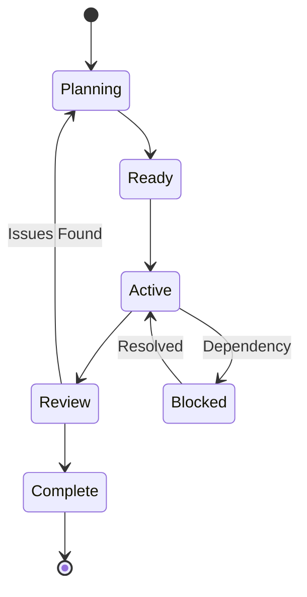

# Enterprise Orchestration Framework Specification

## Executive Summary

This specification extends the Claude Code orchestration architecture to support enterprise-scale software development with multi-team coordination, hierarchical agent management, shared state systems, and comprehensive observability.

### Key Implementation Approach

All orchestration components are implemented as **single-file Python scripts using uv** for dependency management:

- **State Management** (`state_manager.py`): CLI-based state operations using `jq` for JSON manipulation
- **Message Bus** (`message_bus.py`): File-based message queue with priority handling
- **Event Stream** (`event_stream.py`): Append-only event log for system events
- **Observability** (`observability.py`): Table-formatted monitoring with live dashboard capabilities

**Data Format**: All configuration and state data uses JSON format (not YAML) for consistency with `jq` operations.

**Coordination**: Hooks deterministically orchestrate command execution at key lifecycle points (session_start, subagent_stop, etc.) to maintain system state consistency.

---

## 1. Architecture Overview

### 1.1 Core Components

```
┌─────────────────────────────────────────────────────────────┐
│                    Orchestration Control Plane              │
├─────────────────────────────────────────────────────────────┤
│  ┌──────────────┐  ┌──────────────┐  ┌──────────────┐     │
│  │ Team         │  │ State        │  │ Observability│     │
│  │ Orchestrators│  │ Management   │  │ Platform     │     │
│  └──────────────┘  └──────────────┘  └──────────────┘     │
├─────────────────────────────────────────────────────────────┤
│                    Agent Execution Layer                    │
│  ┌──────────────────────────────────────────────────┐      │
│  │ Specialized Agents with Tool Access              │      │
│  └──────────────────────────────────────────────────┘      │
├─────────────────────────────────────────────────────────────┤
│                    Communication Bus                        │
│  ┌──────────────┐  ┌──────────────┐  ┌──────────────┐     │
│  │ Task Queue   │  │ Event Stream │  │ Message Bus  │     │
│  └──────────────┘  └──────────────┘  └──────────────┘     │
└─────────────────────────────────────────────────────────────┘
```

### 1.2 System Layers

1. **Control Plane**: Team orchestration, resource allocation, strategic planning
2. **Execution Layer**: Individual agents performing specialized tasks
3. **State Layer**: Persistent state management, context sharing
4. **Communication Layer**: Inter-agent messaging, event streaming
5. **Observability Layer**: Monitoring, logging, analytics, reporting

---

## 2. State Management System

### 2.1 State Store Architecture

```json
{
  "organization": {
    "id": "org-uuid",
    "projects": ["project-1", "project-2"],
    "teams": ["product", "engineering", "qa"],
    "settings": {}
  },
  "projects": {
    "project-1": {
      "id": "project-uuid",
      "name": "E-Commerce Platform",
      "epics": ["epic-1", "epic-2"],
      "current_sprint": "sprint-3",
      "teams_assigned": ["product", "engineering"],
      "repository": {
        "main_branch": "main",
        "worktrees": {
          "feature/auth": "wt-auth-uuid",
          "feature/payments": "wt-payments-uuid"
        }
      }
    }
  },
  "epics": {
    "epic-1": {
      "id": "epic-uuid",
      "title": "User Authentication System",
      "status": "in_progress",
      "sprints": ["sprint-1", "sprint-2", "sprint-3"],
      "features": ["login", "oauth", "2fa"],
      "dependencies": []
    }
  },
  "sprints": {
    "sprint-3": {
      "id": "sprint-uuid",
      "epic_id": "epic-1",
      "status": "active",
      "start_date": "2025-01-13",
      "end_date": "2025-01-27",
      "tasks": {
        "queued": ["task-5", "task-6"],
        "active": ["task-3", "task-4"],
        "completed": ["task-1", "task-2"],
        "blocked": []
      },
      "team_assignments": {
        "engineering": ["task-3", "task-4"],
        "qa": ["task-5"]
      }
    }
  },
  "tasks": {
    "task-3": {
      "id": "task-uuid",
      "type": "feature",
      "title": "Implement OAuth2 flow",
      "assignee": "fullstack-eng",
      "status": "in_progress",
      "dependencies": ["task-1"],
      "artifacts": ["src/auth/oauth.ts"],
      "worktree": "feature/auth",
      "context": {
        "spec_url": "docs/specs/oauth.md",
        "test_coverage": 0.82,
        "last_update": "2025-01-19T10:30:00Z"
      }
    }
  },
  "agents": {
    "active": {
      "engineering-orchestrator": {
        "session_id": "session-uuid",
        "current_task": "orchestrate-sprint-3",
        "child_agents": ["fullstack-eng-1", "ux-eng-1"]
      },
      "fullstack-eng-1": {
        "session_id": "session-uuid",
        "current_task": "task-3",
        "status": "implementing"
      }
    }
  },
  "communication": {
    "questions": [
      {
        "id": "q-uuid",
        "from": "fullstack-eng-1",
        "to": "tech-lead",
        "question": "Should OAuth tokens be stored in Redis or PostgreSQL?",
        "context": "task-3",
        "timestamp": "2025-01-19T10:15:00Z",
        "status": "pending"
      }
    ],
    "handoffs": [
      {
        "id": "handoff-uuid",
        "from": "ux-eng-1",
        "to": "fullstack-eng-1",
        "artifact": "components/AuthForm.tsx",
        "task": "task-3",
        "status": "ready"
      }
    ]
  },
  "observability": {
    "metrics": {
      "sprint_velocity": 8,
      "task_completion_rate": 0.75,
      "agent_utilization": 0.85,
      "test_coverage": 0.78,
      "build_success_rate": 0.92
    },
    "events": [
      {
        "type": "task_completed",
        "task_id": "task-2",
        "agent": "fullstack-eng-1",
        "timestamp": "2025-01-19T09:45:00Z"
      }
    ]
  }
}
```

### 2.2 State Management Implementation

#### Single-File Python Script with CLI Interface
```python
#!/usr/bin/env -S uv run --script
# .claude/scripts/state_manager.py
# /// script
# dependencies = [
#   "click",
#   "filelock",
#   "rich",
# ]
# ///

import json
import subprocess
from pathlib import Path
from datetime import datetime
from filelock import FileLock
import click
from rich.console import Console
from rich.table import Table

console = Console()
STATE_DIR = Path(".claude/state")
STATE_FILE = STATE_DIR / "orchestration.json"
LOCK_FILE = STATE_DIR / ".lock"

def ensure_state_exists():
    """Ensure state file exists with default structure"""
    STATE_DIR.mkdir(parents=True, exist_ok=True)
    if not STATE_FILE.exists():
        default_state = {
            "organization": {},
            "projects": {},
            "epics": {},
            "sprints": {},
            "tasks": {},
            "agents": {"active": {}},
            "communication": {"questions": [], "handoffs": []},
            "observability": {"metrics": {}, "events": []}
        }
        STATE_FILE.write_text(json.dumps(default_state, indent=2))

@click.group()
def cli():
    """State management for orchestration system"""
    ensure_state_exists()

@cli.command()
@click.argument('path', required=False)
@click.option('--format', type=click.Choice(['json', 'table']), default='json')
def get(path, format):
    """Get state value at path using jq-style query"""
    with FileLock(LOCK_FILE):
        state = json.loads(STATE_FILE.read_text())
        
        if path:
            # Use jq for path query
            result = subprocess.run(
                ['jq', f'.{path}'],
                input=json.dumps(state),
                capture_output=True,
                text=True
            )
            value = json.loads(result.stdout) if result.stdout.strip() else None
        else:
            value = state
            
        if format == 'table' and isinstance(value, dict):
            table = Table(title=f"State: {path or 'root'}")
            table.add_column("Key", style="cyan")
            table.add_column("Value", style="green")
            for k, v in value.items():
                table.add_row(k, json.dumps(v, indent=2))
            console.print(table)
        else:
            console.print_json(data=value)

@cli.command()
@click.argument('path')
@click.argument('value')
@click.option('--merge/--replace', default=False)
def set(path, value, merge):
    """Set state value at path"""
    with FileLock(LOCK_FILE):
        state = json.loads(STATE_FILE.read_text())
        
        # Parse value as JSON
        try:
            parsed_value = json.loads(value)
        except json.JSONDecodeError:
            parsed_value = value
        
        # Use jq to update state
        if merge:
            jq_expr = f'.{path} |= . + {json.dumps(parsed_value)}'
        else:
            jq_expr = f'.{path} = {json.dumps(parsed_value)}'
            
        result = subprocess.run(
            ['jq', jq_expr],
            input=json.dumps(state),
            capture_output=True,
            text=True
        )
        
        if result.returncode == 0:
            new_state = json.loads(result.stdout)
            STATE_FILE.write_text(json.dumps(new_state, indent=2))
            console.print(f"[green]✓[/green] Updated {path}")
            
            # Emit event
            emit_event('state_updated', {'path': path, 'value': parsed_value})
        else:
            console.print(f"[red]✗[/red] Failed to update: {result.stderr}")

@cli.command()
@click.argument('task_id')
@click.argument('status', type=click.Choice(['pending', 'in_progress', 'completed', 'blocked']))
def update_task(task_id, status):
    """Update task status"""
    with FileLock(LOCK_FILE):
        state = json.loads(STATE_FILE.read_text())
        
        # Update task status
        if task_id in state.get('tasks', {}):
            state['tasks'][task_id]['status'] = status
            state['tasks'][task_id]['updated_at'] = datetime.now().isoformat()
            
            # Update sprint task lists
            for sprint_id, sprint in state.get('sprints', {}).items():
                for old_status, task_list in sprint.get('tasks', {}).items():
                    if task_id in task_list:
                        task_list.remove(task_id)
                        sprint['tasks'].setdefault(status, []).append(task_id)
                        break
            
            STATE_FILE.write_text(json.dumps(state, indent=2))
            console.print(f"[green]✓[/green] Task {task_id} → {status}")
            emit_event('task_status_changed', {'task_id': task_id, 'status': status})

@cli.command()
@click.argument('agent_id')
@click.argument('task_id', required=False)
@click.option('--status', type=click.Choice(['idle', 'busy', 'blocked']))
def update_agent(agent_id, task_id, status):
    """Update agent status and assignment"""
    with FileLock(LOCK_FILE):
        state = json.loads(STATE_FILE.read_text())
        
        agents = state.setdefault('agents', {}).setdefault('active', {})
        agent = agents.setdefault(agent_id, {})
        
        if task_id:
            agent['current_task'] = task_id
        if status:
            agent['status'] = status
        agent['last_update'] = datetime.now().isoformat()
        
        STATE_FILE.write_text(json.dumps(state, indent=2))
        console.print(f"[green]✓[/green] Agent {agent_id} updated")

def emit_event(event_type, data):
    """Emit event to event stream"""
    event_script = Path(".claude/scripts/event_stream.py")
    if event_script.exists():
        subprocess.run([
            str(event_script),
            'emit',
            event_type,
            json.dumps(data)
        ])

if __name__ == '__main__':
    cli()
```

#### Usage Examples
```bash
# Get entire state
$ .claude/scripts/state_manager.py get

# Get specific path
$ .claude/scripts/state_manager.py get "tasks.task-3"

# Update task status
$ .claude/scripts/state_manager.py update-task task-3 completed

# Set value at path
$ .claude/scripts/state_manager.py set "agents.active.fullstack-eng-1.status" '"busy"'

# Merge data
$ .claude/scripts/state_manager.py set "sprints.sprint-3.metrics" '{"velocity": 8}' --merge
```

---

## 3. Team Hierarchy & Orchestrators

### 3.1 Team Structure

```json
{
  "teams": {
    "product": {
      "orchestrator": "product-director",
      "members": [
        "product-manager",
        "business-analyst",
        "data-scientist",
        "market-researcher"
      ],
      "capabilities": [
        "requirements_gathering",
        "market_analysis",
        "user_story_creation",
        "acceptance_criteria"
      ]
    },
    "engineering": {
      "orchestrator": "engineering-director",
      "members": [
        "tech-lead",
        "fullstack-eng",
        "ux-eng",
        "api-engineer",
        "test-engineer",
        "doc-writer"
      ],
      "capabilities": [
        "technical_design",
        "implementation",
        "code_review",
        "testing"
      ]
    },
    "qa": {
      "orchestrator": "qa-director",
      "members": [
        "qa-engineer",
        "qa-analyst",
        "performance-tester"
      ],
      "capabilities": [
        "test_planning",
        "test_execution",
        "bug_reporting",
        "regression_testing"
      ]
    },
    "devops": {
      "orchestrator": "devops-manager",
      "members": [
        "ci-cd-engineer",
        "infra-engineer",
        "release-manager"
      ],
      "capabilities": [
        "deployment",
        "infrastructure",
        "monitoring",
        "release_management"
      ]
    }
  }
}
```

### 3.2 Orchestrator Agent Specification

```markdown
# .claude/agents/engineering-orchestrator.md
---
name: engineering-orchestrator
description: Engineering team orchestrator responsible for sprint management, task delegation, and team coordination. MUST BE USED when starting engineering sprints or managing engineering team.
tools: Task, Read, Write, Bash(git:*), TodoWrite, mcp__state__*
model: opus
---

# Purpose

You are the Engineering Director orchestrator, responsible for managing the engineering team's sprint execution, task delegation, and cross-team coordination.

## Core Responsibilities

1. **Sprint Management**
   - Initialize and manage engineering sprints
   - Track sprint progress and velocity
   - Handle sprint ceremonies (planning, review)
   
2. **Task Delegation**
   - Analyze task requirements and dependencies
   - Assign tasks to appropriate team members
   - Monitor task progress and blockers
   
3. **Team Coordination**
   - Coordinate parallel agent execution
   - Manage handoffs between agents
   - Resolve inter-agent dependencies
   
4. **State Management**
   - Update sprint and task states
   - Track team capacity and utilization
   - Maintain engineering metrics

## Workflow

### Sprint Initialization
1. Read sprint definition from state
2. Analyze task list and dependencies
3. Create task execution plan
4. Spawn specialized agents in parallel:
   ```
   Parallel Batch 1: Independent tasks
   - tech-lead: Technical specification
   - doc-expert: Documentation gathering
   
   Parallel Batch 2: Implementation
   - ux-eng: UI components
   - fullstack-eng: Backend APIs
   
   Sequential: Integration
   - fullstack-eng: Connect UI to backend
   - test-engineer: E2E testing
   ```

### Task Delegation Protocol
```python
def delegate_task(task):
    # Determine agent type
    if task.type == "ui_component":
        agent = "ux-eng"
    elif task.type == "api":
        agent = "api-engineer"
    elif task.type == "feature":
        agent = "fullstack-eng"
    
    # Prepare context
    context = {
        "task": task,
        "dependencies": get_completed_dependencies(task),
        "specifications": get_task_spec(task),
        "worktree": assign_worktree(task)
    }
    
    # Launch agent
    spawn_agent(agent, context)
    update_state(f"tasks.{task.id}.status", "assigned")
```

### Progress Monitoring
- Poll agent status every 30 seconds
- Update task states in real-time
- Detect and handle blockers
- Trigger escalations when needed
```

---

## 4. Inter-Agent Communication Protocol

### 4.1 Message Types

```typescript
interface AgentMessage {
  id: string;
  timestamp: string;
  from: AgentIdentifier;
  to: AgentIdentifier | "broadcast";
  type: MessageType;
  payload: any;
  priority: "low" | "normal" | "high" | "critical";
}

enum MessageType {
  // Coordination
  TASK_ASSIGNED = "task_assigned",
  TASK_COMPLETED = "task_completed",
  TASK_BLOCKED = "task_blocked",
  
  // Collaboration
  QUESTION = "question",
  ANSWER = "answer",
  REVIEW_REQUEST = "review_request",
  REVIEW_COMPLETE = "review_complete",
  
  // Handoffs
  ARTIFACT_READY = "artifact_ready",
  ARTIFACT_RECEIVED = "artifact_received",
  
  // State
  STATE_UPDATED = "state_updated",
  LOCK_ACQUIRED = "lock_acquired",
  LOCK_RELEASED = "lock_released"
}
```

### 4.2 Communication Bus Implementation

#### Message Bus Script
```python
#!/usr/bin/env -S uv run --script
# .claude/scripts/message_bus.py
# /// script
# dependencies = [
#   "click",
#   "rich",
#   "filelock",
# ]
# ///

import json
import uuid
import subprocess
from pathlib import Path
from datetime import datetime
from filelock import FileLock
import click
from rich.console import Console
from rich.table import Table

console = Console()
QUEUE_DIR = Path(".claude/messages")
QUEUE_DIR.mkdir(parents=True, exist_ok=True)

@click.group()
def cli():
    """Message bus for inter-agent communication"""
    pass

@cli.command()
@click.argument('from_agent')
@click.argument('to_agent')
@click.argument('message_type')
@click.argument('payload')
@click.option('--priority', type=click.Choice(['low', 'normal', 'high', 'critical']), default='normal')
def send(from_agent, to_agent, message_type, payload, priority):
    """Send message to agent"""
    message = {
        "id": str(uuid.uuid4()),
        "timestamp": datetime.now().isoformat(),
        "from": from_agent,
        "to": to_agent,
        "type": message_type,
        "payload": json.loads(payload) if payload.startswith('{') else payload,
        "priority": priority
    }
    
    msg_file = QUEUE_DIR / f"{to_agent}_{message['id']}.json"
    msg_file.write_text(json.dumps(message, indent=2))
    
    console.print(f"[green]✓[/green] Message sent: {from_agent} → {to_agent} ({message_type})")
    
    # Trigger notification for high priority
    if priority in ['high', 'critical']:
        notify_agent(to_agent, message)

@cli.command()
@click.argument('agent_id')
@click.option('--consume/--peek', default=True)
@click.option('--format', type=click.Choice(['json', 'table']), default='table')
def receive(agent_id, consume, format):
    """Receive messages for agent"""
    pattern = f"{agent_id}_*.json"
    messages = []
    
    for msg_file in sorted(QUEUE_DIR.glob(pattern)):
        message = json.loads(msg_file.read_text())
        messages.append(message)
        if consume:
            msg_file.unlink()
    
    # Sort by priority
    priority_order = {'critical': 0, 'high': 1, 'normal': 2, 'low': 3}
    messages.sort(key=lambda m: priority_order.get(m['priority'], 999))
    
    if format == 'table' and messages:
        table = Table(title=f"Messages for {agent_id}")
        table.add_column("From", style="cyan")
        table.add_column("Type", style="yellow")
        table.add_column("Priority", style="red")
        table.add_column("Payload", style="green")
        
        for msg in messages:
            table.add_row(
                msg['from'],
                msg['type'],
                msg['priority'],
                json.dumps(msg['payload'], indent=2)
            )
        console.print(table)
    else:
        console.print_json(data=messages)
    
    return messages

@cli.command()
@click.argument('from_agent')
@click.argument('message_type')
@click.argument('payload')
@click.option('--priority', type=click.Choice(['low', 'normal', 'high', 'critical']), default='normal')
def broadcast(from_agent, message_type, payload, priority):
    """Broadcast message to all active agents"""
    # Get active agents from state
    result = subprocess.run(
        ['.claude/scripts/state_manager.py', 'get', 'agents.active'],
        capture_output=True,
        text=True
    )
    
    if result.returncode == 0:
        active_agents = json.loads(result.stdout)
        count = 0
        
        for agent_id in active_agents.keys():
            if agent_id != from_agent:
                send.callback(
                    from_agent, agent_id, message_type, payload, priority
                )
                count += 1
        
        console.print(f"[green]✓[/green] Broadcast sent to {count} agents")

@cli.command()
@click.argument('agent_id')
def queue_status(agent_id):
    """Check message queue status for agent"""
    pattern = f"{agent_id}_*.json"
    messages = list(QUEUE_DIR.glob(pattern))
    
    console.print(f"Queue status for {agent_id}:")
    console.print(f"  Pending messages: {len(messages)}")
    
    if messages:
        priorities = {'critical': 0, 'high': 0, 'normal': 0, 'low': 0}
        for msg_file in messages:
            msg = json.loads(msg_file.read_text())
            priorities[msg.get('priority', 'normal')] += 1
        
        for priority, count in priorities.items():
            if count > 0:
                console.print(f"    {priority}: {count}")

def notify_agent(agent_id, message):
    """Notify agent of high-priority message"""
    # Could trigger a hook or send system notification
    console.print(f"[red]![/red] High priority message for {agent_id}")

if __name__ == '__main__':
    cli()
```

#### Event Stream Script
```python
#!/usr/bin/env -S uv run --script
# .claude/scripts/event_stream.py
# /// script
# dependencies = [
#   "click",
#   "rich",
# ]
# ///

import json
from pathlib import Path
from datetime import datetime
import click
from rich.console import Console

console = Console()
EVENT_LOG = Path(".claude/events/stream.jsonl")
EVENT_LOG.parent.mkdir(parents=True, exist_ok=True)

@click.group()
def cli():
    """Event stream for orchestration system"""
    pass

@cli.command()
@click.argument('event_type')
@click.argument('data')
@click.option('--source', default='system')
def emit(event_type, data, source):
    """Emit event to stream"""
    event = {
        "timestamp": datetime.now().isoformat(),
        "type": event_type,
        "source": source,
        "data": json.loads(data) if data.startswith('{') else data
    }
    
    with EVENT_LOG.open('a') as f:
        f.write(json.dumps(event) + '\n')
    
    console.print(f"[green]✓[/green] Event emitted: {event_type}")

@cli.command()
@click.option('--follow', '-f', is_flag=True)
@click.option('--tail', '-n', type=int, default=10)
def stream(follow, tail):
    """Stream events"""
    if not EVENT_LOG.exists():
        console.print("No events yet")
        return
    
    with EVENT_LOG.open('r') as f:
        lines = f.readlines()
        
        # Show last N lines
        for line in lines[-tail:]:
            event = json.loads(line)
            console.print(f"[{event['timestamp']}] [{event['type']}] {event['data']}")
        
        if follow:
            # Continue following (simplified - real impl would use inotify)
            import time
            while True:
                line = f.readline()
                if line:
                    event = json.loads(line)
                    console.print(f"[{event['timestamp']}] [{event['type']}] {event['data']}")
                else:
                    time.sleep(0.1)

if __name__ == '__main__':
    cli()
```

### 4.3 Hook Coordination System

#### Hook Configuration
```json
{
  "hooks": {
    "session_start": {
      "description": "Initialize agent state and fetch assigned tasks",
      "commands": [
        ".claude/scripts/state_manager.py get agents.active.{AGENT_ID}",
        ".claude/scripts/message_bus.py receive {AGENT_ID}"
      ]
    },
    "subagent_start": {
      "description": "Mark task as in_progress when subagent starts",
      "commands": [
        ".claude/scripts/state_manager.py update-task {TASK_ID} in_progress",
        ".claude/scripts/event_stream.py emit task_started '{\"task_id\": \"{TASK_ID}\", \"agent\": \"{AGENT_ID}\"}'"
      ]
    },
    "subagent_stop": {
      "description": "Mark task complete and trigger handoffs",
      "commands": [
        ".claude/scripts/state_manager.py update-task {TASK_ID} completed",
        ".claude/scripts/message_bus.py send {AGENT_ID} orchestrator TASK_COMPLETED '{\"task_id\": \"{TASK_ID}\"}'",
        ".claude/scripts/event_stream.py emit task_completed '{\"task_id\": \"{TASK_ID}\"}'"
      ]
    },
    "tool_use": {
      "description": "Track tool usage and coordinate actions",
      "commands": [
        ".claude/scripts/event_stream.py emit tool_used '{\"tool\": \"{TOOL_NAME}\", \"agent\": \"{AGENT_ID}\"}'"
      ]
    },
    "error": {
      "description": "Handle errors and update task status",
      "commands": [
        ".claude/scripts/state_manager.py update-task {TASK_ID} blocked",
        ".claude/scripts/message_bus.py send {AGENT_ID} orchestrator TASK_BLOCKED '{\"task_id\": \"{TASK_ID}\", \"error\": \"{ERROR}\"}' --priority=high"
      ]
    }
  }
}
```

#### Hook Implementation Script
```python
#!/usr/bin/env -S uv run --script
# .claude/hooks/orchestration_hooks.py
# /// script
# dependencies = [
#   "click",
# ]
# ///

import os
import json
import subprocess
from pathlib import Path

def get_env_var(name, default=""):
    """Get environment variable with fallback"""
    return os.environ.get(name, default)

def execute_command(cmd):
    """Execute command with variable substitution"""
    # Replace variables
    cmd = cmd.replace("{AGENT_ID}", get_env_var("CLAUDE_AGENT_ID"))
    cmd = cmd.replace("{TASK_ID}", get_env_var("CLAUDE_TASK_ID"))
    cmd = cmd.replace("{TOOL_NAME}", get_env_var("CLAUDE_TOOL_NAME"))
    cmd = cmd.replace("{ERROR}", get_env_var("CLAUDE_ERROR"))
    
    # Execute
    subprocess.run(cmd, shell=True)

def main():
    """Main hook handler"""
    hook_type = get_env_var("CLAUDE_HOOK_TYPE")
    
    # Load hook configuration
    config_file = Path(".claude/hooks/config.json")
    if config_file.exists():
        config = json.loads(config_file.read_text())
        hooks = config.get("hooks", {})
        
        if hook_type in hooks:
            hook_config = hooks[hook_type]
            commands = hook_config.get("commands", [])
            
            for cmd in commands:
                execute_command(cmd)

if __name__ == "__main__":
    main()
```

#### Example: Sprint Start Hook Flow
```bash
# 1. User triggers sprint start
$ claude run sprint start sprint-3

# 2. Hook sequence:
# - session_start: Initialize orchestrator
.claude/scripts/state_manager.py get sprints.sprint-3

# - spawn orchestrator agent
.claude/scripts/state_manager.py update-agent engineering-orchestrator sprint-3 --status=busy

# - orchestrator analyzes tasks and spawns agents
.claude/scripts/message_bus.py send orchestrator fullstack-eng-1 TASK_ASSIGNED '{"task_id": "task-oauth"}'
.claude/scripts/message_bus.py send orchestrator ux-eng-1 TASK_ASSIGNED '{"task_id": "task-ui"}'

# 3. Subagents start (triggered by subagent_start hook)
.claude/scripts/state_manager.py update-task task-oauth in_progress
.claude/scripts/state_manager.py update-task task-ui in_progress

# 4. Work progresses, agents communicate via message bus
.claude/scripts/message_bus.py send ux-eng-1 fullstack-eng-1 ARTIFACT_READY '{"file": "components/AuthForm.tsx"}'

# 5. Tasks complete (triggered by subagent_stop hook)
.claude/scripts/state_manager.py update-task task-ui completed
.claude/scripts/message_bus.py send ux-eng-1 orchestrator TASK_COMPLETED '{"task_id": "task-ui"}'

# 6. Orchestrator coordinates handoffs
.claude/scripts/message_bus.py receive orchestrator
# Orchestrator sees task-ui is complete, checks dependencies, starts next tasks
```

---

## 5. Hook Coordination Examples

### 5.1 Deterministic Task Execution

```bash
#!/bin/bash
# .claude/hooks/task_lifecycle.sh

# Called at session start
session_start() {
    AGENT_ID=$1
    
    # Fetch agent's current state
    STATE=$(.claude/scripts/state_manager.py get "agents.active.$AGENT_ID")
    
    # Check for assigned tasks
    TASK_ID=$(echo "$STATE" | jq -r '.current_task // "none"')
    
    if [ "$TASK_ID" != "none" ]; then
        # Update task status
        .claude/scripts/state_manager.py update-task "$TASK_ID" in_progress
        
        # Emit event
        .claude/scripts/event_stream.py emit task_resumed "{\"task_id\": \"$TASK_ID\", \"agent\": \"$AGENT_ID\"}"
    fi
}

# Called when subagent completes
subagent_complete() {
    AGENT_ID=$1
    TASK_ID=$2
    STATUS=$3
    
    if [ "$STATUS" = "success" ]; then
        # Mark task complete
        .claude/scripts/state_manager.py update-task "$TASK_ID" completed
        
        # Notify orchestrator
        .claude/scripts/message_bus.py send "$AGENT_ID" orchestrator TASK_COMPLETED "{\"task_id\": \"$TASK_ID\"}"
    else
        # Mark task blocked
        .claude/scripts/state_manager.py update-task "$TASK_ID" blocked
        
        # Send high-priority alert
        .claude/scripts/message_bus.py send "$AGENT_ID" orchestrator TASK_BLOCKED "{\"task_id\": \"$TASK_ID\"}" --priority=high
    fi
}
```

### 5.2 State Synchronization Hooks

```python
#!/usr/bin/env -S uv run --script
# .claude/hooks/state_sync.py
# /// script
# dependencies = [
#   "watchdog",
# ]
# ///

import json
import subprocess
from pathlib import Path
from watchdog.observers import Observer
from watchdog.events import FileSystemEventHandler

class StateSyncHandler(FileSystemEventHandler):
    """Sync state changes to observability platform"""
    
    def on_modified(self, event):
        if event.src_path.endswith('orchestration.json'):
            # State was modified, update metrics
            subprocess.run(['.claude/scripts/observability.py', 'metrics'])
            
            # Check for critical conditions
            state = json.loads(Path(event.src_path).read_text())
            self.check_critical_conditions(state)
    
    def check_critical_conditions(self, state):
        # Check if too many tasks are blocked
        tasks = state.get('tasks', {})
        blocked = sum(1 for t in tasks.values() if t.get('status') == 'blocked')
        
        if blocked > 3:
            # Alert orchestrator
            subprocess.run([
                '.claude/scripts/message_bus.py',
                'broadcast',
                'system',
                'CRITICAL_ALERT',
                f'{{"message": "{blocked} tasks are blocked"}}',
                '--priority=critical'
            ])

if __name__ == "__main__":
    observer = Observer()
    observer.schedule(StateSyncHandler(), '.claude/state', recursive=False)
    observer.start()
    observer.join()
```

---

## 6. Sprint & Epic Workflow Management

### 5.1 Workflow States



### 5.2 Sprint Management Commands

```markdown
# .claude/commands/sprint/start.md
---
description: Start a new sprint with team orchestration
argument-hint: [sprint-id] [--team=engineering]
---

## Sprint Initialization Protocol

1. **Load Sprint Definition**
   - Read sprint tasks from state
   - Identify dependencies
   - Calculate critical path

2. **Team Activation**
   - Spawn team orchestrator
   - Allocate agent resources
   - Setup worktrees

3. **Parallel Execution**
   - Launch independent tasks
   - Monitor progress
   - Handle dependencies

4. **Sprint Tracking**
   - Update burndown chart
   - Track velocity
   - Report blockers
```

### 5.3 Epic Management

```python
# .claude/orchestration/epic_manager.py
class EpicManager:
    def plan_epic(self, epic_id: str):
        """Break epic into sprints"""
        epic = self.state.get(f"epics.{epic_id}")
        
        # Analyze features
        features = self.analyze_features(epic.features)
        
        # Create sprint plan
        sprints = []
        for i, feature_batch in enumerate(self.batch_features(features)):
            sprint = {
                "id": f"sprint-{epic_id}-{i}",
                "features": feature_batch,
                "duration": 14,  # days
                "teams": self.assign_teams(feature_batch)
            }
            sprints.append(sprint)
            
        return sprints
    
    def execute_epic(self, epic_id: str):
        """Execute epic sprints sequentially"""
        sprints = self.plan_epic(epic_id)
        
        for sprint in sprints:
            # Start sprint
            self.start_sprint(sprint)
            
            # Monitor until complete
            while not self.is_sprint_complete(sprint.id):
                self.monitor_sprint(sprint.id)
                time.sleep(30)
            
            # Sprint retrospective
            self.retrospective(sprint.id)
```

---

## 7. Worktree Management

### 6.1 Parallel Development Strategy

```python
# .claude/worktree/manager.py
class WorktreeManager:
    def __init__(self):
        self.worktree_dir = Path(".worktrees")
        self.worktree_map = {}
    
    def create_worktree(self, feature: str, base_branch: str = "main"):
        """Create worktree for feature development"""
        worktree_path = self.worktree_dir / feature
        
        # Create worktree
        subprocess.run([
            "git", "worktree", "add",
            str(worktree_path),
            f"feature/{feature}"
        ])
        
        # Register in state
        self.state.update(
            f"projects.current.worktrees.{feature}",
            str(worktree_path)
        )
        
        return worktree_path
    
    def assign_to_agent(self, agent_id: str, feature: str):
        """Assign worktree to agent"""
        worktree = self.get_or_create_worktree(feature)
        
        # Update agent context
        self.state.update(
            f"agents.active.{agent_id}.worktree",
            str(worktree)
        )
        
        # Lock worktree
        self.lock_worktree(worktree, agent_id)
```

### 6.2 Worktree Coordination

```json
{
  "worktree_strategy": {
    "epic_level": {
      "description": "One worktree per epic",
      "use_case": "Large, independent features",
      "example": "feature/authentication-system"
    },
    "sprint_level": {
      "description": "One worktree per sprint",
      "use_case": "Coordinated team efforts",
      "example": "sprint-3-payments"
    },
    "task_level": {
      "description": "One worktree per task",
      "use_case": "Highly parallel development",
      "example": "task-oauth-implementation"
    },
    "team_level": {
      "description": "One worktree per team",
      "use_case": "Team isolation",
      "example": "team-frontend-work"
    }
  }
}
```

---

## 8. Observability & Monitoring

### 7.1 Observability Script

```python
#!/usr/bin/env -S uv run --script
# .claude/scripts/observability.py
# /// script
# dependencies = [
#   "click",
#   "rich",
#   "tabulate",
# ]
# ///

import json
import subprocess
from pathlib import Path
from datetime import datetime, timedelta
import click
from rich.console import Console
from rich.table import Table
from rich.panel import Panel
from rich.layout import Layout
from rich.live import Live
from tabulate import tabulate

console = Console()

def get_state(path=None):
    """Get state using state_manager script"""
    cmd = ['.claude/scripts/state_manager.py', 'get']
    if path:
        cmd.append(path)
    
    result = subprocess.run(cmd, capture_output=True, text=True)
    if result.returncode == 0:
        return json.loads(result.stdout)
    return {}

@click.group()
def cli():
    """Observability dashboard for orchestration system"""
    pass

@cli.command()
@click.option('--format', type=click.Choice(['table', 'json', 'summary']), default='table')
@click.option('--team', help='Filter by team')
def status(format, team):
    """Show overall system status"""
    state = get_state()
    
    if format == 'summary':
        # Quick summary view
        agents = state.get('agents', {}).get('active', {})
        sprints = state.get('sprints', {})
        tasks = state.get('tasks', {})
        
        console.print(Panel.fit(
            f"[bold]System Status[/bold]\n"
            f"Active Agents: {len(agents)}\n"
            f"Active Sprints: {sum(1 for s in sprints.values() if s.get('status') == 'active')}\n"
            f"Tasks: {sum(1 for t in tasks.values() if t.get('status') == 'in_progress')} in progress, "
            f"{sum(1 for t in tasks.values() if t.get('status') == 'completed')} completed\n"
        ))
    
    elif format == 'table':
        # Detailed table view
        layout = Layout()
        layout.split_column(
            Layout(name="header", size=3),
            Layout(name="main"),
            Layout(name="footer", size=3)
        )
        
        # Header
        layout["header"].update(Panel("[bold]Orchestration Dashboard[/bold]"))
        
        # Main content - multiple tables
        main_layout = Layout()
        main_layout.split_row(
            Layout(name="agents"),
            Layout(name="tasks")
        )
        
        # Agents table
        agents_table = Table(title="Active Agents")
        agents_table.add_column("Agent", style="cyan")
        agents_table.add_column("Status", style="yellow")
        agents_table.add_column("Current Task", style="green")
        agents_table.add_column("Last Update", style="dim")
        
        for agent_id, agent_info in state.get('agents', {}).get('active', {}).items():
            if team and not agent_id.startswith(team):
                continue
            agents_table.add_row(
                agent_id,
                agent_info.get('status', 'idle'),
                agent_info.get('current_task', '-'),
                agent_info.get('last_update', '-')[:19]
            )
        
        main_layout["agents"].update(agents_table)
        
        # Tasks table
        tasks_table = Table(title="Task Overview")
        tasks_table.add_column("Status", style="bold")
        tasks_table.add_column("Count", style="cyan")
        
        task_counts = {'pending': 0, 'in_progress': 0, 'completed': 0, 'blocked': 0}
        for task in state.get('tasks', {}).values():
            status = task.get('status', 'pending')
            task_counts[status] = task_counts.get(status, 0) + 1
        
        for status, count in task_counts.items():
            tasks_table.add_row(status.replace('_', ' ').title(), str(count))
        
        main_layout["tasks"].update(tasks_table)
        
        layout["main"].update(main_layout)
        
        # Footer - metrics
        metrics = state.get('observability', {}).get('metrics', {})
        footer_text = (
            f"Velocity: {metrics.get('sprint_velocity', 0)} | "
            f"Completion: {metrics.get('task_completion_rate', 0)*100:.0f}% | "
            f"Coverage: {metrics.get('test_coverage', 0)*100:.0f}%"
        )
        layout["footer"].update(Panel(footer_text))
        
        console.print(layout)
    
    else:  # json
        console.print_json(data=state)

@cli.command()
@click.argument('sprint_id', required=False)
def sprint(sprint_id):
    """Show sprint details and burndown"""
    state = get_state()
    sprints = state.get('sprints', {})
    
    if not sprint_id:
        # Find active sprint
        for sid, sprint_data in sprints.items():
            if sprint_data.get('status') == 'active':
                sprint_id = sid
                break
    
    if not sprint_id or sprint_id not in sprints:
        console.print("[red]No active sprint found[/red]")
        return
    
    sprint_data = sprints[sprint_id]
    
    # Sprint header
    console.print(Panel.fit(
        f"[bold]Sprint: {sprint_id}[/bold]\n"
        f"Epic: {sprint_data.get('epic_id', 'N/A')}\n"
        f"Status: {sprint_data.get('status', 'unknown')}\n"
        f"Dates: {sprint_data.get('start_date', '?')} to {sprint_data.get('end_date', '?')}"
    ))
    
    # Task breakdown
    tasks = sprint_data.get('tasks', {})
    task_table = Table(title="Task Status")
    task_table.add_column("Status", style="bold")
    task_table.add_column("Tasks", style="cyan")
    task_table.add_column("IDs", style="dim")
    
    for status, task_list in tasks.items():
        if task_list:
            task_table.add_row(
                status.replace('_', ' ').title(),
                str(len(task_list)),
                ', '.join(task_list[:3]) + ('...' if len(task_list) > 3 else '')
            )
    
    console.print(task_table)
    
    # Team assignments
    if 'team_assignments' in sprint_data:
        team_table = Table(title="Team Assignments")
        team_table.add_column("Team", style="cyan")
        team_table.add_column("Tasks", style="green")
        
        for team, task_ids in sprint_data['team_assignments'].items():
            team_table.add_row(team, ', '.join(task_ids))
        
        console.print(team_table)

@cli.command()
@click.option('--interval', type=int, default=30, help='Update interval in seconds')
def monitor(interval):
    """Live monitoring dashboard"""
    import time
    
    def generate_dashboard():
        state = get_state()
        
        # Create dashboard layout
        layout = Layout()
        layout.split_column(
            Layout(name="header", size=3),
            Layout(name="metrics", size=5),
            Layout(name="agents", size=10),
            Layout(name="events", size=8)
        )
        
        # Header
        layout["header"].update(
            Panel(f"[bold]Live Monitor[/bold] - {datetime.now().strftime('%Y-%m-%d %H:%M:%S')}")
        )
        
        # Metrics
        metrics = state.get('observability', {}).get('metrics', {})
        metrics_text = (
            f"[bold]System Metrics[/bold]\n"
            f"Sprint Velocity: {metrics.get('sprint_velocity', 0)}\n"
            f"Task Completion: {metrics.get('task_completion_rate', 0)*100:.1f}%\n"
            f"Agent Utilization: {metrics.get('agent_utilization', 0)*100:.1f}%\n"
            f"Test Coverage: {metrics.get('test_coverage', 0)*100:.1f}%"
        )
        layout["metrics"].update(Panel(metrics_text))
        
        # Active Agents
        agents_table = Table(title="Active Agents")
        agents_table.add_column("Agent", style="cyan")
        agents_table.add_column("Status", style="yellow")
        agents_table.add_column("Task", style="green")
        
        for agent_id, agent_info in state.get('agents', {}).get('active', {}).items():
            agents_table.add_row(
                agent_id,
                agent_info.get('status', 'idle'),
                agent_info.get('current_task', '-')
            )
        
        layout["agents"].update(agents_table)
        
        # Recent Events
        events = state.get('observability', {}).get('events', [])
        events_table = Table(title="Recent Events")
        events_table.add_column("Time", style="dim")
        events_table.add_column("Type", style="yellow")
        events_table.add_column("Details", style="cyan")
        
        for event in events[-5:]:
            events_table.add_row(
                event.get('timestamp', '')[:19],
                event.get('type', ''),
                str(event.get('agent', '')) + ': ' + str(event.get('task_id', ''))
            )
        
        layout["events"].update(events_table)
        
        return layout
    
    with Live(generate_dashboard(), refresh_per_second=1) as live:
        while True:
            time.sleep(interval)
            live.update(generate_dashboard())

@cli.command()
@click.option('--days', type=int, default=7, help='Number of days to analyze')
def metrics(days):
    """Calculate and display system metrics"""
    state = get_state()
    
    # Calculate metrics
    tasks = state.get('tasks', {})
    agents = state.get('agents', {}).get('active', {})
    sprints = state.get('sprints', {})
    
    # Task metrics
    total_tasks = len(tasks)
    completed_tasks = sum(1 for t in tasks.values() if t.get('status') == 'completed')
    in_progress_tasks = sum(1 for t in tasks.values() if t.get('status') == 'in_progress')
    blocked_tasks = sum(1 for t in tasks.values() if t.get('status') == 'blocked')
    
    # Agent metrics
    total_agents = len(agents)
    busy_agents = sum(1 for a in agents.values() if a.get('status') == 'busy')
    
    # Sprint metrics
    active_sprints = sum(1 for s in sprints.values() if s.get('status') == 'active')
    
    # Display metrics
    metrics_table = Table(title="System Metrics")
    metrics_table.add_column("Category", style="cyan")
    metrics_table.add_column("Metric", style="yellow")
    metrics_table.add_column("Value", style="green")
    
    metrics_table.add_row("Tasks", "Total", str(total_tasks))
    metrics_table.add_row("Tasks", "Completed", f"{completed_tasks} ({completed_tasks/max(total_tasks,1)*100:.1f}%)")
    metrics_table.add_row("Tasks", "In Progress", str(in_progress_tasks))
    metrics_table.add_row("Tasks", "Blocked", str(blocked_tasks))
    metrics_table.add_row("", "", "")
    metrics_table.add_row("Agents", "Total", str(total_agents))
    metrics_table.add_row("Agents", "Busy", f"{busy_agents} ({busy_agents/max(total_agents,1)*100:.1f}%)")
    metrics_table.add_row("", "", "")
    metrics_table.add_row("Sprints", "Active", str(active_sprints))
    
    console.print(metrics_table)
    
    # Update metrics in state
    new_metrics = {
        "task_completion_rate": completed_tasks / max(total_tasks, 1),
        "agent_utilization": busy_agents / max(total_agents, 1),
        "blocked_task_ratio": blocked_tasks / max(total_tasks, 1),
        "timestamp": datetime.now().isoformat()
    }
    
    subprocess.run([
        '.claude/scripts/state_manager.py',
        'set',
        'observability.metrics',
        json.dumps(new_metrics),
        '--merge'
    ])

if __name__ == '__main__':
    cli()
```

#### Usage Examples
```bash
# Show overall status (default table view)
$ .claude/scripts/observability.py status

# Quick summary
$ .claude/scripts/observability.py status --format=summary

# Sprint details
$ .claude/scripts/observability.py sprint sprint-3

# Live monitoring
$ .claude/scripts/observability.py monitor --interval=10

# Calculate metrics
$ .claude/scripts/observability.py metrics --days=7
```

### 7.3 Status Line Integration

```python
# .claude/status_lines/orchestration_status.py
def get_status():
    """Generate orchestration status line"""
    state = StateManager().read_state()
    
    sprint = state.get("sprints.current")
    metrics = state.get("observability.metrics")
    
    return {
        "team": os.environ.get("CLAUDE_TEAM", "engineering"),
        "epic": sprint.get("epic_id", "none"),
        "sprint": sprint.get("id", "none"),
        "tasks": {
            "active": len(sprint.get("tasks.active", [])),
            "queued": len(sprint.get("tasks.queued", [])),
            "done": len(sprint.get("tasks.completed", []))
        },
        "tests": {
            "coverage": f"{metrics.get('test_coverage', 0)*100:.0f}%",
            "passing": metrics.get("tests_passing", 0),
            "failing": metrics.get("tests_failing", 0)
        },
        "agents": get_active_agent_dots()
    }
```

---

## 9. Implementation Roadmap

### Phase 1: Foundation (Week 1-2)
- [x] State management system
- [ ] Basic orchestrator agents
- [ ] Message bus implementation
- [ ] Session data migration

### Phase 2: Team Structure (Week 3-4)
- [ ] Team orchestrator agents
- [ ] Sprint management commands
- [ ] Task delegation system
- [ ] Basic worktree management

### Phase 3: Communication (Week 5-6)
- [ ] Inter-agent messaging
- [ ] Event streaming
- [ ] Question/Answer system
- [ ] Artifact handoffs

### Phase 4: Workflow (Week 7-8)
- [ ] Epic planning system
- [ ] Sprint execution engine
- [ ] Dependency management
- [ ] Blocker resolution

### Phase 5: Observability (Week 9-10)
- [ ] Metrics collection
- [ ] Real-time dashboard
- [ ] Status line integration
- [ ] Reporting system

### Phase 6: Advanced Features (Week 11-12)
- [ ] Advanced worktree strategies
- [ ] AI-powered planning
- [ ] Predictive analytics
- [ ] Auto-scaling agents

---

## 10. Configuration Examples

### 9.1 Team Configuration

```json
{
  "teams": {
    "engineering": {
      "orchestrator": {
        "agent": "engineering-orchestrator",
        "model": "opus",
        "max_parallel_agents": 5
      },
      "members": [
        {
          "agent": "tech-lead",
          "capacity": 1,
          "specialties": ["architecture", "review"]
        },
        {
          "agent": "fullstack-eng",
          "capacity": 3,
          "specialties": ["frontend", "backend"]
        },
        {
          "agent": "ux-eng",
          "capacity": 2,
          "specialties": ["ui", "responsive"]
        }
      ],
      "settings": {
        "auto_assign": true,
        "require_review": true,
        "worktree_strategy": "sprint_level"
      }
    }
  }
}
```

### 9.2 Sprint Configuration

```json
{
  "sprint": {
    "id": "sprint-3",
    "epic": "authentication-system",
    "duration": 14,
    "teams": ["engineering", "qa"],
    "goals": [
      "Complete OAuth implementation",
      "Add 2FA support",
      "Achieve 90% test coverage"
    ],
    "tasks": [
      {
        "id": "task-oauth",
        "type": "feature",
        "priority": "high",
        "estimate": 5,
        "dependencies": []
      },
      {
        "id": "task-2fa",
        "type": "feature",
        "priority": "medium",
        "estimate": 3,
        "dependencies": ["task-oauth"]
      }
    ],
    "success_criteria": [
      "All tests passing",
      "Security review complete",
      "Documentation updated"
    ]
  }
}
```

---

## 11. Security & Compliance

### 10.1 Access Control

```python
# .claude/security/rbac.py
class RoleBasedAccess:
    roles = {
        "orchestrator": {
            "can_spawn_agents": True,
            "can_modify_state": True,
            "can_access_secrets": True
        },
        "team_member": {
            "can_spawn_agents": False,
            "can_modify_state": ["own_tasks"],
            "can_access_secrets": False
        },
        "reviewer": {
            "can_spawn_agents": False,
            "can_modify_state": ["reviews"],
            "can_access_secrets": False
        }
    }
    
    def check_permission(self, agent_id, action, resource):
        role = self.get_agent_role(agent_id)
        permissions = self.roles.get(role, {})
        return self.evaluate_permission(permissions, action, resource)
```

### 10.2 Audit Logging

```python
# .claude/audit/logger.py
class AuditLogger:
    def log_event(self, event):
        """Log security-relevant events"""
        entry = {
            "timestamp": datetime.now().isoformat(),
            "agent": event.agent_id,
            "action": event.action,
            "resource": event.resource,
            "result": event.result,
            "context": event.context
        }
        
        # Append to audit log
        with open(".claude/audit/audit.log", "a") as f:
            f.write(json.dumps(entry) + "\n")
        
        # Alert on suspicious activity
        if self.is_suspicious(event):
            self.alert_security_team(event)
```

---

## Conclusion

This orchestration specification provides a comprehensive framework for enterprise-scale multi-agent software development. The architecture supports:

1. **Hierarchical team management** with specialized orchestrators
2. **Sophisticated state management** for complex project coordination
3. **Inter-agent communication** protocols for seamless collaboration
4. **Sprint and epic workflows** matching real-world development practices
5. **Parallel development** through intelligent worktree management
6. **Comprehensive observability** for monitoring and optimization
7. **Security and compliance** features for enterprise requirements

The system is designed to be incrementally adoptable, allowing teams to start with basic orchestration and gradually enable more advanced features as needed.

### Next Steps

1. Implement Phase 1 foundation components
2. Create example orchestrator agents for each team
3. Develop integration tests for state management
4. Build prototype dashboard for visualization
5. Document best practices and patterns

This framework transforms Claude Code from a single-agent tool into a comprehensive AI-powered development platform capable of managing entire software projects with multiple teams working in parallel.