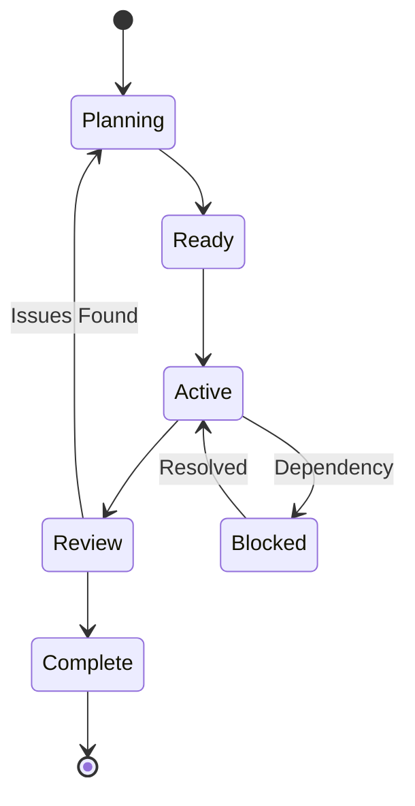

# Enterprise Orchestration Framework Specification

## Executive Summary

This specification extends the Claude Code orchestration architecture to support enterprise-scale software development with multi-team coordination, hierarchical agent management, shared state systems, and comprehensive observability.

---

## 1. Architecture Overview

### 1.1 Core Components

```
┌─────────────────────────────────────────────────────────────┐
│                    Orchestration Control Plane              │
├─────────────────────────────────────────────────────────────┤
│  ┌──────────────┐  ┌──────────────┐  ┌──────────────┐     │
│  │ Team         │  │ State        │  │ Observability│     │
│  │ Orchestrators│  │ Management   │  │ Platform     │     │
│  └──────────────┘  └──────────────┘  └──────────────┘     │
├─────────────────────────────────────────────────────────────┤
│                    Agent Execution Layer                    │
│  ┌──────────────────────────────────────────────────┐      │
│  │ Specialized Agents with Tool Access              │      │
│  └──────────────────────────────────────────────────┘      │
├─────────────────────────────────────────────────────────────┤
│                    Communication Bus                        │
│  ┌──────────────┐  ┌──────────────┐  ┌──────────────┐     │
│  │ Task Queue   │  │ Event Stream │  │ Message Bus  │     │
│  └──────────────┘  └──────────────┘  └──────────────┘     │
└─────────────────────────────────────────────────────────────┘
```

### 1.2 System Layers

1. **Control Plane**: Team orchestration, resource allocation, strategic planning
2. **Execution Layer**: Individual agents performing specialized tasks
3. **State Layer**: Persistent state management, context sharing
4. **Communication Layer**: Inter-agent messaging, event streaming
5. **Observability Layer**: Monitoring, logging, analytics, reporting

---

## 2. State Management System

### 2.1 State Store Architecture

```json
{
  "organization": {
    "id": "org-uuid",
    "projects": ["project-1", "project-2"],
    "teams": ["product", "engineering", "qa"],
    "settings": {}
  },
  "projects": {
    "project-1": {
      "id": "project-uuid",
      "name": "E-Commerce Platform",
      "epics": ["epic-1", "epic-2"],
      "current_sprint": "sprint-3",
      "teams_assigned": ["product", "engineering"],
      "repository": {
        "main_branch": "main",
        "worktrees": {
          "feature/auth": "wt-auth-uuid",
          "feature/payments": "wt-payments-uuid"
        }
      }
    }
  },
  "epics": {
    "epic-1": {
      "id": "epic-uuid",
      "title": "User Authentication System",
      "status": "in_progress",
      "sprints": ["sprint-1", "sprint-2", "sprint-3"],
      "features": ["login", "oauth", "2fa"],
      "dependencies": []
    }
  },
  "sprints": {
    "sprint-3": {
      "id": "sprint-uuid",
      "epic_id": "epic-1",
      "status": "active",
      "start_date": "2025-01-13",
      "end_date": "2025-01-27",
      "tasks": {
        "queued": ["task-5", "task-6"],
        "active": ["task-3", "task-4"],
        "completed": ["task-1", "task-2"],
        "blocked": []
      },
      "team_assignments": {
        "engineering": ["task-3", "task-4"],
        "qa": ["task-5"]
      }
    }
  },
  "tasks": {
    "task-3": {
      "id": "task-uuid",
      "type": "feature",
      "title": "Implement OAuth2 flow",
      "assignee": "fullstack-eng",
      "status": "in_progress",
      "dependencies": ["task-1"],
      "artifacts": ["src/auth/oauth.ts"],
      "worktree": "feature/auth",
      "context": {
        "spec_url": "docs/specs/oauth.md",
        "test_coverage": 0.82,
        "last_update": "2025-01-19T10:30:00Z"
      }
    }
  },
  "agents": {
    "active": {
      "engineering-orchestrator": {
        "session_id": "session-uuid",
        "current_task": "orchestrate-sprint-3",
        "child_agents": ["fullstack-eng-1", "ux-eng-1"]
      },
      "fullstack-eng-1": {
        "session_id": "session-uuid",
        "current_task": "task-3",
        "status": "implementing"
      }
    }
  },
  "communication": {
    "questions": [
      {
        "id": "q-uuid",
        "from": "fullstack-eng-1",
        "to": "tech-lead",
        "question": "Should OAuth tokens be stored in Redis or PostgreSQL?",
        "context": "task-3",
        "timestamp": "2025-01-19T10:15:00Z",
        "status": "pending"
      }
    ],
    "handoffs": [
      {
        "id": "handoff-uuid",
        "from": "ux-eng-1",
        "to": "fullstack-eng-1",
        "artifact": "components/AuthForm.tsx",
        "task": "task-3",
        "status": "ready"
      }
    ]
  },
  "observability": {
    "metrics": {
      "sprint_velocity": 8,
      "task_completion_rate": 0.75,
      "agent_utilization": 0.85,
      "test_coverage": 0.78,
      "build_success_rate": 0.92
    },
    "events": [
      {
        "type": "task_completed",
        "task_id": "task-2",
        "agent": "fullstack-eng-1",
        "timestamp": "2025-01-19T09:45:00Z"
      }
    ]
  }
}
```

### 2.2 State Management Implementation

#### File-Based State Store
```python
# .claude/state/manager.py
class StateManager:
    def __init__(self):
        self.state_dir = Path(".claude/state")
        self.state_file = self.state_dir / "orchestration.json"
        self.lock_file = self.state_dir / ".lock"
        
    def read_state(self, path: str = None):
        """Read state with optional JSON path query"""
        with self._lock():
            state = self._load_state()
            if path:
                return self._query_path(state, path)
            return state
    
    def update_state(self, path: str, value: Any):
        """Update state at specific path"""
        with self._lock():
            state = self._load_state()
            self._set_path(state, path, value)
            self._save_state(state)
            self._emit_event("state_updated", {"path": path})
    
    def atomic_operation(self, operation: Callable):
        """Execute atomic state operation"""
        with self._lock():
            state = self._load_state()
            new_state = operation(state)
            self._save_state(new_state)
```

#### MCP State Server (Advanced)
```yaml
# mcp_servers.yaml
state-server:
  command: uv run .claude/mcp/state_server.py
  args:
    - --port=7890
    - --db=.claude/state/orchestration.db
  env:
    STATE_MODE: "sqlite"
```

---

## 3. Team Hierarchy & Orchestrators

### 3.1 Team Structure

```yaml
teams:
  product:
    orchestrator: product-director
    members:
      - product-manager
      - business-analyst
      - data-scientist
      - market-researcher
    capabilities:
      - requirements_gathering
      - market_analysis
      - user_story_creation
      - acceptance_criteria
      
  engineering:
    orchestrator: engineering-director
    members:
      - tech-lead
      - fullstack-eng
      - ux-eng
      - api-engineer
      - test-engineer
      - doc-writer
    capabilities:
      - technical_design
      - implementation
      - code_review
      - testing
      
  qa:
    orchestrator: qa-director
    members:
      - qa-engineer
      - qa-analyst
      - performance-tester
    capabilities:
      - test_planning
      - test_execution
      - bug_reporting
      - regression_testing
      
  devops:
    orchestrator: devops-manager
    members:
      - ci-cd-engineer
      - infra-engineer
      - release-manager
    capabilities:
      - deployment
      - infrastructure
      - monitoring
      - release_management
```

### 3.2 Orchestrator Agent Specification

```markdown
# .claude/agents/engineering-orchestrator.md
---
name: engineering-orchestrator
description: Engineering team orchestrator responsible for sprint management, task delegation, and team coordination. MUST BE USED when starting engineering sprints or managing engineering team.
tools: Task, Read, Write, Bash(git:*), TodoWrite, mcp__state__*
model: opus
---

# Purpose

You are the Engineering Director orchestrator, responsible for managing the engineering team's sprint execution, task delegation, and cross-team coordination.

## Core Responsibilities

1. **Sprint Management**
   - Initialize and manage engineering sprints
   - Track sprint progress and velocity
   - Handle sprint ceremonies (planning, review)
   
2. **Task Delegation**
   - Analyze task requirements and dependencies
   - Assign tasks to appropriate team members
   - Monitor task progress and blockers
   
3. **Team Coordination**
   - Coordinate parallel agent execution
   - Manage handoffs between agents
   - Resolve inter-agent dependencies
   
4. **State Management**
   - Update sprint and task states
   - Track team capacity and utilization
   - Maintain engineering metrics

## Workflow

### Sprint Initialization
1. Read sprint definition from state
2. Analyze task list and dependencies
3. Create task execution plan
4. Spawn specialized agents in parallel:
   ```
   Parallel Batch 1: Independent tasks
   - tech-lead: Technical specification
   - doc-expert: Documentation gathering
   
   Parallel Batch 2: Implementation
   - ux-eng: UI components
   - fullstack-eng: Backend APIs
   
   Sequential: Integration
   - fullstack-eng: Connect UI to backend
   - test-engineer: E2E testing
   ```

### Task Delegation Protocol
```python
def delegate_task(task):
    # Determine agent type
    if task.type == "ui_component":
        agent = "ux-eng"
    elif task.type == "api":
        agent = "api-engineer"
    elif task.type == "feature":
        agent = "fullstack-eng"
    
    # Prepare context
    context = {
        "task": task,
        "dependencies": get_completed_dependencies(task),
        "specifications": get_task_spec(task),
        "worktree": assign_worktree(task)
    }
    
    # Launch agent
    spawn_agent(agent, context)
    update_state(f"tasks.{task.id}.status", "assigned")
```

### Progress Monitoring
- Poll agent status every 30 seconds
- Update task states in real-time
- Detect and handle blockers
- Trigger escalations when needed
```

---

## 4. Inter-Agent Communication Protocol

### 4.1 Message Types

```typescript
interface AgentMessage {
  id: string;
  timestamp: string;
  from: AgentIdentifier;
  to: AgentIdentifier | "broadcast";
  type: MessageType;
  payload: any;
  priority: "low" | "normal" | "high" | "critical";
}

enum MessageType {
  // Coordination
  TASK_ASSIGNED = "task_assigned",
  TASK_COMPLETED = "task_completed",
  TASK_BLOCKED = "task_blocked",
  
  // Collaboration
  QUESTION = "question",
  ANSWER = "answer",
  REVIEW_REQUEST = "review_request",
  REVIEW_COMPLETE = "review_complete",
  
  // Handoffs
  ARTIFACT_READY = "artifact_ready",
  ARTIFACT_RECEIVED = "artifact_received",
  
  // State
  STATE_UPDATED = "state_updated",
  LOCK_ACQUIRED = "lock_acquired",
  LOCK_RELEASED = "lock_released"
}
```

### 4.2 Communication Bus Implementation

```python
# .claude/hooks/message_bus.py
class MessageBus:
    def __init__(self):
        self.queue_dir = Path(".claude/messages")
        self.queue_dir.mkdir(exist_ok=True)
        
    def send(self, message: AgentMessage):
        """Send message to agent or broadcast"""
        msg_file = self.queue_dir / f"{message.to}_{message.id}.json"
        msg_file.write_text(json.dumps(message))
        
        # Trigger notification hook
        if message.priority in ["high", "critical"]:
            self._notify_agent(message.to)
    
    def receive(self, agent_id: str, block: bool = False):
        """Receive messages for agent"""
        pattern = f"{agent_id}_*.json"
        messages = []
        
        for msg_file in self.queue_dir.glob(pattern):
            message = json.loads(msg_file.read_text())
            messages.append(message)
            msg_file.unlink()  # Consume message
            
        return sorted(messages, key=lambda m: m["priority"])
    
    def broadcast(self, message: AgentMessage):
        """Broadcast to all active agents"""
        active_agents = self._get_active_agents()
        for agent in active_agents:
            self.send({**message, "to": agent})
```

### 4.3 Hook-Based Communication

```python
# .claude/hooks/agent_communicate.py
def handle_communication(event_type, data):
    if event_type == "tool_use" and data.get("tool") == "Task":
        # Inter-agent task delegation
        message = {
            "type": "TASK_ASSIGNED",
            "from": get_current_agent(),
            "to": data["agent"],
            "payload": data["task"]
        }
        MessageBus().send(message)
    
    elif event_type == "task_complete":
        # Notify orchestrator
        message = {
            "type": "TASK_COMPLETED",
            "from": get_current_agent(),
            "to": get_orchestrator(),
            "payload": data
        }
        MessageBus().send(message)
```

---

## 5. Sprint & Epic Workflow Management

### 5.1 Workflow States



### 5.2 Sprint Management Commands

```markdown
# .claude/commands/sprint/start.md
---
description: Start a new sprint with team orchestration
argument-hint: [sprint-id] [--team=engineering]
---

## Sprint Initialization Protocol

1. **Load Sprint Definition**
   - Read sprint tasks from state
   - Identify dependencies
   - Calculate critical path

2. **Team Activation**
   - Spawn team orchestrator
   - Allocate agent resources
   - Setup worktrees

3. **Parallel Execution**
   - Launch independent tasks
   - Monitor progress
   - Handle dependencies

4. **Sprint Tracking**
   - Update burndown chart
   - Track velocity
   - Report blockers
```

### 5.3 Epic Management

```python
# .claude/orchestration/epic_manager.py
class EpicManager:
    def plan_epic(self, epic_id: str):
        """Break epic into sprints"""
        epic = self.state.get(f"epics.{epic_id}")
        
        # Analyze features
        features = self.analyze_features(epic.features)
        
        # Create sprint plan
        sprints = []
        for i, feature_batch in enumerate(self.batch_features(features)):
            sprint = {
                "id": f"sprint-{epic_id}-{i}",
                "features": feature_batch,
                "duration": 14,  # days
                "teams": self.assign_teams(feature_batch)
            }
            sprints.append(sprint)
            
        return sprints
    
    def execute_epic(self, epic_id: str):
        """Execute epic sprints sequentially"""
        sprints = self.plan_epic(epic_id)
        
        for sprint in sprints:
            # Start sprint
            self.start_sprint(sprint)
            
            # Monitor until complete
            while not self.is_sprint_complete(sprint.id):
                self.monitor_sprint(sprint.id)
                time.sleep(30)
            
            # Sprint retrospective
            self.retrospective(sprint.id)
```

---

## 6. Worktree Management

### 6.1 Parallel Development Strategy

```python
# .claude/worktree/manager.py
class WorktreeManager:
    def __init__(self):
        self.worktree_dir = Path(".worktrees")
        self.worktree_map = {}
    
    def create_worktree(self, feature: str, base_branch: str = "main"):
        """Create worktree for feature development"""
        worktree_path = self.worktree_dir / feature
        
        # Create worktree
        subprocess.run([
            "git", "worktree", "add",
            str(worktree_path),
            f"feature/{feature}"
        ])
        
        # Register in state
        self.state.update(
            f"projects.current.worktrees.{feature}",
            str(worktree_path)
        )
        
        return worktree_path
    
    def assign_to_agent(self, agent_id: str, feature: str):
        """Assign worktree to agent"""
        worktree = self.get_or_create_worktree(feature)
        
        # Update agent context
        self.state.update(
            f"agents.active.{agent_id}.worktree",
            str(worktree)
        )
        
        # Lock worktree
        self.lock_worktree(worktree, agent_id)
```

### 6.2 Worktree Coordination

```yaml
worktree_strategy:
  epic_level:
    - description: "One worktree per epic"
    - use_case: "Large, independent features"
    - example: "feature/authentication-system"
    
  sprint_level:
    - description: "One worktree per sprint"
    - use_case: "Coordinated team efforts"
    - example: "sprint-3-payments"
    
  task_level:
    - description: "One worktree per task"
    - use_case: "Highly parallel development"
    - example: "task-oauth-implementation"
    
  team_level:
    - description: "One worktree per team"
    - use_case: "Team isolation"
    - example: "team-frontend-work"
```

---

## 7. Observability & Monitoring

### 7.1 Metrics Collection

```python
# .claude/observability/collector.py
class MetricsCollector:
    def __init__(self):
        self.metrics = {}
        self.events = []
        
    def track_agent_metrics(self):
        """Collect agent performance metrics"""
        return {
            "agent_count": self.count_active_agents(),
            "task_throughput": self.calculate_throughput(),
            "average_task_time": self.calculate_avg_time(),
            "error_rate": self.calculate_error_rate(),
            "resource_utilization": self.get_resource_usage()
        }
    
    def track_sprint_metrics(self):
        """Collect sprint metrics"""
        return {
            "velocity": self.calculate_velocity(),
            "burndown": self.generate_burndown(),
            "blocker_count": self.count_blockers(),
            "completion_rate": self.calculate_completion(),
            "cycle_time": self.calculate_cycle_time()
        }
```

### 7.2 Reporting Dashboard

```html
<!-- .claude/dashboard/index.html -->
<!DOCTYPE html>
<html>
<head>
    <title>Orchestration Dashboard</title>
    <script src="https://cdn.jsdelivr.net/npm/chart.js"></script>
</head>
<body>
    <div class="dashboard">
        <!-- Sprint Progress -->
        <div class="widget">
            <h2>Sprint Progress</h2>
            <canvas id="burndown-chart"></canvas>
        </div>
        
        <!-- Agent Activity -->
        <div class="widget">
            <h2>Agent Activity</h2>
            <div id="agent-status"></div>
        </div>
        
        <!-- Task Queue -->
        <div class="widget">
            <h2>Task Queue</h2>
            <ul id="task-queue"></ul>
        </div>
        
        <!-- System Metrics -->
        <div class="widget">
            <h2>System Metrics</h2>
            <canvas id="metrics-chart"></canvas>
        </div>
    </div>
    
    <script>
        // Real-time updates via WebSocket
        const ws = new WebSocket('ws://localhost:7891');
        ws.onmessage = (event) => {
            const data = JSON.parse(event.data);
            updateDashboard(data);
        };
    </script>
</body>
</html>
```

### 7.3 Status Line Integration

```python
# .claude/status_lines/orchestration_status.py
def get_status():
    """Generate orchestration status line"""
    state = StateManager().read_state()
    
    sprint = state.get("sprints.current")
    metrics = state.get("observability.metrics")
    
    return {
        "team": os.environ.get("CLAUDE_TEAM", "engineering"),
        "epic": sprint.get("epic_id", "none"),
        "sprint": sprint.get("id", "none"),
        "tasks": {
            "active": len(sprint.get("tasks.active", [])),
            "queued": len(sprint.get("tasks.queued", [])),
            "done": len(sprint.get("tasks.completed", []))
        },
        "tests": {
            "coverage": f"{metrics.get('test_coverage', 0)*100:.0f}%",
            "passing": metrics.get("tests_passing", 0),
            "failing": metrics.get("tests_failing", 0)
        },
        "agents": get_active_agent_dots()
    }
```

---

## 8. Implementation Roadmap

### Phase 1: Foundation (Week 1-2)
- [x] State management system
- [ ] Basic orchestrator agents
- [ ] Message bus implementation
- [ ] Session data migration

### Phase 2: Team Structure (Week 3-4)
- [ ] Team orchestrator agents
- [ ] Sprint management commands
- [ ] Task delegation system
- [ ] Basic worktree management

### Phase 3: Communication (Week 5-6)
- [ ] Inter-agent messaging
- [ ] Event streaming
- [ ] Question/Answer system
- [ ] Artifact handoffs

### Phase 4: Workflow (Week 7-8)
- [ ] Epic planning system
- [ ] Sprint execution engine
- [ ] Dependency management
- [ ] Blocker resolution

### Phase 5: Observability (Week 9-10)
- [ ] Metrics collection
- [ ] Real-time dashboard
- [ ] Status line integration
- [ ] Reporting system

### Phase 6: Advanced Features (Week 11-12)
- [ ] Advanced worktree strategies
- [ ] AI-powered planning
- [ ] Predictive analytics
- [ ] Auto-scaling agents

---

## 9. Configuration Examples

### 9.1 Team Configuration

```yaml
# .claude/teams.yaml
teams:
  engineering:
    orchestrator:
      agent: engineering-orchestrator
      model: opus
      max_parallel_agents: 5
    members:
      - agent: tech-lead
        capacity: 1
        specialties: [architecture, review]
      - agent: fullstack-eng
        capacity: 3
        specialties: [frontend, backend]
      - agent: ux-eng
        capacity: 2
        specialties: [ui, responsive]
    settings:
      auto_assign: true
      require_review: true
      worktree_strategy: sprint_level
```

### 9.2 Sprint Configuration

```yaml
# .claude/sprints/sprint-3.yaml
sprint:
  id: sprint-3
  epic: authentication-system
  duration: 14
  teams: [engineering, qa]
  goals:
    - Complete OAuth implementation
    - Add 2FA support
    - Achieve 90% test coverage
  tasks:
    - id: task-oauth
      type: feature
      priority: high
      estimate: 5
      dependencies: []
    - id: task-2fa
      type: feature
      priority: medium
      estimate: 3
      dependencies: [task-oauth]
  success_criteria:
    - All tests passing
    - Security review complete
    - Documentation updated
```

---

## 10. Security & Compliance

### 10.1 Access Control

```python
# .claude/security/rbac.py
class RoleBasedAccess:
    roles = {
        "orchestrator": {
            "can_spawn_agents": True,
            "can_modify_state": True,
            "can_access_secrets": True
        },
        "team_member": {
            "can_spawn_agents": False,
            "can_modify_state": ["own_tasks"],
            "can_access_secrets": False
        },
        "reviewer": {
            "can_spawn_agents": False,
            "can_modify_state": ["reviews"],
            "can_access_secrets": False
        }
    }
    
    def check_permission(self, agent_id, action, resource):
        role = self.get_agent_role(agent_id)
        permissions = self.roles.get(role, {})
        return self.evaluate_permission(permissions, action, resource)
```

### 10.2 Audit Logging

```python
# .claude/audit/logger.py
class AuditLogger:
    def log_event(self, event):
        """Log security-relevant events"""
        entry = {
            "timestamp": datetime.now().isoformat(),
            "agent": event.agent_id,
            "action": event.action,
            "resource": event.resource,
            "result": event.result,
            "context": event.context
        }
        
        # Append to audit log
        with open(".claude/audit/audit.log", "a") as f:
            f.write(json.dumps(entry) + "\n")
        
        # Alert on suspicious activity
        if self.is_suspicious(event):
            self.alert_security_team(event)
```

---

## Conclusion

This orchestration specification provides a comprehensive framework for enterprise-scale multi-agent software development. The architecture supports:

1. **Hierarchical team management** with specialized orchestrators
2. **Sophisticated state management** for complex project coordination
3. **Inter-agent communication** protocols for seamless collaboration
4. **Sprint and epic workflows** matching real-world development practices
5. **Parallel development** through intelligent worktree management
6. **Comprehensive observability** for monitoring and optimization
7. **Security and compliance** features for enterprise requirements

The system is designed to be incrementally adoptable, allowing teams to start with basic orchestration and gradually enable more advanced features as needed.

### Next Steps

1. Implement Phase 1 foundation components
2. Create example orchestrator agents for each team
3. Develop integration tests for state management
4. Build prototype dashboard for visualization
5. Document best practices and patterns

This framework transforms Claude Code from a single-agent tool into a comprehensive AI-powered development platform capable of managing entire software projects with multiple teams working in parallel.