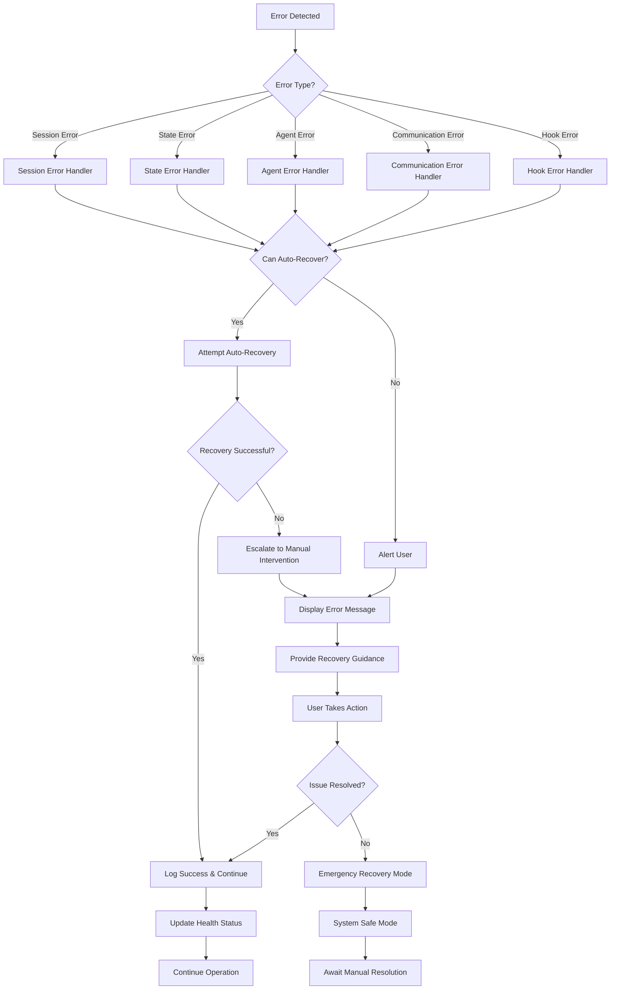
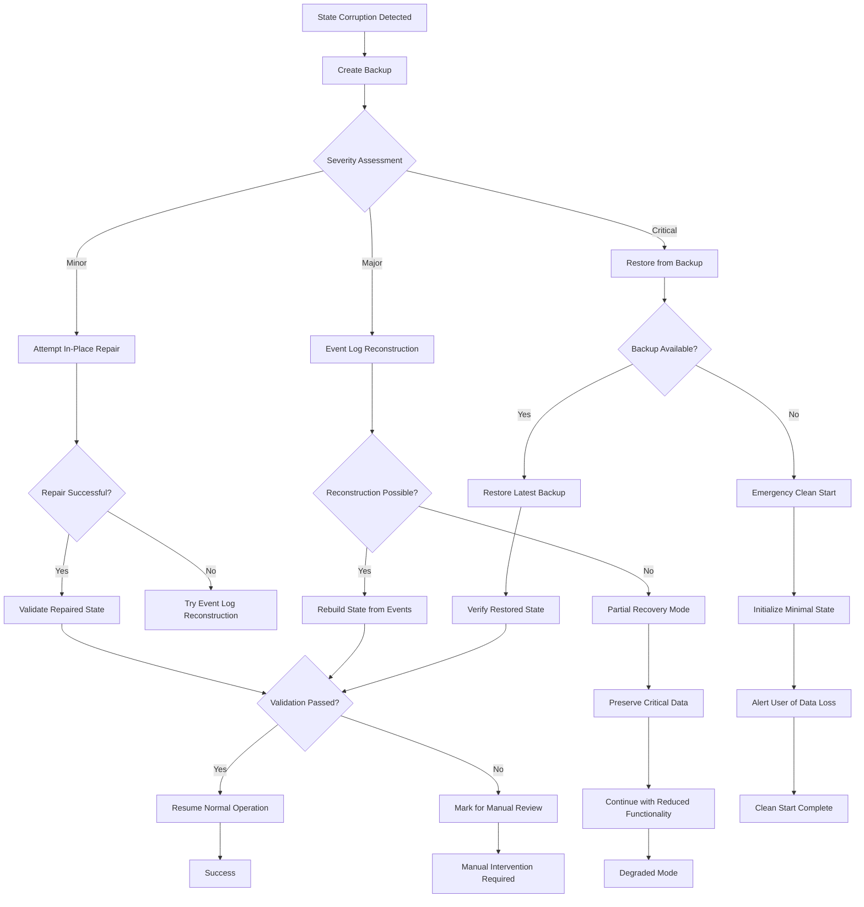
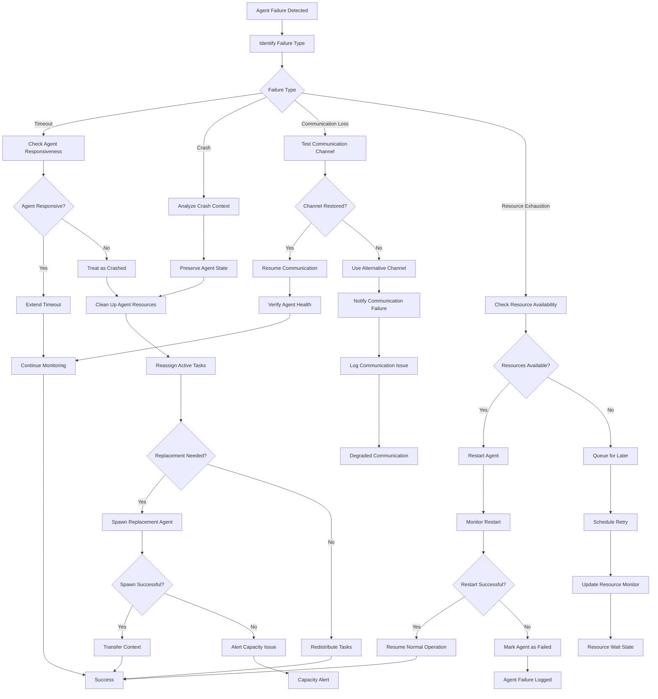

# V2 Orchestration Error Handling and Recovery Procedures

## Executive Summary

This document defines comprehensive error handling, recovery procedures, and resilience strategies for the v2 orchestration system. The design ensures graceful degradation, automatic recovery, and data consistency in face of failures across session management, state operations, agent coordination, and communication systems.

## Error Categories and Classification

### 1. Session Management Errors

#### 1.1 Session Initialization Errors

**Error Types:**
- `SESSION_INIT_FAILED`: Session state initialization failure
- `WORKSPACE_ACCESS_DENIED`: Insufficient permissions to workspace
- `CONFIG_CORRUPTED`: Invalid or corrupted configuration files
- `RESOURCE_EXHAUSTION`: Insufficient system resources for session

**Symptoms:**
- Session fails to start within timeout period (> 5s)
- Invalid session state structure
- Permission errors accessing .claude directory
- Memory allocation failures

**Recovery Strategy:**
```python
def handle_session_init_failure(error_type: str, error_data: Dict) -> bool:
    """Handle session initialization failures"""
    if error_type == "SESSION_INIT_FAILED":
        # Attempt recovery with minimal state
        try:
            minimal_state = create_minimal_session_state()
            return initialize_with_fallback_state(minimal_state)
        except Exception:
            return False
    
    elif error_type == "WORKSPACE_ACCESS_DENIED":
        # Try alternative workspace locations
        fallback_locations = get_fallback_workspace_locations()
        for location in fallback_locations:
            if try_workspace_access(location):
                return initialize_with_workspace(location)
        return False
    
    elif error_type == "CONFIG_CORRUPTED":
        # Restore from backup or use defaults
        if restore_config_from_backup():
            return retry_session_initialization()
        else:
            return initialize_with_default_config()
    
    elif error_type == "RESOURCE_EXHAUSTION":
        # Wait and retry with reduced resource requirements
        time.sleep(2)
        return initialize_with_reduced_resources()
    
    return False
```

#### 1.2 Session Timeout and Corruption

**Error Types:**
- `SESSION_TIMEOUT`: Session exceeded maximum lifetime
- `SESSION_CORRUPTED`: State consistency validation failed
- `SESSION_LOCKED`: Session locked by another process
- `SESSION_ZOMBIE`: Session process exists but unresponsive

**Recovery Procedures:**
```python
def handle_session_corruption(session_id: str, corruption_type: str) -> SessionRecoveryResult:
    """Handle session corruption with data preservation"""
    recovery_manager = RecoveryManager(workspace_path)
    
    # Create backup before any recovery attempts
    backup_path = create_session_backup(session_id)
    
    try:
        if corruption_type == "SESSION_CORRUPTED":
            # Attempt state reconstruction from event log
            recovered_state = recovery_manager.recover_session(session_id)
            if validate_recovered_state(recovered_state):
                return SessionRecoveryResult(
                    success=True,
                    state=recovered_state,
                    method="event_log_replay"
                )
        
        # Partial recovery - preserve critical data
        critical_data = extract_critical_session_data(session_id)
        new_session = create_new_session_with_data(critical_data)
        
        return SessionRecoveryResult(
            success=True,
            state=new_session,
            method="partial_recovery",
            data_preserved=critical_data
        )
        
    except Exception as e:
        # Last resort - clean session with user notification
        cleanup_corrupted_session(session_id)
        return SessionRecoveryResult(
            success=False,
            error=str(e),
            backup_location=backup_path
        )
```

### 2. State Management Errors

#### 2.1 State Consistency Errors

**Error Types:**
- `STATE_CONFLICT`: Concurrent modification conflict
- `STATE_SIZE_EXCEEDED`: State exceeds maximum size limits
- `STATE_VALIDATION_FAILED`: Schema validation failure
- `STATE_CIRCULAR_REFERENCE`: Circular references detected

**Detection and Prevention:**
```python
class StateConsistencyGuard:
    def __init__(self, state_manager):
        self.state_manager = state_manager
        self.lock_manager = LockManager()
        self.validator = StateValidator()
    
    def safe_state_update(self, path: str, value: Any, operation_id: str = None):
        """Safely update state with consistency checks"""
        operation_id = operation_id or str(uuid.uuid4())
        
        # Acquire lock for the affected path
        with self.lock_manager.acquire_path_lock(path, operation_id):
            # Pre-update validation
            current_state = self.state_manager.get()
            proposed_state = self._apply_change_preview(current_state, path, value)
            
            validation_result = self.validator.validate_state_change(
                current_state, proposed_state, path, value
            )
            
            if not validation_result.valid:
                raise StateValidationError(
                    f"State validation failed: {validation_result.errors}",
                    path=path,
                    operation_id=operation_id
                )
            
            # Check for conflicts
            if self._detect_concurrent_modifications(path, operation_id):
                raise StateConcurrencyError(
                    f"Concurrent modification detected on path: {path}",
                    path=path,
                    operation_id=operation_id
                )
            
            # Apply change with rollback capability
            try:
                checkpoint = self._create_operation_checkpoint(current_state)
                success = self.state_manager.set(path, value, emit_event=True)
                
                if not success:
                    raise StateUpdateError(f"Failed to update state at path: {path}")
                
                # Post-update validation
                new_state = self.state_manager.get()
                if not self.validator.validate_full_state(new_state):
                    self._rollback_to_checkpoint(checkpoint)
                    raise StateConsistencyError(
                        "State consistency validation failed after update"
                    )
                
                return True
                
            except Exception as e:
                # Automatic rollback on any failure
                self._rollback_to_checkpoint(checkpoint)
                raise StateUpdateError(f"State update failed and was rolled back: {e}")
    
    def _detect_concurrent_modifications(self, path: str, operation_id: str) -> bool:
        """Detect if path was modified by another operation"""
        recent_events = self.state_manager.get_recent_events(minutes=1)
        
        for event in recent_events:
            if (event.get("type") == "state_updated" and 
                event.get("data", {}).get("path") == path and
                event.get("correlation_id") != operation_id):
                return True
        
        return False
```

#### 2.2 State Size and Memory Errors

**Error Types:**
- `STATE_SIZE_LIMIT_EXCEEDED`: State size exceeds configured limits
- `MEMORY_EXHAUSTION`: Insufficient memory for state operations
- `PERSISTENCE_FAILED`: State persistence to disk failed
- `CACHE_OVERFLOW`: In-memory cache exceeded capacity

**Automatic Cleanup and Recovery:**
```python
class StateResourceManager:
    def __init__(self, state_manager, config):
        self.state_manager = state_manager
        self.config = config
        self.cleanup_manager = CleanupManager(state_manager)
        self.memory_monitor = MemoryMonitor()
    
    def handle_resource_exhaustion(self, error_type: str, severity: str):
        """Handle state resource exhaustion with graduated response"""
        
        if error_type == "STATE_SIZE_LIMIT_EXCEEDED":
            # Progressive cleanup strategy
            if severity == "warning":
                self._cleanup_old_data()
            elif severity == "critical":
                self._aggressive_cleanup()
            else:
                self._emergency_cleanup()
        
        elif error_type == "MEMORY_EXHAUSTION":
            # Memory pressure relief
            self._clear_caches()
            self._archive_completed_tasks()
            self._compress_large_objects()
            
            # If still critical, force persistence and restart session
            if self.memory_monitor.get_usage_percent() > 95:
                self._force_persistence_and_restart()
        
        elif error_type == "PERSISTENCE_FAILED":
            # Try alternative persistence methods
            if not self._try_alternative_persistence():
                # Keep state in memory and alert user
                self._enable_memory_only_mode()
                self._alert_persistence_failure()
    
    def _cleanup_old_data(self):
        """Standard cleanup of old data"""
        # Archive completed tasks older than 24 hours
        cutoff_time = datetime.now() - timedelta(hours=24)
        tasks = self.state_manager.get("execution.tasks", {})
        
        archived_count = 0
        for task_id, task in list(tasks.items()):
            if (task.get("status") == "completed" and 
                task.get("updated_at") and
                datetime.fromisoformat(task["updated_at"]) < cutoff_time):
                
                self.cleanup_manager.archive_task(task_id, task)
                tasks.pop(task_id)
                archived_count += 1
        
        # Clean old messages
        self.cleanup_manager.clean_old_messages(hours=6)
        
        # Prune event history
        self.cleanup_manager.prune_event_history(max_events=1000)
        
        logger.info(f"Cleaned up {archived_count} old tasks and associated data")
    
    def _aggressive_cleanup(self):
        """Aggressive cleanup when approaching limits"""
        self._cleanup_old_data()
        
        # Archive all completed tasks regardless of age
        tasks = self.state_manager.get("execution.tasks", {})
        completed_tasks = {k: v for k, v in tasks.items() if v.get("status") == "completed"}
        
        for task_id, task in completed_tasks.items():
            self.cleanup_manager.archive_task(task_id, task)
            tasks.pop(task_id)
        
        # Clear all caches
        self.state_manager._memory_cache.clear()
        
        # Compress remaining data
        self._compress_state_data()
        
        logger.warning("Performed aggressive cleanup to manage state size")
    
    def _emergency_cleanup(self):
        """Emergency cleanup to prevent system failure"""
        self._aggressive_cleanup()
        
        # Remove non-essential data
        self.state_manager.set("observability.events.recent", [])
        self.state_manager.set("communication.message_queues", {})
        
        # Keep only active agents and pending tasks
        agents = self.state_manager.get("execution.agents.active", {})
        active_agents = {k: v for k, v in agents.items() if v.get("status") == "busy"}
        self.state_manager.set("execution.agents.active", active_agents)
        
        tasks = self.state_manager.get("execution.tasks", {})
        critical_tasks = {k: v for k, v in tasks.items() 
                         if v.get("status") in ["pending", "in_progress", "blocked"]}
        self.state_manager.set("execution.tasks", critical_tasks)
        
        logger.critical("Performed emergency cleanup - some data may have been lost")
```

### 3. Agent Coordination Errors

#### 3.1 Agent Spawn and Communication Failures

**Error Types:**
- `AGENT_SPAWN_FAILED`: Agent creation/initialization failed
- `AGENT_TIMEOUT`: Agent exceeded response timeout
- `AGENT_CRASHED`: Agent process terminated unexpectedly  
- `AGENT_COMMUNICATION_LOST`: Lost connection to agent
- `AGENT_CAPACITY_EXCEEDED`: Too many concurrent agents

**Recovery Strategies:**
```python
class AgentRecoveryManager:
    def __init__(self, state_manager):
        self.state_manager = state_manager
        self.agent_pool = AgentPool()
        self.health_monitor = AgentHealthMonitor()
    
    def handle_agent_failure(self, agent_id: str, failure_type: str, context: Dict):
        """Handle agent failures with automatic recovery"""
        
        agent_info = self.state_manager.get(f"execution.agents.active.{agent_id}")
        if not agent_info:
            logger.warning(f"Unknown agent failure reported: {agent_id}")
            return
        
        # Log failure for analysis
        self._log_agent_failure(agent_id, failure_type, context, agent_info)
        
        if failure_type == "AGENT_SPAWN_FAILED":
            # Retry with exponential backoff
            return self._retry_agent_spawn(agent_id, agent_info)
        
        elif failure_type == "AGENT_TIMEOUT":
            # Check if agent is still responsive
            if self._ping_agent(agent_id):
                # Agent is alive but slow - extend timeout
                self._extend_agent_timeout(agent_id)
                return True
            else:
                # Agent is unresponsive - treat as crashed
                return self._handle_agent_crash(agent_id, agent_info)
        
        elif failure_type == "AGENT_CRASHED":
            return self._handle_agent_crash(agent_id, agent_info)
        
        elif failure_type == "AGENT_COMMUNICATION_LOST":
            return self._restore_agent_communication(agent_id, agent_info)
        
        elif failure_type == "AGENT_CAPACITY_EXCEEDED":
            return self._handle_capacity_exceeded()
        
        return False
    
    def _handle_agent_crash(self, agent_id: str, agent_info: Dict) -> bool:
        """Handle crashed agent with task reassignment"""
        
        # Mark agent as failed
        self.state_manager.set(f"execution.agents.active.{agent_id}.status", "failed")
        self.state_manager.set(f"execution.agents.active.{agent_id}.failed_at", datetime.now().isoformat())
        
        # Get agent's current task
        current_task = agent_info.get("current_task")
        if current_task:
            # Reset task status for reassignment
            self.state_manager.set(f"execution.tasks.{current_task}.status", "pending")
            self.state_manager.set(f"execution.tasks.{current_task}.assignee", None)
            self.state_manager.set(f"execution.tasks.{current_task}.retry_count", 
                                 self.state_manager.get(f"execution.tasks.{current_task}.retry_count", 0) + 1)
            
            # Emit task reassignment event
            self.state_manager._emit_event("task_reassignment_required", {
                "task_id": current_task,
                "failed_agent": agent_id,
                "reason": "agent_crashed"
            })
        
        # Clean up agent resources
        self._cleanup_agent_resources(agent_id, agent_info)
        
        # Try to spawn replacement agent
        agent_type = agent_info.get("agent_type")
        if agent_type and self.agent_pool.can_spawn(agent_type):
            replacement_id = self.agent_pool.spawn_agent(agent_type)
            if replacement_id:
                logger.info(f"Spawned replacement agent {replacement_id} for failed {agent_id}")
                return True
        
        # Notify orchestrator of agent loss
        self._notify_agent_loss(agent_id, agent_info)
        return False
    
    def _cleanup_agent_resources(self, agent_id: str, agent_info: Dict):
        """Clean up resources held by failed agent"""
        
        # Release resource locks
        locks = self.state_manager.get("communication.coordination.locks", {})
        for resource, lock_info in list(locks.items()):
            if lock_info.get("locked_by") == agent_id:
                locks.pop(resource)
                logger.info(f"Released lock on {resource} from failed agent {agent_id}")
        
        # Clean up child agents
        child_agents = agent_info.get("context", {}).get("child_agents", [])
        for child_id in child_agents:
            self._terminate_child_agent(child_id, f"Parent agent {agent_id} failed")
        
        # Remove from active agents
        self.state_manager.set(f"execution.agents.active.{agent_id}", None)
    
    def _retry_agent_spawn(self, agent_id: str, agent_info: Dict, max_retries: int = 3) -> bool:
        """Retry agent spawn with exponential backoff"""
        
        retry_count = agent_info.get("retry_count", 0)
        if retry_count >= max_retries:
            logger.error(f"Agent spawn failed after {max_retries} retries: {agent_id}")
            self._notify_spawn_failure(agent_id, agent_info)
            return False
        
        # Exponential backoff: 2^retry_count seconds
        delay = 2 ** retry_count
        time.sleep(delay)
        
        try:
            agent_type = agent_info.get("agent_type")
            new_agent_id = self.agent_pool.spawn_agent(agent_type)
            
            if new_agent_id:
                # Update state with new agent ID
                self.state_manager.set(f"execution.agents.active.{new_agent_id}", {
                    **agent_info,
                    "retry_count": retry_count + 1,
                    "previous_id": agent_id,
                    "spawned_at": datetime.now().isoformat()
                })
                
                logger.info(f"Successfully respawned agent {agent_id} as {new_agent_id} after {retry_count + 1} retries")
                return True
            else:
                return self._retry_agent_spawn(agent_id, {**agent_info, "retry_count": retry_count + 1}, max_retries)
                
        except Exception as e:
            logger.error(f"Agent spawn retry failed: {e}")
            return self._retry_agent_spawn(agent_id, {**agent_info, "retry_count": retry_count + 1}, max_retries)
```

#### 3.2 Task Assignment and Dependency Errors

**Error Types:**
- `TASK_ASSIGNMENT_FAILED`: Unable to assign task to agent
- `CIRCULAR_DEPENDENCY`: Circular dependencies detected in task graph
- `DEPENDENCY_DEADLOCK`: Tasks waiting for each other indefinitely
- `TASK_ORPHANED`: Task has no available agents for execution

**Dependency Resolution:**
```python
class DependencyResolver:
    def __init__(self, state_manager):
        self.state_manager = state_manager
        self.dependency_analyzer = DependencyAnalyzer()
    
    def resolve_dependency_conflicts(self):
        """Resolve dependency conflicts and deadlocks"""
        
        dependency_graph = self.state_manager.get("communication.coordination.dependencies.graph")
        if not dependency_graph:
            return
        
        # Check for circular dependencies
        cycles = self.dependency_analyzer.find_cycles(dependency_graph)
        if cycles:
            self._resolve_circular_dependencies(cycles)
        
        # Check for deadlocks
        deadlocks = self.dependency_analyzer.find_deadlocks(dependency_graph)
        if deadlocks:
            self._resolve_deadlocks(deadlocks)
        
        # Check for orphaned tasks
        orphaned_tasks = self.dependency_analyzer.find_orphaned_tasks()
        if orphaned_tasks:
            self._resolve_orphaned_tasks(orphaned_tasks)
    
    def _resolve_circular_dependencies(self, cycles: List[List[str]]):
        """Break circular dependencies by removing weakest links"""
        
        for cycle in cycles:
            logger.warning(f"Circular dependency detected: {' -> '.join(cycle)}")
            
            # Find the weakest dependency link to break
            weakest_link = self._find_weakest_dependency_link(cycle)
            
            if weakest_link:
                from_task, to_task = weakest_link
                self._remove_dependency(from_task, to_task, "circular_dependency_resolution")
                
                logger.info(f"Broke circular dependency: {from_task} no longer blocks {to_task}")
            else:
                # If no clear weak link, remove the most recently added dependency
                self._remove_most_recent_dependency(cycle)
    
    def _resolve_deadlocks(self, deadlocks: List[Dict]):
        """Resolve deadlocks by task prioritization and dependency relaxation"""
        
        for deadlock in deadlocks:
            involved_tasks = deadlock["tasks"]
            logger.warning(f"Deadlock detected involving tasks: {involved_tasks}")
            
            # Find highest priority task in deadlock
            priorities = {}
            for task_id in involved_tasks:
                task = self.state_manager.get(f"execution.tasks.{task_id}")
                priorities[task_id] = self._get_task_priority_score(task)
            
            # Allow highest priority task to proceed by removing one of its dependencies
            highest_priority_task = max(priorities.keys(), key=lambda t: priorities[t])
            task_dependencies = self.state_manager.get(f"execution.tasks.{highest_priority_task}.dependencies", [])
            
            if task_dependencies:
                # Remove dependency to least critical task
                dependency_to_remove = min(task_dependencies, 
                                         key=lambda d: priorities.get(d, 0))
                
                self._remove_dependency(dependency_to_remove, highest_priority_task, "deadlock_resolution")
                logger.info(f"Resolved deadlock by removing dependency: {dependency_to_remove} -> {highest_priority_task}")
    
    def _remove_dependency(self, from_task: str, to_task: str, reason: str):
        """Remove a dependency relationship"""
        
        # Update task dependencies
        task_deps = self.state_manager.get(f"execution.tasks.{to_task}.dependencies", [])
        if from_task in task_deps:
            task_deps.remove(from_task)
            self.state_manager.set(f"execution.tasks.{to_task}.dependencies", task_deps)
        
        # Update task blocking list
        task_blocking = self.state_manager.get(f"execution.tasks.{from_task}.blocking", [])
        if to_task in task_blocking:
            task_blocking.remove(to_task)
            self.state_manager.set(f"execution.tasks.{from_task}.blocking", task_blocking)
        
        # Update dependency graph
        dependency_graph = self.state_manager.get("communication.coordination.dependencies.graph", {"edges": []})
        edges = dependency_graph.get("edges", [])
        edges = [e for e in edges if not (e["from"] == from_task and e["to"] == to_task)]
        dependency_graph["edges"] = edges
        self.state_manager.set("communication.coordination.dependencies.graph", dependency_graph)
        
        # Log the removal
        self.state_manager._emit_event("dependency_removed", {
            "from_task": from_task,
            "to_task": to_task,
            "reason": reason
        })
```

### 4. Hook Execution Errors

#### 4.1 Hook Processing Failures

**Error Types:**
- `HOOK_EXECUTION_FAILED`: Hook script execution failed
- `HOOK_TIMEOUT`: Hook exceeded maximum execution time
- `HOOK_INFINITE_LOOP`: Hook appears to be in infinite loop
- `HOOK_PERMISSION_DENIED`: Insufficient permissions for hook execution
- `HOOK_DEPENDENCY_MISSING`: Required dependencies not available

**Hook Error Handling:**
```python
class HookErrorHandler:
    def __init__(self, workspace_path: str):
        self.workspace_path = Path(workspace_path)
        self.hook_monitor = HookMonitor()
        self.execution_history = {}
    
    def execute_hook_safely(self, hook_path: Path, hook_data: Dict, timeout: int = 30) -> HookResult:
        """Execute hook with comprehensive error handling"""
        
        hook_id = str(uuid.uuid4())
        hook_name = hook_path.name
        
        try:
            # Pre-execution validation
            validation_result = self._validate_hook_execution(hook_path, hook_data)
            if not validation_result.valid:
                return HookResult(
                    success=False,
                    error=f"Hook validation failed: {validation_result.error}",
                    hook_name=hook_name
                )
            
            # Check for infinite loop potential
            if self._detect_potential_infinite_loop(hook_name, hook_data):
                return HookResult(
                    success=False,
                    error="Potential infinite loop detected - hook execution blocked",
                    hook_name=hook_name
                )
            
            # Execute with timeout and monitoring
            start_time = time.time()
            self.hook_monitor.start_monitoring(hook_id, hook_name)
            
            result = self._execute_with_timeout(hook_path, hook_data, timeout)
            
            execution_time = time.time() - start_time
            self._record_execution_history(hook_name, execution_time, result.success)
            
            return result
            
        except TimeoutError:
            logger.error(f"Hook {hook_name} timed out after {timeout}s")
            self._handle_hook_timeout(hook_id, hook_name)
            return HookResult(
                success=False,
                error=f"Hook execution timed out after {timeout} seconds",
                hook_name=hook_name
            )
            
        except PermissionError as e:
            logger.error(f"Permission denied for hook {hook_name}: {e}")
            return HookResult(
                success=False,
                error=f"Permission denied: {e}",
                hook_name=hook_name,
                recovery_suggestion="Check file permissions and execution rights"
            )
            
        except Exception as e:
            logger.error(f"Hook {hook_name} execution failed: {e}")
            return self._handle_unexpected_hook_error(hook_name, e)
        
        finally:
            self.hook_monitor.stop_monitoring(hook_id)
    
    def _detect_potential_infinite_loop(self, hook_name: str, hook_data: Dict) -> bool:
        """Detect potential infinite loops before execution"""
        
        # Check execution frequency
        recent_executions = self._get_recent_executions(hook_name, minutes=5)
        if len(recent_executions) > 10:  # More than 10 executions in 5 minutes
            logger.warning(f"High frequency execution detected for hook {hook_name}")
            return True
        
        # Check for identical parameters in recent executions
        if len(recent_executions) >= 3:
            latest_params = [exec_info.get("params") for exec_info in recent_executions[-3:]]
            if all(params == latest_params[0] for params in latest_params):
                logger.warning(f"Identical parameters in recent executions for hook {hook_name}")
                return True
        
        return False
    
    def _execute_with_timeout(self, hook_path: Path, hook_data: Dict, timeout: int) -> HookResult:
        """Execute hook with timeout protection"""
        
        import signal
        
        def timeout_handler(signum, frame):
            raise TimeoutError("Hook execution timed out")
        
        # Set up timeout
        signal.signal(signal.SIGALRM, timeout_handler)
        signal.alarm(timeout)
        
        try:
            # Create isolated environment for hook execution
            env = self._create_hook_environment(hook_data)
            
            # Execute hook
            import subprocess
            result = subprocess.run(
                [str(hook_path)],
                input=json.dumps(hook_data),
                capture_output=True,
                text=True,
                env=env,
                timeout=timeout
            )
            
            if result.returncode == 0:
                return HookResult(
                    success=True,
                    output=result.stdout,
                    hook_name=hook_path.name
                )
            else:
                return HookResult(
                    success=False,
                    error=result.stderr or "Hook returned non-zero exit code",
                    exit_code=result.returncode,
                    hook_name=hook_path.name
                )
                
        finally:
            signal.alarm(0)  # Cancel timeout
    
    def _handle_hook_timeout(self, hook_id: str, hook_name: str):
        """Handle hook timeout with cleanup"""
        
        # Try to find and kill the hook process
        try:
            import psutil
            current_process = psutil.Process()
            
            for child in current_process.children(recursive=True):
                if hook_name in child.cmdline():
                    logger.info(f"Terminating timed-out hook process: {child.pid}")
                    child.terminate()
                    
                    # Give it a moment to terminate gracefully
                    try:
                        child.wait(timeout=5)
                    except psutil.TimeoutExpired:
                        child.kill()  # Force kill if it doesn't terminate
                        
        except Exception as e:
            logger.warning(f"Could not clean up hook process: {e}")
        
        # Record timeout in history
        self.execution_history[hook_name] = self.execution_history.get(hook_name, [])
        self.execution_history[hook_name].append({
            "timestamp": datetime.now().isoformat(),
            "result": "timeout",
            "execution_time": None
        })
    
    def _create_hook_environment(self, hook_data: Dict) -> Dict[str, str]:
        """Create isolated environment for hook execution"""
        
        env = os.environ.copy()
        
        # Add hook-specific environment variables
        env.update({
            "CLAUDE_HOOK_SESSION_ID": hook_data.get("session_id", ""),
            "CLAUDE_HOOK_WORKSPACE": str(self.workspace_path),
            "CLAUDE_HOOK_TIMESTAMP": datetime.now().isoformat(),
            "CLAUDE_HOOK_DATA": json.dumps(hook_data)
        })
        
        # Remove potentially dangerous environment variables
        dangerous_vars = ["LD_PRELOAD", "DYLD_INSERT_LIBRARIES", "PYTHONPATH"]
        for var in dangerous_vars:
            env.pop(var, None)
        
        return env
```

### 5. Communication System Errors

#### 5.1 Message Bus and Queue Errors

**Error Types:**
- `MESSAGE_QUEUE_OVERFLOW`: Message queue exceeded capacity
- `MESSAGE_DELIVERY_FAILED`: Failed to deliver message to recipient
- `MESSAGE_CORRUPTION`: Message data corrupted during transmission
- `CHANNEL_UNAVAILABLE`: Communication channel not accessible
- `BROADCAST_FAILED`: Failed to broadcast message to all recipients

**Message System Recovery:**
```python
class MessageSystemRecovery:
    def __init__(self, state_manager):
        self.state_manager = state_manager
        self.message_store = MessageStore(state_manager)
        self.retry_scheduler = RetryScheduler()
    
    def handle_message_system_error(self, error_type: str, error_context: Dict):
        """Handle message system errors with appropriate recovery"""
        
        if error_type == "MESSAGE_QUEUE_OVERFLOW":
            self._handle_queue_overflow(error_context)
        
        elif error_type == "MESSAGE_DELIVERY_FAILED":
            self._handle_delivery_failure(error_context)
        
        elif error_type == "MESSAGE_CORRUPTION":
            self._handle_message_corruption(error_context)
        
        elif error_type == "CHANNEL_UNAVAILABLE":
            self._handle_channel_unavailable(error_context)
        
        elif error_type == "BROADCAST_FAILED":
            self._handle_broadcast_failure(error_context)
    
    def _handle_queue_overflow(self, context: Dict):
        """Handle message queue overflow"""
        
        queue_name = context.get("queue_name")
        current_size = context.get("current_size", 0)
        
        logger.warning(f"Message queue overflow: {queue_name} ({current_size} messages)")
        
        # Emergency queue cleanup
        messages = self.state_manager.get(f"communication.message_queues.{queue_name}", [])
        
        # Keep only high priority messages
        high_priority_messages = [
            msg for msg in messages 
            if msg.get("priority", "normal") in ["high", "critical"]
        ]
        
        # Keep most recent normal priority messages
        normal_messages = [
            msg for msg in messages 
            if msg.get("priority", "normal") == "normal"
        ]
        normal_messages.sort(key=lambda m: m.get("timestamp", ""), reverse=True)
        kept_normal = normal_messages[:50]  # Keep 50 most recent
        
        # Combine and update queue
        cleaned_messages = high_priority_messages + kept_normal
        self.state_manager.set(f"communication.message_queues.{queue_name}", cleaned_messages)
        
        # Archive dropped messages
        dropped_messages = set(messages) - set(cleaned_messages)
        if dropped_messages:
            self.message_store.archive_messages(list(dropped_messages), "queue_overflow")
        
        logger.info(f"Cleaned queue {queue_name}: kept {len(cleaned_messages)}, archived {len(dropped_messages)}")
    
    def _handle_delivery_failure(self, context: Dict):
        """Handle failed message delivery with retry logic"""
        
        message = context.get("message")
        recipient = context.get("recipient")
        attempt_count = context.get("attempt_count", 1)
        
        if not message or not recipient:
            logger.error("Invalid delivery failure context")
            return
        
        # Check retry limits
        max_retries = self._get_max_retries(message.get("priority", "normal"))
        if attempt_count >= max_retries:
            logger.error(f"Message delivery failed after {max_retries} attempts: {message.get('id')}")
            self._handle_permanent_delivery_failure(message, recipient)
            return
        
        # Schedule retry with exponential backoff
        delay = min(2 ** attempt_count, 300)  # Cap at 5 minutes
        
        self.retry_scheduler.schedule_retry(
            operation="message_delivery",
            data={
                "message": message,
                "recipient": recipient,
                "attempt_count": attempt_count + 1
            },
            delay_seconds=delay
        )
        
        logger.info(f"Scheduled message delivery retry in {delay}s (attempt {attempt_count + 1})")
    
    def _handle_permanent_delivery_failure(self, message: Dict, recipient: str):
        """Handle permanently failed message delivery"""
        
        # Move to dead letter queue
        dead_letter_queue = self.state_manager.get("communication.channels.dead_letter", [])
        
        failed_message = {
            **message,
            "failed_delivery": {
                "recipient": recipient,
                "failed_at": datetime.now().isoformat(),
                "reason": "max_retries_exceeded"
            }
        }
        
        dead_letter_queue.append(failed_message)
        self.state_manager.set("communication.channels.dead_letter", dead_letter_queue)
        
        # Notify sender if possible
        sender = message.get("from")
        if sender and sender != recipient:
            error_notification = {
                "id": str(uuid.uuid4()),
                "timestamp": datetime.now().isoformat(),
                "from": "system",
                "to": sender,
                "type": "delivery_failure",
                "priority": "high",
                "payload": {
                    "failed_message_id": message.get("id"),
                    "intended_recipient": recipient,
                    "reason": "Recipient unavailable after multiple retry attempts"
                }
            }
            
            # Add to sender's queue (bypass normal delivery to avoid recursion)
            sender_queue = self.state_manager.get(f"communication.message_queues.{sender}", [])
            sender_queue.append(error_notification)
            self.state_manager.set(f"communication.message_queues.{sender}", sender_queue)
    
    def _get_max_retries(self, priority: str) -> int:
        """Get maximum retry attempts based on message priority"""
        retry_limits = {
            "critical": 10,
            "high": 5,
            "normal": 3,
            "low": 1
        }
        return retry_limits.get(priority, 3)
```

## Recovery Procedures

### 1. Automatic Recovery Strategies

#### 1.1 Self-Healing Mechanisms

```python
class SelfHealingOrchestrator:
    def __init__(self, state_manager):
        self.state_manager = state_manager
        self.health_monitor = SystemHealthMonitor()
        self.recovery_handlers = self._initialize_recovery_handlers()
        self.healing_active = True
    
    def start_self_healing_loop(self, interval: int = 60):
        """Start continuous self-healing monitoring"""
        
        async def healing_loop():
            while self.healing_active:
                try:
                    await self._perform_health_check()
                    await asyncio.sleep(interval)
                except Exception as e:
                    logger.error(f"Self-healing loop error: {e}")
                    await asyncio.sleep(interval * 2)  # Back off on error
        
        asyncio.create_task(healing_loop())
    
    async def _perform_health_check(self):
        """Perform comprehensive system health check"""
        
        health_report = self.health_monitor.get_health_report()
        
        for component, health_status in health_report.items():
            if health_status["status"] not in ["healthy", "warning"]:
                await self._attempt_component_healing(component, health_status)
    
    async def _attempt_component_healing(self, component: str, health_status: Dict):
        """Attempt to heal a specific component"""
        
        healing_strategy = self.recovery_handlers.get(component)
        if not healing_strategy:
            logger.warning(f"No healing strategy available for component: {component}")
            return
        
        logger.info(f"Attempting to heal component: {component}")
        
        try:
            healing_result = await healing_strategy.heal(health_status)
            
            if healing_result.success:
                logger.info(f"Successfully healed component: {component}")
                self._record_healing_success(component, healing_result)
            else:
                logger.warning(f"Failed to heal component: {component} - {healing_result.error}")
                await self._escalate_healing_failure(component, healing_result)
                
        except Exception as e:
            logger.error(f"Healing attempt failed for {component}: {e}")
            await self._escalate_healing_failure(component, HealingResult(success=False, error=str(e)))
```

#### 1.2 Circuit Breaker Pattern

```python
class CircuitBreaker:
    def __init__(self, failure_threshold: int = 5, recovery_timeout: int = 60):
        self.failure_threshold = failure_threshold
        self.recovery_timeout = recovery_timeout
        self.failure_count = 0
        self.last_failure_time = None
        self.state = "CLOSED"  # CLOSED, OPEN, HALF_OPEN
    
    def call(self, func, *args, **kwargs):
        """Execute function with circuit breaker protection"""
        
        if self.state == "OPEN":
            if self._should_attempt_reset():
                self.state = "HALF_OPEN"
            else:
                raise CircuitBreakerOpenException("Circuit breaker is OPEN")
        
        try:
            result = func(*args, **kwargs)
            self._on_success()
            return result
            
        except Exception as e:
            self._on_failure()
            raise e
    
    def _should_attempt_reset(self) -> bool:
        """Check if enough time has passed to attempt reset"""
        if self.last_failure_time is None:
            return True
        
        return (time.time() - self.last_failure_time) > self.recovery_timeout
    
    def _on_success(self):
        """Handle successful operation"""
        self.failure_count = 0
        self.state = "CLOSED"
    
    def _on_failure(self):
        """Handle failed operation"""
        self.failure_count += 1
        self.last_failure_time = time.time()
        
        if self.failure_count >= self.failure_threshold:
            self.state = "OPEN"
            logger.warning(f"Circuit breaker opened after {self.failure_count} failures")

# Usage in orchestration components
class ResilientStateManager:
    def __init__(self, session_manager):
        self.session_manager = session_manager
        self.state_circuit_breaker = CircuitBreaker(failure_threshold=3, recovery_timeout=30)
        self.persistence_circuit_breaker = CircuitBreaker(failure_threshold=5, recovery_timeout=60)
    
    def get_state_safely(self, path: str):
        """Get state with circuit breaker protection"""
        try:
            return self.state_circuit_breaker.call(self.session_manager.get, path)
        except CircuitBreakerOpenException:
            # Fallback to cached or default values
            return self._get_fallback_state(path)
    
    def persist_state_safely(self):
        """Persist state with circuit breaker protection"""
        try:
            return self.persistence_circuit_breaker.call(self.session_manager.persist)
        except CircuitBreakerOpenException:
            logger.warning("State persistence circuit breaker open - skipping persistence")
            return False
```

### 2. Manual Intervention Procedures

#### 2.1 Emergency Recovery Commands

```bash
#!/bin/bash
# .claude/scripts/emergency_recovery.sh

set -e

WORKSPACE_PATH="${1:-.}"
RECOVERY_TYPE="${2:-auto}"

echo "🚨 Starting Emergency Recovery for V2 Orchestration System"
echo "Workspace: $WORKSPACE_PATH"
echo "Recovery Type: $RECOVERY_TYPE"

# Function to backup current state
backup_current_state() {
    echo "📦 Creating backup of current state..."
    
    BACKUP_DIR="$WORKSPACE_PATH/.claude/recovery/backup-$(date +%Y%m%d-%H%M%S)"
    mkdir -p "$BACKUP_DIR"
    
    # Backup state files
    if [ -d "$WORKSPACE_PATH/.claude/state" ]; then
        cp -r "$WORKSPACE_PATH/.claude/state" "$BACKUP_DIR/"
        echo "✅ State files backed up to $BACKUP_DIR"
    fi
    
    # Backup event logs
    if [ -d "$WORKSPACE_PATH/.claude/state/events" ]; then
        cp -r "$WORKSPACE_PATH/.claude/state/events" "$BACKUP_DIR/"
        echo "✅ Event logs backed up"
    fi
    
    echo "$BACKUP_DIR" > "$WORKSPACE_PATH/.claude/recovery/latest_backup.txt"
}

# Function to detect and clean corrupted sessions
clean_corrupted_sessions() {
    echo "🧹 Cleaning corrupted sessions..."
    
    python3 << 'EOF'
import json
import os
from pathlib import Path
from datetime import datetime, timedelta

workspace = Path(os.environ.get('WORKSPACE_PATH', '.'))
state_dir = workspace / '.claude' / 'state'

if not state_dir.exists():
    print("No state directory found")
    exit(0)

corrupted_count = 0
for state_file in state_dir.glob('session-*.json'):
    try:
        with state_file.open() as f:
            state = json.load(f)
        
        # Check basic structure
        required_keys = ['session', 'organization', 'execution', 'communication', 'observability', 'persistence']
        if not all(key in state for key in required_keys):
            print(f"❌ Corrupted session file: {state_file.name}")
            # Move to corrupted directory
            corrupted_dir = state_dir / 'corrupted'
            corrupted_dir.mkdir(exist_ok=True)
            state_file.rename(corrupted_dir / state_file.name)
            corrupted_count += 1
            continue
        
        # Check if session is too old
        session_data = state.get('session', {})
        last_activity = session_data.get('lifecycle', {}).get('last_activity')
        
        if last_activity:
            last_time = datetime.fromisoformat(last_activity.replace('Z', '+00:00'))
            if datetime.now(last_time.tzinfo) - last_time > timedelta(hours=24):
                print(f"🗑️ Removing stale session: {state_file.name}")
                state_file.unlink()
        
    except (json.JSONDecodeError, KeyError, ValueError) as e:
        print(f"❌ Corrupted session file: {state_file.name} - {e}")
        corrupted_dir = state_dir / 'corrupted'
        corrupted_dir.mkdir(exist_ok=True)
        state_file.rename(corrupted_dir / state_file.name)
        corrupted_count += 1

print(f"✅ Cleaned {corrupted_count} corrupted session files")
EOF
}

# Function to reset to safe defaults
reset_to_defaults() {
    echo "🔄 Resetting to safe defaults..."
    
    # Remove all active sessions
    rm -f "$WORKSPACE_PATH/.claude/state/session-*.json"
    
    # Clear event logs older than 1 day
    find "$WORKSPACE_PATH/.claude/state/events" -name "*.jsonl" -mtime +1 -delete 2>/dev/null || true
    
    # Reset orchestration config to defaults
    python3 << 'EOF'
import json
import os
from pathlib import Path

workspace = Path(os.environ.get('WORKSPACE_PATH', '.'))
config_dir = workspace / '.claude' / 'state'
config_dir.mkdir(parents=True, exist_ok=True)

# Create minimal default configuration
default_config = {
    "version": "2.0.0",
    "defaults": {
        "session_timeout_hours": 8,
        "max_concurrent_agents": 10,
        "auto_cleanup_enabled": True,
        "performance_monitoring": True
    }
}

config_file = config_dir / 'default_config.json'
with config_file.open('w') as f:
    json.dump(default_config, f, indent=2)

print("✅ Default configuration restored")
EOF
    
    echo "✅ System reset to safe defaults"
}

# Function to validate system integrity
validate_system_integrity() {
    echo "🔍 Validating system integrity..."
    
    python3 << 'EOF'
import os
from pathlib import Path

workspace = Path(os.environ.get('WORKSPACE_PATH', '.'))
claude_dir = workspace / '.claude'

# Check required directories
required_dirs = [
    'agents', 'commands', 'hooks', 'output-styles', 
    'scripts', 'state', 'state/events', 'recovery'
]

missing_dirs = []
for dir_name in required_dirs:
    dir_path = claude_dir / dir_name
    if not dir_path.exists():
        dir_path.mkdir(parents=True, exist_ok=True)
        missing_dirs.append(dir_name)

if missing_dirs:
    print(f"📁 Created missing directories: {', '.join(missing_dirs)}")

# Check required scripts
required_scripts = ['session_manager.py', 'state_engine.py', 'observability.py']
scripts_dir = claude_dir / 'scripts'

for script in required_scripts:
    script_path = scripts_dir / script
    if not script_path.exists():
        print(f"⚠️ Missing required script: {script}")

print("✅ System integrity validation complete")
EOF
}

# Function to test basic functionality
test_basic_functionality() {
    echo "🧪 Testing basic functionality..."
    
    # Test session creation
    python3 << 'EOF'
import sys
import os
from pathlib import Path
import json
import uuid
from datetime import datetime

workspace = Path(os.environ.get('WORKSPACE_PATH', '.'))
sys.path.insert(0, str(workspace / '.claude' / 'scripts'))

try:
    # Test basic state operations
    test_state = {
        "session": {
            "id": str(uuid.uuid4()),
            "created_at": datetime.now().isoformat(),
            "mode": "test",
            "user_context": {"workspace_path": str(workspace)},
            "lifecycle": {"status": "testing"}
        },
        "organization": {"teams": {}, "projects": {}},
        "execution": {"agents": {"active": {}, "pool": {}}, "tasks": {}, "workflows": {"active_sprints": [], "epics": {}}},
        "communication": {"message_queues": {}, "channels": {"broadcast": [], "emergency": [], "handoffs": []}, "coordination": {"locks": {}, "dependencies": {"graph": {"nodes": {}, "edges": []}, "blocks": []}}},
        "observability": {"metrics": {"performance": {}, "utilization": {}, "quality": {}}, "events": {"recent": [], "event_stream_offset": 0}, "health": {"system_status": "healthy", "checks": {}}},
        "persistence": {"checkpoint": {"last_saved": datetime.now().isoformat(), "sequence": 0, "hash": "", "size_bytes": 0}, "event_log": {"current_offset": 0, "total_events": 0, "log_files": []}}
    }
    
    # Try to write test state
    state_dir = workspace / '.claude' / 'state'
    test_file = state_dir / 'test_session.json'
    
    with test_file.open('w') as f:
        json.dump(test_state, f, indent=2)
    
    # Try to read it back
    with test_file.open() as f:
        loaded_state = json.load(f)
    
    # Cleanup
    test_file.unlink()
    
    print("✅ Basic state operations working")
    
except Exception as e:
    print(f"❌ Basic functionality test failed: {e}")
    sys.exit(1)
EOF
    
    echo "✅ Basic functionality tests passed"
}

# Main recovery flow
main() {
    case $RECOVERY_TYPE in
        "backup")
            backup_current_state
            ;;
        "clean")
            backup_current_state
            clean_corrupted_sessions
            ;;
        "reset")
            backup_current_state
            clean_corrupted_sessions
            reset_to_defaults
            validate_system_integrity
            test_basic_functionality
            ;;
        "auto"|*)
            echo "🔄 Performing automatic recovery..."
            backup_current_state
            clean_corrupted_sessions
            validate_system_integrity
            test_basic_functionality
            echo "✅ Automatic recovery completed"
            ;;
    esac
    
    echo ""
    echo "🎉 Emergency recovery completed successfully!"
    echo ""
    echo "📋 Recovery Summary:"
    echo "   - Backup created: $(cat $WORKSPACE_PATH/.claude/recovery/latest_backup.txt 2>/dev/null || echo 'None')"
    echo "   - Corrupted sessions cleaned"
    echo "   - System integrity validated"
    echo "   - Basic functionality tested"
    echo ""
    echo "🚀 You can now restart your orchestration session"
}

main
```

#### 2.2 State Recovery Tools

```python
# .claude/scripts/state_recovery.py
#!/usr/bin/env -S uv run --script
# /// script
# dependencies = [
#   "click",
#   "rich",
#   "jsonschema",
# ]
# ///

import click
import json
import shutil
from pathlib import Path
from datetime import datetime, timedelta
from typing import Dict, List, Optional
from rich.console import Console
from rich.table import Table
from rich.progress import Progress

console = Console()

class StateRecoveryManager:
    def __init__(self, workspace_path: str):
        self.workspace_path = Path(workspace_path)
        self.state_dir = self.workspace_path / ".claude" / "state"
        self.recovery_dir = self.workspace_path / ".claude" / "recovery"
        
        # Ensure directories exist
        self.state_dir.mkdir(parents=True, exist_ok=True)
        self.recovery_dir.mkdir(parents=True, exist_ok=True)
    
    def analyze_state_health(self) -> Dict[str, any]:
        """Analyze the health of all session states"""
        
        health_report = {
            "total_sessions": 0,
            "healthy_sessions": 0,
            "corrupted_sessions": 0,
            "stale_sessions": 0,
            "large_sessions": 0,
            "details": []
        }
        
        for state_file in self.state_dir.glob("session-*.json"):
            health_report["total_sessions"] += 1
            session_health = self._analyze_session_health(state_file)
            health_report["details"].append(session_health)
            
            if session_health["status"] == "healthy":
                health_report["healthy_sessions"] += 1
            elif session_health["status"] == "corrupted":
                health_report["corrupted_sessions"] += 1
            elif session_health["status"] == "stale":
                health_report["stale_sessions"] += 1
            
            if session_health["size_mb"] > 10:  # Large session threshold
                health_report["large_sessions"] += 1
        
        return health_report
    
    def _analyze_session_health(self, state_file: Path) -> Dict[str, any]:
        """Analyze the health of a single session"""
        
        session_info = {
            "file": state_file.name,
            "size_mb": state_file.stat().st_size / (1024 * 1024),
            "modified": datetime.fromtimestamp(state_file.stat().st_mtime),
            "status": "unknown",
            "issues": []
        }
        
        try:
            with state_file.open() as f:
                state = json.load(f)
            
            # Check basic structure
            required_keys = ["session", "organization", "execution", "communication", "observability", "persistence"]
            missing_keys = [key for key in required_keys if key not in state]
            
            if missing_keys:
                session_info["status"] = "corrupted"
                session_info["issues"].append(f"Missing keys: {', '.join(missing_keys)}")
                return session_info
            
            # Check session age
            session_data = state.get("session", {})
            lifecycle = session_data.get("lifecycle", {})
            last_activity = lifecycle.get("last_activity")
            
            if last_activity:
                try:
                    last_time = datetime.fromisoformat(last_activity.replace('Z', '+00:00'))
                    age_hours = (datetime.now(last_time.tzinfo) - last_time).total_seconds() / 3600
                    
                    if age_hours > 24:
                        session_info["status"] = "stale"
                        session_info["issues"].append(f"Last activity: {age_hours:.1f} hours ago")
                    else:
                        session_info["status"] = "healthy"
                        
                except (ValueError, TypeError):
                    session_info["issues"].append("Invalid last_activity timestamp")
            
            # Check for consistency issues
            consistency_issues = self._check_state_consistency(state)
            if consistency_issues:
                session_info["issues"].extend(consistency_issues)
                if session_info["status"] == "healthy":
                    session_info["status"] = "corrupted"
            
        except (json.JSONDecodeError, KeyError) as e:
            session_info["status"] = "corrupted"
            session_info["issues"].append(f"JSON error: {str(e)}")
        
        return session_info
    
    def _check_state_consistency(self, state: Dict) -> List[str]:
        """Check for internal consistency issues in state"""
        
        issues = []
        
        try:
            # Check task-agent consistency
            tasks = state.get("execution", {}).get("tasks", {})
            active_agents = state.get("execution", {}).get("agents", {}).get("active", {})
            
            for task_id, task in tasks.items():
                assignee = task.get("assignee")
                if assignee and assignee not in active_agents:
                    issues.append(f"Task {task_id} assigned to non-existent agent {assignee}")
            
            for agent_id, agent in active_agents.items():
                current_task = agent.get("current_task")
                if current_task and current_task not in tasks:
                    issues.append(f"Agent {agent_id} working on non-existent task {current_task}")
            
            # Check dependency graph consistency
            dependency_graph = state.get("communication", {}).get("coordination", {}).get("dependencies", {}).get("graph", {})
            nodes = dependency_graph.get("nodes", {})
            edges = dependency_graph.get("edges", [])
            
            for edge in edges:
                if edge.get("from") not in nodes or edge.get("to") not in nodes:
                    issues.append("Dependency graph has edges to non-existent nodes")
                    break
            
        except Exception as e:
            issues.append(f"Consistency check failed: {str(e)}")
        
        return issues
    
    def create_backup(self, name: str = None) -> Path:
        """Create a complete backup of current state"""
        
        if name is None:
            name = f"backup-{datetime.now().strftime('%Y%m%d-%H%M%S')}"
        
        backup_dir = self.recovery_dir / name
        backup_dir.mkdir(exist_ok=True)
        
        with Progress() as progress:
            # Copy state files
            if self.state_dir.exists():
                task = progress.add_task("Backing up state files...", total=None)
                shutil.copytree(self.state_dir, backup_dir / "state", dirs_exist_ok=True)
                progress.update(task, completed=1)
        
        # Create backup metadata
        metadata = {
            "created_at": datetime.now().isoformat(),
            "workspace_path": str(self.workspace_path),
            "backup_type": "manual",
            "files_backed_up": len(list((backup_dir / "state").rglob("*")))
        }
        
        with (backup_dir / "backup_metadata.json").open('w') as f:
            json.dump(metadata, f, indent=2)
        
        console.print(f"✅ Backup created: {backup_dir}")
        return backup_dir
    
    def restore_from_backup(self, backup_path: Path, confirm: bool = False) -> bool:
        """Restore state from backup"""
        
        if not backup_path.exists():
            console.print(f"❌ Backup path does not exist: {backup_path}")
            return False
        
        # Load backup metadata
        metadata_file = backup_path / "backup_metadata.json"
        if metadata_file.exists():
            with metadata_file.open() as f:
                metadata = json.load(f)
            console.print(f"📋 Backup Info: Created {metadata.get('created_at')}, {metadata.get('files_backed_up')} files")
        
        if not confirm:
            if not click.confirm("This will overwrite current state. Continue?"):
                return False
        
        # Create current state backup before restore
        current_backup = self.create_backup("pre-restore-backup")
        console.print(f"📦 Current state backed up to: {current_backup}")
        
        # Restore from backup
        backup_state_dir = backup_path / "state"
        if backup_state_dir.exists():
            # Remove current state
            if self.state_dir.exists():
                shutil.rmtree(self.state_dir)
            
            # Restore from backup
            shutil.copytree(backup_state_dir, self.state_dir)
            console.print("✅ State restored from backup")
            return True
        else:
            console.print("❌ No state directory found in backup")
            return False
    
    def repair_corrupted_session(self, session_file: Path) -> bool:
        """Attempt to repair a corrupted session"""
        
        console.print(f"🔧 Attempting to repair: {session_file.name}")
        
        try:
            # Try to load partial data
            with session_file.open() as f:
                content = f.read()
            
            # Try to fix common JSON issues
            fixed_content = self._fix_common_json_issues(content)
            
            if fixed_content != content:
                # Create backup of corrupted file
                corrupted_backup = session_file.with_suffix('.corrupted.bak')
                session_file.rename(corrupted_backup)
                
                # Write fixed content
                with session_file.open('w') as f:
                    f.write(fixed_content)
                
                console.print(f"✅ Repaired JSON issues in {session_file.name}")
                return True
            
            # If JSON is valid, try to fix structural issues
            state = json.loads(content)
            fixed_state = self._fix_structural_issues(state)
            
            if fixed_state != state:
                # Backup and write fixed state
                backup_file = session_file.with_suffix('.pre-repair.bak')
                shutil.copy2(session_file, backup_file)
                
                with session_file.open('w') as f:
                    json.dump(fixed_state, f, indent=2)
                
                console.print(f"✅ Fixed structural issues in {session_file.name}")
                return True
            
        except Exception as e:
            console.print(f"❌ Could not repair {session_file.name}: {e}")
            return False
        
        console.print(f"ℹ️ No issues found in {session_file.name}")
        return True
    
    def _fix_common_json_issues(self, content: str) -> str:
        """Fix common JSON formatting issues"""
        
        # Remove trailing commas
        import re
        content = re.sub(r',(\s*[}\]])', r'\1', content)
        
        # Fix unescaped quotes in strings (basic attempt)
        # This is simplified - a full implementation would need proper parsing
        
        return content
    
    def _fix_structural_issues(self, state: Dict) -> Dict:
        """Fix structural issues in state"""
        
        fixed_state = state.copy()
        
        # Ensure all required top-level keys exist
        required_structure = {
            "session": {
                "lifecycle": {"status": "unknown"},
                "user_context": {}
            },
            "organization": {"teams": {}, "projects": {}},
            "execution": {
                "agents": {"active": {}, "pool": {}},
                "tasks": {},
                "workflows": {"active_sprints": [], "epics": {}}
            },
            "communication": {
                "message_queues": {},
                "channels": {"broadcast": [], "emergency": [], "handoffs": []},
                "coordination": {
                    "locks": {},
                    "dependencies": {"graph": {"nodes": {}, "edges": []}, "blocks": []}
                }
            },
            "observability": {
                "metrics": {"performance": {}, "utilization": {}, "quality": {}},
                "events": {"recent": [], "event_stream_offset": 0},
                "health": {"system_status": "unknown", "checks": {}}
            },
            "persistence": {
                "checkpoint": {"sequence": 0, "size_bytes": 0},
                "event_log": {"current_offset": 0, "total_events": 0, "log_files": []}
            }
        }
        
        def merge_structures(target: Dict, template: Dict):
            """Recursively merge template structure into target"""
            for key, value in template.items():
                if key not in target:
                    target[key] = value
                elif isinstance(value, dict) and isinstance(target[key], dict):
                    merge_structures(target[key], value)
        
        merge_structures(fixed_state, required_structure)
        
        return fixed_state

@click.group()
def cli():
    """State recovery tools for V2 orchestration system"""
    pass

@cli.command()
@click.option('--workspace', default='.', help='Workspace path')
def analyze(workspace):
    """Analyze state health"""
    manager = StateRecoveryManager(workspace)
    health_report = manager.analyze_state_health()
    
    # Display summary
    console.print("\n🏥 State Health Analysis")
    console.print("=" * 50)
    
    table = Table(title="Health Summary")
    table.add_column("Metric", style="cyan")
    table.add_column("Count", style="green")
    
    table.add_row("Total Sessions", str(health_report["total_sessions"]))
    table.add_row("Healthy Sessions", str(health_report["healthy_sessions"]))
    table.add_row("Corrupted Sessions", str(health_report["corrupted_sessions"]))
    table.add_row("Stale Sessions", str(health_report["stale_sessions"]))
    table.add_row("Large Sessions (>10MB)", str(health_report["large_sessions"]))
    
    console.print(table)
    
    # Display details for problematic sessions
    if health_report["corrupted_sessions"] > 0 or health_report["stale_sessions"] > 0:
        console.print("\n⚠️ Sessions Requiring Attention:")
        
        details_table = Table()
        details_table.add_column("File", style="cyan")
        details_table.add_column("Status", style="yellow")
        details_table.add_column("Size (MB)", style="green")
        details_table.add_column("Issues", style="red")
        
        for detail in health_report["details"]:
            if detail["status"] != "healthy":
                issues_str = "; ".join(detail["issues"]) if detail["issues"] else "None"
                details_table.add_row(
                    detail["file"],
                    detail["status"],
                    f"{detail['size_mb']:.2f}",
                    issues_str
                )
        
        console.print(details_table)

@cli.command()
@click.option('--workspace', default='.', help='Workspace path')
@click.option('--name', help='Backup name')
def backup(workspace, name):
    """Create state backup"""
    manager = StateRecoveryManager(workspace)
    backup_path = manager.create_backup(name)
    console.print(f"📦 Backup created: {backup_path}")

@cli.command()
@click.option('--workspace', default='.', help='Workspace path')
@click.argument('backup_path')
@click.option('--yes', is_flag=True, help='Skip confirmation')
def restore(workspace, backup_path, yes):
    """Restore from backup"""
    manager = StateRecoveryManager(workspace)
    success = manager.restore_from_backup(Path(backup_path), confirm=yes)
    if success:
        console.print("✅ State restored successfully")
    else:
        console.print("❌ Restore failed")

@cli.command()
@click.option('--workspace', default='.', help='Workspace path')
@click.option('--all', is_flag=True, help='Repair all corrupted sessions')
@click.argument('session_file', required=False)
def repair(workspace, all, session_file):
    """Repair corrupted sessions"""
    manager = StateRecoveryManager(workspace)
    
    if all:
        health_report = manager.analyze_state_health()
        corrupted_sessions = [
            detail for detail in health_report["details"] 
            if detail["status"] == "corrupted"
        ]
        
        if not corrupted_sessions:
            console.print("✅ No corrupted sessions found")
            return
        
        console.print(f"🔧 Repairing {len(corrupted_sessions)} corrupted sessions...")
        
        for session_detail in corrupted_sessions:
            session_path = manager.state_dir / session_detail["file"]
            manager.repair_corrupted_session(session_path)
    
    elif session_file:
        session_path = Path(session_file)
        if not session_path.is_absolute():
            session_path = manager.state_dir / session_file
        
        if session_path.exists():
            manager.repair_corrupted_session(session_path)
        else:
            console.print(f"❌ Session file not found: {session_path}")
    
    else:
        console.print("❌ Please specify --all or provide a session file")

if __name__ == "__main__":
    cli()
```

### 3. Escalation Paths

#### 3.1 Alert Levels and Response

```python
class AlertManager:
    def __init__(self, state_manager):
        self.state_manager = state_manager
        self.alert_config = self._load_alert_config()
        self.escalation_rules = self._load_escalation_rules()
        self.notification_channels = self._setup_notification_channels()
    
    def process_alert(self, alert: Dict):
        """Process alert and determine escalation path"""
        
        alert_level = self._determine_alert_level(alert)
        escalation_path = self.escalation_rules.get(alert_level, [])
        
        for escalation_step in escalation_path:
            self._execute_escalation_step(alert, escalation_step)
    
    def _determine_alert_level(self, alert: Dict) -> str:
        """Determine alert severity level"""
        
        alert_type = alert.get("type")
        severity = alert.get("severity", "info")
        
        # Critical system failures
        if alert_type in ["SESSION_CORRUPTED", "STATE_CONSISTENCY_FAILED", "AGENT_SYSTEM_FAILURE"]:
            return "CRITICAL"
        
        # High priority issues
        elif alert_type in ["AGENT_CRASHED", "MESSAGE_DELIVERY_FAILED", "HOOK_EXECUTION_FAILED"]:
            if severity in ["error", "critical"]:
                return "HIGH"
            else:
                return "MEDIUM"
        
        # Performance degradation
        elif alert_type in ["PERFORMANCE_DEGRADED", "RESOURCE_EXHAUSTION"]:
            return "MEDIUM"
        
        # Information and warnings
        else:
            return "LOW"
    
    def _execute_escalation_step(self, alert: Dict, step: Dict):
        """Execute a specific escalation step"""
        
        step_type = step.get("type")
        
        if step_type == "log":
            self._log_alert(alert, step.get("level", "warning"))
        
        elif step_type == "notify_user":
            self._notify_user(alert, step.get("channel", "console"))
        
        elif step_type == "attempt_recovery":
            self._attempt_automatic_recovery(alert)
        
        elif step_type == "escalate_to_human":
            self._escalate_to_human(alert, step.get("contact_method", "display"))
        
        elif step_type == "emergency_shutdown":
            self._emergency_shutdown(alert)
    
    def _escalate_to_human(self, alert: Dict, contact_method: str):
        """Escalate alert to human operator"""
        
        escalation_message = self._format_escalation_message(alert)
        
        if contact_method == "display":
            # Display urgent message in terminal
            console.print(Panel(
                escalation_message,
                title="🚨 URGENT: Manual Intervention Required",
                border_style="red"
            ))
        
        elif contact_method == "file":
            # Write to urgent alerts file
            urgent_file = self.state_manager.workspace_path / ".claude" / "urgent_alerts.txt"
            with urgent_file.open('a') as f:
                f.write(f"\n{datetime.now().isoformat()}: {escalation_message}\n")
        
        elif contact_method == "system_notification":
            # Try to send system notification
            self._send_system_notification(alert)
    
    def _format_escalation_message(self, alert: Dict) -> str:
        """Format alert for human escalation"""
        
        return f"""
ORCHESTRATION SYSTEM ALERT

Type: {alert.get('type', 'UNKNOWN')}
Severity: {alert.get('severity', 'UNKNOWN')}
Time: {alert.get('timestamp', datetime.now().isoformat())}

Description: {alert.get('message', 'No description available')}

Context:
{json.dumps(alert.get('context', {}), indent=2)}

Recommended Actions:
{self._get_recommended_actions(alert)}

Recovery Commands:
- Emergency reset: ./.claude/scripts/emergency_recovery.sh . reset
- State analysis: python ./.claude/scripts/state_recovery.py analyze
- Create backup: python ./.claude/scripts/state_recovery.py backup
        """.strip()
    
    def _get_recommended_actions(self, alert: Dict) -> str:
        """Get recommended actions for alert type"""
        
        alert_type = alert.get("type")
        
        recommendations = {
            "SESSION_CORRUPTED": """
1. Stop all orchestration activities
2. Create backup of current state
3. Run state recovery analysis
4. Restore from last known good backup if necessary
            """.strip(),
            
            "AGENT_SYSTEM_FAILURE": """
1. Check system resources (CPU, memory, disk)
2. Review recent error logs
3. Restart orchestration session
4. Consider reducing concurrent agent limit
            """.strip(),
            
            "STATE_CONSISTENCY_FAILED": """
1. Run state integrity check
2. Look for concurrent modification conflicts
3. Review recent state changes in event log
4. Consider manual state repair
            """.strip(),
            
            "RESOURCE_EXHAUSTION": """
1. Check available system resources
2. Run cleanup operations
3. Archive old data
4. Consider increasing system limits
            """.strip()
        }
        
        return recommendations.get(alert_type, "Review logs and contact support if issue persists")
```

## Error Prevention

### 1. Validation Strategies

#### 1.1 Input Validation Framework

```python
class InputValidationFramework:
    def __init__(self):
        self.validators = self._initialize_validators()
        self.sanitizers = self._initialize_sanitizers()
    
    def validate_and_sanitize(self, input_type: str, data: any) -> ValidationResult:
        """Validate and sanitize input data"""
        
        validator = self.validators.get(input_type)
        if not validator:
            return ValidationResult(
                valid=False,
                error=f"No validator found for input type: {input_type}"
            )
        
        # First validate
        validation_result = validator.validate(data)
        if not validation_result.valid:
            return validation_result
        
        # Then sanitize
        sanitizer = self.sanitizers.get(input_type)
        if sanitizer:
            sanitized_data = sanitizer.sanitize(data)
            return ValidationResult(
                valid=True,
                sanitized_data=sanitized_data
            )
        
        return ValidationResult(valid=True, sanitized_data=data)
    
    def _initialize_validators(self) -> Dict[str, 'Validator']:
        """Initialize input validators"""
        
        return {
            "session_id": UUIDValidator(),
            "agent_id": AgentIDValidator(),
            "task_data": TaskDataValidator(),
            "state_path": StatePathValidator(),
            "hook_data": HookDataValidator(),
            "message_data": MessageDataValidator()
        }
    
    def _initialize_sanitizers(self) -> Dict[str, 'Sanitizer']:
        """Initialize input sanitizers"""
        
        return {
            "task_data": TaskDataSanitizer(),
            "hook_data": HookDataSanitizer(),
            "message_data": MessageDataSanitizer(),
            "file_path": FilePathSanitizer()
        }

class TaskDataValidator:
    def validate(self, task_data: Dict) -> ValidationResult:
        """Validate task data structure and content"""
        
        required_fields = ["id", "type", "title", "status", "priority"]
        missing_fields = [field for field in required_fields if field not in task_data]
        
        if missing_fields:
            return ValidationResult(
                valid=False,
                error=f"Missing required fields: {', '.join(missing_fields)}"
            )
        
        # Validate field values
        valid_statuses = ["pending", "assigned", "in_progress", "review", "completed", "blocked", "cancelled"]
        if task_data.get("status") not in valid_statuses:
            return ValidationResult(
                valid=False,
                error=f"Invalid status: {task_data.get('status')}"
            )
        
        valid_priorities = ["critical", "high", "medium", "low"]
        if task_data.get("priority") not in valid_priorities:
            return ValidationResult(
                valid=False,
                error=f"Invalid priority: {task_data.get('priority')}"
            )
        
        # Validate dependencies
        dependencies = task_data.get("dependencies", [])
        if not isinstance(dependencies, list):
            return ValidationResult(
                valid=False,
                error="Dependencies must be a list"
            )
        
        return ValidationResult(valid=True)
```

#### 1.2 Schema Validation

```python
import jsonschema

class SchemaValidator:
    def __init__(self):
        self.schemas = self._load_schemas()
    
    def validate_state_schema(self, state: Dict) -> ValidationResult:
        """Validate complete state against schema"""
        
        try:
            jsonschema.validate(state, self.schemas["session_state"])
            return ValidationResult(valid=True)
        except jsonschema.ValidationError as e:
            return ValidationResult(
                valid=False,
                error=f"Schema validation failed: {e.message}",
                details={"path": list(e.absolute_path), "schema_path": list(e.schema_path)}
            )
    
    def validate_partial_schema(self, data: Dict, schema_name: str) -> ValidationResult:
        """Validate partial data against specific schema"""
        
        if schema_name not in self.schemas:
            return ValidationResult(
                valid=False,
                error=f"Unknown schema: {schema_name}"
            )
        
        try:
            jsonschema.validate(data, self.schemas[schema_name])
            return ValidationResult(valid=True)
        except jsonschema.ValidationError as e:
            return ValidationResult(
                valid=False,
                error=f"Schema validation failed: {e.message}",
                details={"path": list(e.absolute_path)}
            )
    
    def _load_schemas(self) -> Dict[str, Dict]:
        """Load JSON schemas for validation"""
        
        # This would load the actual schema from the state management design
        # For brevity, showing a simplified version
        
        return {
            "session_state": {
                "type": "object",
                "required": ["session", "organization", "execution", "communication", "observability", "persistence"],
                "properties": {
                    "session": {
                        "type": "object",
                        "required": ["id", "created_at", "mode", "user_context", "lifecycle"],
                        "properties": {
                            "id": {"type": "string", "format": "uuid"},
                            "mode": {"enum": ["development", "leadership", "config", "emergency"]},
                            # ... other properties
                        }
                    }
                    # ... other top-level properties
                }
            },
            "task": {
                "type": "object",
                "required": ["id", "type", "title", "status", "priority", "created_at"],
                # ... task schema definition
            },
            "agent": {
                "type": "object",
                "required": ["session_id", "agent_type", "spawned_at", "status"],
                # ... agent schema definition
            }
        }
```

### 2. Resource Limits and Monitoring

#### 2.1 Resource Limit Enforcement

```python
class ResourceLimitManager:
    def __init__(self, config: Dict):
        self.limits = config.get("resource_limits", {})
        self.monitors = self._setup_monitors()
        self.enforcement_actions = self._setup_enforcement_actions()
    
    def check_limits(self) -> List[ResourceViolation]:
        """Check all resource limits and return violations"""
        
        violations = []
        
        for resource_name, monitor in self.monitors.items():
            current_usage = monitor.get_current_usage()
            limit = self.limits.get(resource_name)
            
            if limit and current_usage > limit:
                violations.append(ResourceViolation(
                    resource=resource_name,
                    current=current_usage,
                    limit=limit,
                    severity=self._calculate_violation_severity(current_usage, limit)
                ))
        
        return violations
    
    def enforce_limits(self, violations: List[ResourceViolation]):
        """Enforce resource limits by taking corrective actions"""
        
        for violation in violations:
            action = self.enforcement_actions.get(violation.resource)
            if action:
                action.enforce(violation)
    
    def _setup_monitors(self) -> Dict[str, 'ResourceMonitor']:
        """Setup resource monitors"""
        
        return {
            "memory_mb": MemoryMonitor(),
            "disk_mb": DiskMonitor(),
            "cpu_percent": CPUMonitor(),
            "session_count": SessionCountMonitor(),
            "agent_count": AgentCountMonitor(),
            "state_size_mb": StateSizeMonitor(),
            "event_count": EventCountMonitor()
        }
    
    def _setup_enforcement_actions(self) -> Dict[str, 'EnforcementAction']:
        """Setup enforcement actions for each resource"""
        
        return {
            "memory_mb": MemoryEnforcementAction(),
            "state_size_mb": StateSizeEnforcementAction(),
            "agent_count": AgentCountEnforcementAction(),
            "session_count": SessionCountEnforcementAction()
        }

class StateSizeEnforcementAction:
    def enforce(self, violation: ResourceViolation):
        """Enforce state size limits"""
        
        if violation.severity == "critical":
            # Emergency cleanup
            self._emergency_state_cleanup()
        elif violation.severity == "high":
            # Aggressive cleanup
            self._aggressive_cleanup()
        else:
            # Standard cleanup
            self._standard_cleanup()
    
    def _emergency_state_cleanup(self):
        """Emergency state cleanup to prevent system failure"""
        # Remove all non-essential data
        # Keep only active agents and critical tasks
        pass
    
    def _aggressive_cleanup(self):
        """Aggressive cleanup while preserving essential data"""
        # Archive completed tasks
        # Clear old events
        # Compress remaining data
        pass
    
    def _standard_cleanup(self):
        """Standard cleanup operations"""
        # Archive old completed tasks
        # Clean old messages
        # Prune event history
        pass
```

## Monitoring and Alerting

### 1. Error Detection Mechanisms

#### 1.1 Health Check System

```python
class HealthCheckSystem:
    def __init__(self, state_manager):
        self.state_manager = state_manager
        self.health_checks = self._initialize_health_checks()
        self.check_history = {}
    
    def run_all_health_checks(self) -> HealthReport:
        """Run all health checks and return comprehensive report"""
        
        report = HealthReport()
        
        for check_name, health_check in self.health_checks.items():
            try:
                start_time = time.time()
                result = health_check.check()
                execution_time = (time.time() - start_time) * 1000  # ms
                
                # Record result
                check_result = HealthCheckResult(
                    name=check_name,
                    status=result.status,
                    response_time_ms=execution_time,
                    details=result.details,
                    timestamp=datetime.now()
                )
                
                report.add_result(check_result)
                self._record_check_history(check_name, check_result)
                
            except Exception as e:
                # Health check itself failed
                failed_result = HealthCheckResult(
                    name=check_name,
                    status="fail",
                    details=f"Health check execution failed: {str(e)}",
                    timestamp=datetime.now()
                )
                
                report.add_result(failed_result)
                self._record_check_history(check_name, failed_result)
        
        return report
    
    def _initialize_health_checks(self) -> Dict[str, 'HealthCheck']:
        """Initialize all health checks"""
        
        return {
            "state_consistency": StateConsistencyHealthCheck(self.state_manager),
            "session_validity": SessionValidityHealthCheck(self.state_manager),
            "agent_responsiveness": AgentResponsivenessHealthCheck(self.state_manager),
            "resource_availability": ResourceAvailabilityHealthCheck(self.state_manager),
            "persistence_integrity": PersistenceIntegrityHealthCheck(self.state_manager),
            "communication_flow": CommunicationFlowHealthCheck(self.state_manager),
            "dependency_resolution": DependencyResolutionHealthCheck(self.state_manager),
            "event_processing": EventProcessingHealthCheck(self.state_manager)
        }

class StateConsistencyHealthCheck:
    def __init__(self, state_manager):
        self.state_manager = state_manager
    
    def check(self) -> HealthCheckResult:
        """Check state consistency"""
        
        try:
            state = self.state_manager.get()
            
            # Check for required structure
            required_keys = ["session", "organization", "execution", "communication", "observability", "persistence"]
            missing_keys = [key for key in required_keys if key not in state]
            
            if missing_keys:
                return HealthCheckResult(
                    status="fail",
                    details=f"Missing required state keys: {', '.join(missing_keys)}"
                )
            
            # Check internal consistency
            consistency_issues = []
            
            # Verify task-agent assignments
            tasks = state.get("execution", {}).get("tasks", {})
            agents = state.get("execution", {}).get("agents", {}).get("active", {})
            
            for task_id, task in tasks.items():
                assignee = task.get("assignee")
                if assignee and assignee not in agents:
                    consistency_issues.append(f"Task {task_id} assigned to non-existent agent {assignee}")
            
            # Check dependency graph
            deps = state.get("communication", {}).get("coordination", {}).get("dependencies", {})
            graph = deps.get("graph", {})
            nodes = graph.get("nodes", {})
            edges = graph.get("edges", [])
            
            for edge in edges:
                if edge.get("from") not in nodes or edge.get("to") not in nodes:
                    consistency_issues.append("Dependency graph contains invalid references")
                    break
            
            if consistency_issues:
                return HealthCheckResult(
                    status="warn",
                    details=f"Consistency issues found: {'; '.join(consistency_issues)}"
                )
            
            return HealthCheckResult(
                status="pass",
                details="State consistency check passed"
            )
            
        except Exception as e:
            return HealthCheckResult(
                status="fail",
                details=f"State consistency check failed: {str(e)}"
            )
```

### 2. Alert Thresholds and Configuration

#### 2.1 Configurable Alert System

```yaml
# .claude/config/alerts.yaml
alert_config:
  performance_alerts:
    session_init_time_ms:
      warning_threshold: 150
      critical_threshold: 300
      check_interval: 60
      
    state_query_time_ms:
      warning_threshold: 75
      critical_threshold: 150
      check_interval: 30
      
    agent_spawn_time_ms:
      warning_threshold: 1500
      critical_threshold: 3000
      check_interval: 120
  
  resource_alerts:
    memory_usage_percent:
      warning_threshold: 75
      critical_threshold: 90
      check_interval: 30
      
    cpu_usage_percent:
      warning_threshold: 80
      critical_threshold: 95
      check_interval: 30
      
    disk_usage_percent:
      warning_threshold: 85
      critical_threshold: 95
      check_interval: 300
  
  business_alerts:
    success_rate_percent:
      warning_threshold: 85
      critical_threshold: 70
      check_interval: 300
      
    error_rate_percent:
      warning_threshold: 2
      critical_threshold: 5
      check_interval: 60

notification_channels:
  console:
    enabled: true
    severity_filter: ["warning", "critical"]
  
  file:
    enabled: true
    file_path: ".claude/alerts.log"
    severity_filter: ["warning", "critical", "error"]
  
  system:
    enabled: false
    severity_filter: ["critical"]

escalation_rules:
  CRITICAL:
    - type: "log"
      level: "critical"
    - type: "notify_user"
      channel: "console"
    - type: "attempt_recovery"
    - type: "escalate_to_human"
      contact_method: "display"
    - type: "emergency_shutdown"
      conditions: ["multiple_critical_failures"]
  
  HIGH:
    - type: "log" 
      level: "error"
    - type: "notify_user"
      channel: "console"
    - type: "attempt_recovery"
  
  MEDIUM:
    - type: "log"
      level: "warning"
    - type: "notify_user"
      channel: "file"
  
  LOW:
    - type: "log"
      level: "info"
```

## User-Facing Error Messages

### 1. Error Message Templates

```python
class UserErrorMessages:
    """User-friendly error messages with actionable guidance"""
    
    ERROR_TEMPLATES = {
        "SESSION_INIT_FAILED": {
            "title": "Failed to Initialize Session",
            "message": "The orchestration session could not be started.",
            "common_causes": [
                "Insufficient permissions to workspace directory",
                "Corrupted configuration files",
                "System resource constraints"
            ],
            "user_actions": [
                "Check that you have write permissions to the workspace",
                "Try running: ./.claude/scripts/emergency_recovery.sh . clean",
                "Ensure adequate disk space and memory are available"
            ],
            "technical_support": "If the issue persists, run diagnostics with: ./.claude/scripts/state_recovery.py analyze"
        },
        
        "STATE_CORRUPTED": {
            "title": "Session State Corrupted",
            "message": "The session state has become corrupted and cannot be safely used.",
            "common_causes": [
                "Unexpected system shutdown",
                "Concurrent modifications to state files",
                "File system corruption"
            ],
            "user_actions": [
                "Create a backup: python ./.claude/scripts/state_recovery.py backup",
                "Attempt repair: python ./.claude/scripts/state_recovery.py repair --all",
                "If repair fails, restore from backup or reset: ./.claude/scripts/emergency_recovery.sh . reset"
            ],
            "data_preservation": "Your work may be recoverable from event logs and backups."
        },
        
        "AGENT_SPAWN_FAILED": {
            "title": "Agent Creation Failed",
            "message": "Unable to create the requested agent.",
            "common_causes": [
                "System resource constraints",
                "Agent configuration errors",
                "Network connectivity issues"
            ],
            "user_actions": [
                "Check available system memory and CPU",
                "Reduce concurrent agent limit in settings",
                "Restart the orchestration session"
            ],
            "workaround": "Try using fewer agents or simpler tasks while the issue is resolved."
        },
        
        "DEPENDENCY_DEADLOCK": {
            "title": "Task Dependency Deadlock",
            "message": "Tasks are waiting for each other in a circular dependency, preventing progress.",
            "common_causes": [
                "Circular task dependencies",
                "Incorrectly specified prerequisites",
                "External blocking conditions"
            ],
            "user_actions": [
                "Review and simplify task dependencies",
                "Break circular dependencies by removing non-critical prerequisites",
                "Consider reordering tasks to eliminate conflicts"
            ],
            "automatic_resolution": "The system will attempt to automatically resolve simple dependency conflicts."
        }
    }
    
    @classmethod
    def format_user_error(cls, error_type: str, context: Dict = None) -> str:
        """Format user-friendly error message"""
        
        template = cls.ERROR_TEMPLATES.get(error_type, cls._get_generic_template(error_type))
        context = context or {}
        
        formatted_message = f"""
╔══════════════════════════════════════════════════════════════════════════════
║ 🚨 {template['title']}
╠══════════════════════════════════════════════════════════════════════════════
║ 
║ {template['message']}
║
        """.strip()
        
        if context.get('details'):
            formatted_message += f"\n║ Details: {context['details']}\n║"
        
        formatted_message += f"""
║ Common Causes:
"""
        for cause in template['common_causes']:
            formatted_message += f"║   • {cause}\n"
        
        formatted_message += f"""║
║ What You Can Do:
"""
        for action in template['user_actions']:
            formatted_message += f"║   1. {action}\n"
        
        if 'workaround' in template:
            formatted_message += f"""║
║ 💡 Workaround: {template['workaround']}
"""
        
        if 'data_preservation' in template:
            formatted_message += f"""║
║ 💾 Data Safety: {template['data_preservation']}
"""
        
        if 'automatic_resolution' in template:
            formatted_message += f"""║
║ 🤖 Automatic Resolution: {template['automatic_resolution']}
"""
        
        formatted_message += f"""║
║ Need Help? {template.get('technical_support', 'Check the documentation or contact support')}
╚══════════════════════════════════════════════════════════════════════════════
        """
        
        return formatted_message
    
    @classmethod
    def _get_generic_template(cls, error_type: str) -> Dict:
        """Get generic error template for unknown error types"""
        
        return {
            "title": f"System Error: {error_type}",
            "message": "An unexpected error occurred in the orchestration system.",
            "common_causes": [
                "System resource constraints",
                "Configuration issues",
                "Temporary connectivity problems"
            ],
            "user_actions": [
                "Try restarting the orchestration session",
                "Check system resources (CPU, memory, disk)",
                "Run emergency recovery if the problem persists"
            ],
            "technical_support": "Please report this error with logs for investigation"
        }
```

### 2. Recovery Guidance System

```python
class RecoveryGuidanceSystem:
    def __init__(self, state_manager):
        self.state_manager = state_manager
        self.recovery_procedures = self._load_recovery_procedures()
    
    def get_recovery_guidance(self, error_type: str, system_state: Dict) -> RecoveryGuidance:
        """Get personalized recovery guidance based on current state"""
        
        base_procedure = self.recovery_procedures.get(error_type)
        if not base_procedure:
            return self._get_generic_recovery_guidance(error_type)
        
        # Customize guidance based on current system state
        customized_steps = self._customize_recovery_steps(base_procedure, system_state)
        
        return RecoveryGuidance(
            error_type=error_type,
            severity=self._assess_severity(error_type, system_state),
            estimated_recovery_time=self._estimate_recovery_time(customized_steps),
            steps=customized_steps,
            prerequisites=self._get_prerequisites(customized_steps),
            risks=self._assess_recovery_risks(customized_steps)
        )
    
    def _customize_recovery_steps(self, base_procedure: Dict, system_state: Dict) -> List[RecoveryStep]:
        """Customize recovery steps based on current system state"""
        
        customized_steps = []
        
        for step in base_procedure["steps"]:
            # Check if step is applicable to current state
            if self._is_step_applicable(step, system_state):
                customized_step = self._customize_step(step, system_state)
                customized_steps.append(customized_step)
        
        return customized_steps
    
    def _is_step_applicable(self, step: Dict, system_state: Dict) -> bool:
        """Check if recovery step is applicable to current state"""
        
        conditions = step.get("conditions", [])
        
        for condition in conditions:
            if not self._evaluate_condition(condition, system_state):
                return False
        
        return True
    
    def _customize_step(self, step: Dict, system_state: Dict) -> RecoveryStep:
        """Customize a recovery step for current state"""
        
        # Customize command parameters based on state
        command = step.get("command", "")
        if "{workspace}" in command:
            command = command.replace("{workspace}", str(self.state_manager.workspace_path))
        
        # Add state-specific parameters
        params = step.get("parameters", {})
        if "session_count" in params:
            session_count = len(list(self.state_manager.workspace_path.glob(".claude/state/session-*.json")))
            params["session_count"] = session_count
        
        return RecoveryStep(
            title=step["title"],
            description=step["description"],
            command=command,
            parameters=params,
            estimated_time_minutes=step.get("estimated_time_minutes", 1),
            risk_level=step.get("risk_level", "low"),
            success_criteria=step.get("success_criteria", [])
        )
```

## Implementation Flowcharts

### 1. Error Detection and Response Flow



### 2. State Recovery Decision Tree



### 3. Agent Recovery Workflow



## Conclusion

This comprehensive error handling and recovery documentation provides a robust framework for maintaining system reliability and user trust in the v2 orchestration system. The multi-layered approach ensures that:

1. **Prevention** comes first through validation, resource monitoring, and defensive programming
2. **Detection** happens quickly through health checks, circuit breakers, and monitoring
3. **Recovery** is automated where possible, with clear escalation paths for complex issues
4. **User Experience** remains positive with clear error messages and actionable guidance
5. **Data Preservation** is prioritized throughout all recovery procedures

The system is designed to gracefully degrade functionality while maintaining core capabilities, ensuring that development work can continue even during partial system failures. The comprehensive backup and recovery procedures provide multiple safety nets, while the monitoring and alerting system ensures that issues are detected and addressed promptly.

This error handling framework scales from simple automated recoveries to complex manual interventions, providing the reliability and resilience necessary for a professional development orchestration system.